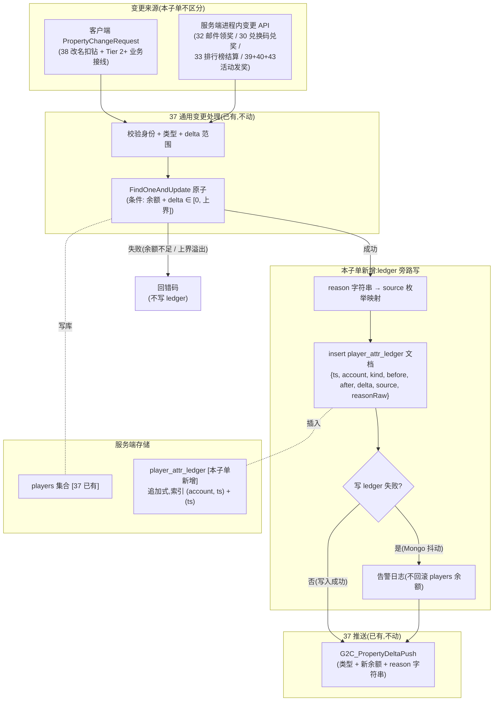
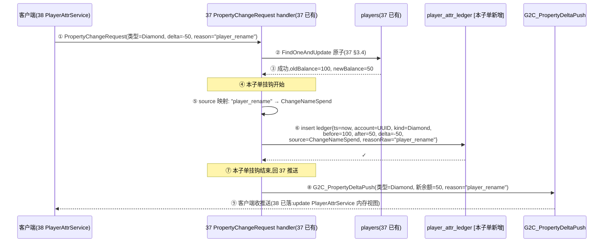
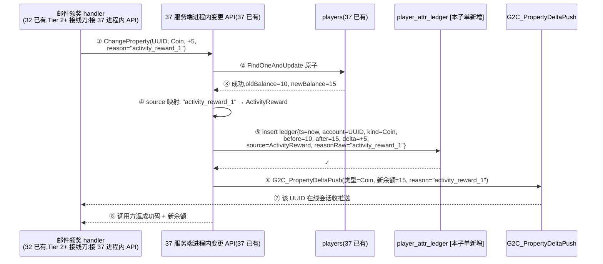
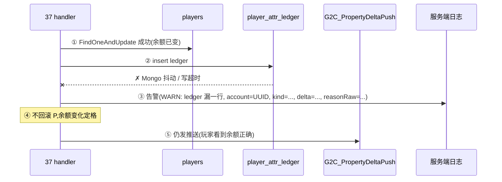

# 玩家属性 ledger 审计日志(Tier 2 第 2 子单 · server)

> 本子单是 [Tier 2 玩家属性权威](#37-player-attr-server) 的**纯服务端补完刀**:在 37 服务端段已落的「`players` 集合权威 + 通用变更入口」之上,**新增 MongoDB `player_attr_ledger` 集合**,把每一次三属性(金币 / 钻石 / 体力)的变动以**追加式流水**写一行,供客服查账 / 玩家自查 / 反作弊审计。本子单只**写流水**不**读流水**(查询 API 留客户端段后续刀,见 [§六](#44-player-attr-ledger::tier-next))。

**读前必看 · 六条边界**

- **本子单是 ledger 落地刀(写入),不是查询刀。** 服务端在每次成功属性变更后追加一行流水(写入),不提供拉流水的客户端 RPC——客户端 UI「我的流水」/ 客服查账 API 留 Tier 2+ 后续刀(见 [§6.2](#44-player-attr-ledger::tier-next))。本子单的 client 段为零(不可视、不可查、玩家无感)。
- **承接 37 §3.5「服务端进程内变更 API」的「成功后」时刻挂钩。** 37 已确立「PropertyChangeRequest 与服务端进程内变更 API 共用同一套校验 + 写库 + 推送」,本子单在此通路的**写库成功后、推送之前**追加 ledger 写入——是**额外的旁路**写,**不**进入 37 既有 FindOneAndUpdate 的原子边界(见 [§3.4](#44-player-attr-ledger::time)),也**不**影响余额更新的成功/失败裁决。
- **新建独立集合 `player_attr_ledger`,不在 `players` 内嵌数组。** 高频追加 + 「按账号查历史 / 按时间段查」类查询模式与 `players`(单文档余额读写)正交;内嵌数组会让 `players` 文档随玩家活跃度无界增长 + 触发 MongoDB 16MB 单文档上限 + 让原本秒级响应的余额读写退化(参 [§3.1](#44-player-attr-ledger::schema) 决策依据)。
- **PropertyChangeRequest / G2C_PropertyDeltaPush 协议签名零改。** 沿 [40](#40-event-unlock-relay) / [43](#43-activity-login-batch) 同口径守不变量:本子单不动客户端可见的三条 RPC([37 §3.3](#37-player-attr-server::protocol))、不动协议字段集、不动 `players` 集合 schema、不动 35 `accounts` 集合、不动既有发奖路径的行为。新增**仅限**新建集合 + 一处「写库成功后追加 ledger」挂钩 + source 枚举登记。
- **现有发奖 / 扣减路径行为不变,只新增 ledger 旁路写。** 38 改名扣钻 / 32 邮件领奖 / 30 兑换码兑奖 / 33 排行榜结算发奖 / 39+40+43 活动达标发奖等**所有**经 37 通用变更入口(对客户端的 PropertyChangeRequest 或服务端进程内 API)走的属性变动,本子单 PASS 后会**自动**每条一行 ledger;调用方**无需**改 reason 字符串以外的任何契约,**无需**额外调 ledger API(沿 37 §3.5「共用一套」的同口径优势——本子单也在「同一套」内挂钩,业务系统不感知 ledger 存在)。
- **本机 MongoDB(`D:\mongodb-portable`,127.0.0.1:27017)必备。** 真往返写 ledger 类 SV 在不可达时判 BLOCKED 非 FAIL(沿 [37 §7.2](#37-player-attr-server::accept) 同口径,memory `local-mongodb-for-server-roundtrip` + server-test memory `feedback-blocked-vs-fail`)。编译 / Code Review / 客户端工程零 diff / 零回归仍照常验。

**立项信息**

| 项 | 内容 |
| --- | --- |
| **类型** | 全栈特性 · Tier 2 玩家属性权威体系第 2 子单 · 服务端 only(纯 server,无客户端段,无新协议,无新 RPC)。出 code-free 设计意图 + 行为级 ledger schema 契约 + source 枚举登记 + 写入时机声明,交服务端段(集合 + 索引 + 挂钩点 + 枚举码)落地;客户端段零改动。 |
| **方向约束** | 离线还原 · **去变现**:ledger 是反作弊 / 客服 / 玩家自查的**审计基底**,不含商业付费流水(去变现下钻石不来自购买);本子单只建账本流水,不含查询 UI、不含「我的流水」客户端 RPC、不含 ledger 导出工具(运营查询直接读 MongoDB,无 GM 后台)。加法式:新建集合,既有 `players` / `accounts` / 30/31/32/33 业务集合零迁移;调用方无需调整签名,只在 reason 字符串处升级为「source 枚举值」(枚举映射在服务端进程内完成,protobuf 字段仍为字符串以守协议签名不变,见 [§3.3](#44-player-attr-ledger::source))。 |
| **需求降层** | **a. 表层要求**(boss brief):每次玩家三属性变动时,在 MongoDB 新增一行审计日志,记 (timestamp, accountId, kind, deltaBefore, deltaAfter, source),覆盖现有所有发奖 / 扣减路径,供客服查账 / 玩家自查 / 反作弊审计。 **b. 底层目的**:① **反作弊溯源**——37 守住「账本权威 + 余额变化原子」但不守「变化的来由」,若有日玩家投诉「钻石莫名其妙少了」/ 出现疑似刷奖账号,无 ledger = 无法定位是哪条路径触发的、哪个 reason 标的;② **客服查账**——玩家提客服工单「我的金币少了」,客服无 ledger 只能看当前余额,有 ledger 可逐笔回放;③ **数据资产**——ledger 是日后做留存分析 / 经济模型校准 / 异常账号识别的原料(本子单不接 BI,但底料已沉淀);④ **回滚 / 退款铺路**——退款是 Tier 2+ 范围(同笔反向),没有 ledger 找不到「原笔」,本子单为退款铺地基。 **c. 有无更直达 b 的做法**:b.① / ② / ③ / ④ 的本质 = 「持久化每笔变更的元信息」,**「独立集合追加式写入 + 索引(account + timestamp)」是直达做法**——零侵入既有通路、无内嵌文档增长上限、查询模式与写入模式对齐。**备选(已否)**:(1) **内嵌进 `players._id` 数组**——上限 16MB / 文档,活跃玩家几个月就破,且读 `players` 的余额字段被附带读出整段流水,违 37 §3.1「`players` 单文档读写小而稳」目的;(2) **写日志文件(append-only file / Serilog)**——查询效率差(grep 文本)、无索引、按账号 / 按时间段查需全文件扫,不适合「按 accountId 查个体历史」核心查询模式;(3) **不分集合 / 表,直接复用现有业务集合(redeem_records / mail_claims 等)的「奖励记录」**——这些集合各自只承载自己业务的语义(兑换码记一行兑换、邮件记一行领取),不含「属性维度统一视图」(客服 / 反作弊要的是「这账号所有钻石变化」,跨业务集合 join 是噩梦)。无更优解,按表层「独立 MongoDB 集合 + (accountId, timestamp) 索引 + source 枚举」实现。 |
| **范围(产品 · 玩法)** | **服务端新增**:① MongoDB `player_attr_ledger` 集合(主键 = 自增 / ObjectId,字段集见 [§3.1](#44-player-attr-ledger::schema));② source 枚举(覆盖现有所有发奖 / 扣减路径 + Unknown 兜底,见 [§3.3](#44-player-attr-ledger::source));③ 37 通用变更通路(对客户端 PropertyChangeRequest + 服务端进程内变更 API)的「写库成功后」追加 ledger 写入挂钩(见 [§3.4](#44-player-attr-ledger::time));④ 索引(account + timestamp 复合 + 单 timestamp,见 [§3.2](#44-player-attr-ledger::index))。 **服务端不动**:`players` 集合 schema 与 FindOneAndUpdate 原子写、35 `accounts` 集合、既有 30/31/32/33 业务集合、37 §3.3 三条客户端 RPC 协议契约、37 §3.5 服务端进程内变更 API 入参(类型 + delta + reason 字符串)。 **协议**:**无新协议 / 无新 RPC**(本子单纯 server 内部存储 + 挂钩,客户端不可见;reason 字符串协议字段不变,服务端在写 ledger 前把字符串映射成 source 枚举)。 **客户端零改**(Unity 工程 git diff 空)。 |
| **关键约束** | ① ledger 写入失败**不**影响余额变动的裁决(已写成功的余额不回滚,只记日志告警,见 [§3.4](#44-player-attr-ledger::time));② ledger 写入是**追加式 insert**,**永不**update / delete(审计完整性硬不变量,Code Review 必拦);③ 服务端遵 Fantasy.Net + MongoDB BSON 命名约定;④ 同 37 同 35 同 30 同 32:身份从会话取(对客户端 RPC 路径)/ 由调用方传入(服务端进程内 API 路径),客户端不自报 accountId;⑤ source 枚举值在协议层**不可见**(协议层仍是字符串 reason),仅服务端内部映射 + 写库存为整数枚举码 + 在 ledger 文档中暴露给运营查询。 |

## 一、前后端职责切分 {#split}

本子单**几乎全服务端、客户端完全不动**(无新协议、无新 RPC、无任何客户端可见效果)。

| 环节 | 归属 | 说明 |
| --- | --- | --- |
| 持权威余额(金币 / 钻石 / 体力) | **服务端 · 37 已有** | `players` 集合,本子单不动 |
| 持流水账本(每笔变更) | **服务端 · 本子单新增** | `player_attr_ledger` 集合,追加式 |
| 校验余额下界 / 上界 + 写库 + 推送 | **服务端 · 37 已有** | 37 §3.4 FindOneAndUpdate 原子,本子单不动 |
| 写库成功后追加 ledger | **服务端 · 本子单新增** | 在 37 「成功裁决」分支后挂钩,**旁路写**(不进 37 FindOneAndUpdate 原子边界,见 [§3.4](#44-player-attr-ledger::time)) |
| 推送 G2C_PropertyDeltaPush | **服务端 · 37 已有** | ledger 写完后推送 / 失败也推送(余额变动是真,ledger 写失败仅告警) |
| reason 字符串 → source 枚举映射 | **服务端 · 本子单新增** | 服务端进程内查表,**不**升级协议字段类型 |
| 拉流水 / 查历史(协议契约 + 服务端 handler + 客户端协议生成物) | **服务端 · 45 已交付** | 协议 `C2G_QueryAttrLedger` + `G2C_QueryAttrLedgerResponse`,handler 按 (account, timestamp DESC) 主索引取前 limit 条,详见 [设计 45](#45-player-attr-ledger-query) |
| 客户端业务接入(`RemoteAttrLedgerService`)+ 我的流水 UI | **不做 · Tier 2+ 客户端段后续刀** | RemoteAttrLedgerService 沿 22 RankService 远程源同范式 / 我的流水 UI 沿 28 排行榜窗 art 受限范式 |
| 客服后台查账 | **不做 · 运营直读 MongoDB** | 本子单不交付 GM 后台,运营经 mongo shell / MongoDB Compass 按 account + timestamp 查 |
| 退款 / 回滚 | **不做 · Tier 2+** | 退款需 ledger 找原笔 + 同笔反向,本子单只铺地基 |

## 二、系统模型 {#model}

本子单在 37 既有通路上挂钩(无新协议、无新 RPC),四方参与:**调用源**(对客户端 PropertyChangeRequest 路径 + 服务端进程内变更 API 路径,**本子单不区分**)→ **37 校验 + 写 `players`** → **本子单挂钩:写 `player_attr_ledger`** → **37 推送 G2C_PropertyDeltaPush**。

> [!NOTE]
> **为什么独立集合而非内嵌进 `players._id` 的数组?**
>
> 决策:**独立集合**,**否决**内嵌数组方案。理由有四:① **MongoDB 16MB 单文档上限**:活跃玩家月级几百笔变更,几个月就触上限,工程演进会被迫做「数组裁剪」(让历史滚动消失,与「审计完整性」矛盾);② **读模式分离**:`players` 是「单文档高频小读」(余额 5 字段),`player_attr_ledger` 是「按账号 + 时间范围扫描」(典型几十-几百笔/账号),两个模式同文档会让 `players` 单次读放大十倍以上;③ **查询模式天然**:客服 / 反作弊查询是「某账号近 N 天所有变更」类范围扫,(account, timestamp) 复合索引天然命中;内嵌数组的范围查询需 MongoDB `$elemMatch` + 数组遍历,效率与可读性都差;④ **演进余地**:Tier 2+ 加退款关联(`refundOf: ledgerId`)、加 BI 聚合(`$lookup` 跨集合 join)、加 TTL(若需限存久)都是独立集合的标准操作,内嵌数组要做这些都麻烦得多。

## 三、行为级 ledger 契约 {#ledger-section}

### 3.1 `player_attr_ledger` 集合 schema {#schema}

新增 MongoDB 集合 `player_attr_ledger`(实际集合名以服务端段 Fantasy.Net 约定为准),字段集如下:

| 字段(游戏含义) | 类型 | 含义 / 约束 |
| --- | --- | --- |
| 主键(`_id`) | MongoDB ObjectId(默认) | 自然唯一,**不**用业务字段做主键(business id 都可能重,ObjectId 天然单调有序便于按时间排序);ObjectId 内嵌的 timestamp 是「Mongo 端 insert 时刻」,与下面 `timestamp` 字段允许有几 ms 偏差(后者是应用端记录,以应用端为准) |
| 时间戳 timestamp | 日期时间(UTC) | 该笔变更的应用端时刻(= 37 写 `players` 成功的时刻),非 Mongo insert 时刻(避免与 Mongo 端写入延迟混淆);**索引字段**(见 [§3.2](#44-player-attr-ledger::index)) |
| 账号 account | 字符串(= UUID,与 `players._id` / `accounts._id` 同源) | 沿 37 / 35 已确立的 account 语义;**索引字段**(见 [§3.2](#44-player-attr-ledger::index)) |
| 属性种类 kind | 整数枚举(= 37 的类型枚举,Coin / Diamond / Stamina) | 与 37 §3.3.2 PropertyChangeRequest 的类型字段同源(Coin=1 / Diamond=2 / Stamina=3,实际枚举码以服务端段定为准);未来加新属性(经验 / 等级 / 体力上限等)时本字段同步扩 |
| 变更前余额 balanceBefore | 整数(非负) | 该笔变更前的余额(从 37 FindOneAndUpdate 的 `findOneAndUpdate({returnDocument: 'before'})` 返回的旧文档读;若 server-dev 实现用 `returnDocument: 'after'` 则 `balanceBefore = balanceAfter - delta`,等价) |
| 变更后余额 balanceAfter | 整数(非负) | 该笔变更后的余额(等于 37 推送 G2C_PropertyDeltaPush 的「新余额」字段值;invariant: `balanceAfter = balanceBefore + delta`) |
| delta | 整数(有符号) | 该笔变更的相对量(正 = 增加 / 奖励,负 = 减少 / 消费);invariant 同上 |
| 变更来源 source | 整数枚举(见 [§3.3](#44-player-attr-ledger::source)) | 系统化分类,供运营 / 客服按 source 聚合查询(「这账号过去一周所有 source=RedeemCode 的变更」类) |
| 原始 reason 字符串 reasonRaw | 字符串 | 调用方传入的原 reason 字符串(如 `"shop_item_123"` / `"mail_claim_456"`);**保留**便于 source 映射未覆盖到的情形 + 业务侧子分类(如「兑换码具体 code」/「邮件 mail_id」) |
| schema 版本 schemaVersion | 整数 | 默认 1;未来加字段时若需迁移升 2(沿 37 §3.1 同范式) |

**字段不变量**(Code Review 必核):

- `balanceAfter = balanceBefore + delta`(应用端断言,任一笔违反即数据错乱)
- `balanceBefore >= 0` 且 `balanceAfter >= 0`(余额永不为负,与 37 §3.4 守住的不变量一致)
- `account` 必存在于 `accounts._id`(应用层弱不变量,沿 37 §3.1 「不强求 FK」口径)
- `kind` 必为已登记枚举之一(未知 kind → 拒写 ledger + 告警,见 [§3.5](#44-player-attr-ledger::failure))
- `source` 必为已登记枚举之一(未映射上 → 写为 `Unknown` + reasonRaw 留全字符串,见 [§3.3](#44-player-attr-ledger::source))

### 3.2 索引策略 {#index}

| 索引 | 字段 | 用途 |
| --- | --- | --- |
| 主索引 | `(account ASC, timestamp DESC)` 复合 | 核心查询模式「某账号最近 N 笔变更」直接命中,DESC 让最新在前 |
| 辅助 | `(timestamp DESC)` 单字段 | 运营「最近 24 小时所有玩家变更」类全局扫描;TTL(若 Tier 2+ 启用)挂此字段 |
| 辅助(可选,本子单不加) | `(account, kind, timestamp DESC)` | 三键复合用于「某账号某属性历史」更窄查询;本子单**不加**——主索引前缀已覆盖大部分场景,投机性索引违 conventions(参 37 §3.1「无按余额查询需求时不加余额索引」) |

**为什么不加 `source` 索引?** source 是低基数字段(枚举值≤10 个),按 source 全量扫描属低频运营查询,加索引收益低 + 维护成本高(写放大),按需 ad-hoc 全表扫即可。

### 3.3 source 枚举登记 {#source}

source 枚举值覆盖**现有所有发奖 / 扣减路径**,沿用既有业务系统术语(无新造词),每条对应一条已 PASS 的全栈刀。**新增**业务路径接入 37 时,**必须**先在本枚举登记一条 source(Code Review 拦未登记的 reason 字符串 → 写为 `Unknown`)。

| source 枚举值 | 触发场景 | reason 字符串约定 | 来源刀 |
| --- | --- | --- | --- |
| `ChangeNameSpend` 核心 | 改名扣钻 | `"player_rename"`(38 §3.5 已定) | [38 客户端段](#38-player-attr-client) |
| `MailClaim` 核心 | 邮件领奖发货币(三属性中的任一) | `"mail_claim_<mailId>"` 或 `"mail_claim_<batchId>"`(具体由 32 邮件领奖刀接 37 进程内 API 时定) | [32 邮件服务端化](#32-mail-server) + Tier 2+ 邮件→37 接线刀 |
| `RedeemCode` 核心 | 兑换码兑奖发货币 | `"redeem_code_<codeId>"` 或 `"redeem_<batchId>"` | [30 兑换码服务端化](#30-redeem-code-server) + Tier 2+ 兑换码→37 接线刀 |
| `RankSettleReward` 核心 | 排行榜结算发奖到名次档 | `"rank_settle_<rankId>_<rankIdx>"` 或 `"rank_settle_<rankId>"` | [33 排行榜结算服务端化](#33-rank-settle-server) + Tier 2+ 排行榜→37 接线刀 |
| `ActivityReward` 核心 | 活动达标发奖(含 Login 类、EVENT 解锁附带的金币 / 钻石 / 体力部分) | `"activity_reward_<activityId>"` 或 `"activity_<activityId>_<cycleKey>"` | [39](#39-activity-server) + [40](#40-event-unlock-relay) + [43](#43-activity-login-batch) + Tier 2+ 活动发奖→37 接线刀 |
| `GameplayConsume` 增强 · 后续接 | 游戏内玩法消费(目前无既有路径——38 §六诚实边界:体力是 merge-order Demo 局内态非元层,金币无玩法路径)。Tier 2+ 玩法刀接入时启用 | `"gameplay_<scene>"`(scene 由各玩法刀定) | 留 Tier 2+ 玩法接入刀 |
| `ShopPurchase` 增强 · 后续接 | 商店购买物品扣货币(目前无商店系统) | `"shop_<itemId>"` | 留 Tier 2+ 商店刀 |
| `AdminGrant` 增强 · 后续接 | 运营 / GM 后台手发(目前无 GM 后台) | `"admin_<opId>"` | 留 Tier 2+ GM 后台刀 |
| `Refund` 增强 · 后续接 | 退款 / 回滚(同笔反向,本子单不做) | `"refund_<originalLedgerId>"` | 留 Tier 2+ 退款刀 |
| `Unknown` 兜底 | source 映射表未命中(reason 字符串为空 / 未登记 / 调用方传非约定值) | reasonRaw 原样保留 | 本子单兜底,Code Review 看到 Unknown 频次升高 → 排查未登记调用方 |

**映射方式**:服务端进程内**单一映射函数**(典型:基于 reason 字符串前缀 / 完整匹配,具体实现以 Fantasy.Net 既有工具约定为准),输入 = reason 字符串,输出 = source 枚举值;未命中返 `Unknown`。**单一函数**:所有调用方(对客户端 RPC handler + 服务端进程内变更 API)统一调此函数,**不**让各业务系统自报 source(沿 [37 §3.5](#37-player-attr-server::internal-api)「共用一套」同口径——防止业务系统侧加新 reason 时漏登记 source)。

> [!NOTE]
> **为什么不在协议层把 reason 升级成 source 枚举?**
>
> 决策:**协议字段仍是字符串 reason**,**否决**「把 protobuf reason 字段改成 source 枚举」方案。理由有三:① **守 37 §3.3.2 协议签名不变**——升级字段类型 = 客户端 protobuf 重生成 + 调用点重写,违 boss 硬约束「不改 PropertyChangeRequest 协议签名」;② **字符串载荷天然支持子分类**——业务侧愿意带「mail_claim_456」而非只「mail_claim」,字符串便于带,枚举要带子分类得加第二字段;③ **客户端无需感知 source 枚举**——客户端只发 reason 字符串(38 已落:固定 `"player_rename"`)、收 G2C_PropertyDeltaPush 用 reason 做 toast(38 已落),source 是「服务端审计维度」,客户端不需要、暴露反而是噪音。

### 3.4 写入时机:成功裁决后、推送前的旁路写 {#time}

**时机**:在 37 「FindOneAndUpdate 成功(matchedCount=1)」分支内,**在**写 ledger 后**才**发 G2C_PropertyDeltaPush;失败分支(余额不足 / 上界溢出 / 类型未知 / 余额读失败)**不**写 ledger(此时 `players` 集合也没动)。

**原子性**:ledger 写入**不**进入 37 FindOneAndUpdate 的原子边界——`players` 写已成功定格,ledger 是**旁路追加**。理由:

| 选项 | 优 | 劣 |
| --- | --- | --- |
| ledger 进 37 同一事务(MongoDB transaction 包两个集合) | 严格一致(余额变了必有 ledger) | 副本集 / 单机模式下事务额外成本 + 复杂度,失败回滚要把已写余额也回滚(玩家感知:扣失败但本机已收到响应说成功 → 体验崩);**与 37 §3.4「单条原子命令」基线不一致** |
| **本子单方案:旁路追加,不阻塞推送、不回滚余额** | 简单 + 与 37 基线一致 + 失败仅告警 | 极少数情况下「余额变了但 ledger 漏一行」(Mongo 抖动期);可接受——审计完整性 vs 服务可用性,Tier 2 取后者(见诚实边界 [§5.4](#44-player-attr-ledger::honest-edge)) |
| 把 ledger 写**移到推送之后**(更迟) | 缩短「写库 → 推送」延时 | ledger 漏行风险更高(若推送阶段抛异常导致 ledger 没写);**本子单不选**——核心查询模式「按账号查历史」需要 ledger 尽量全,延后不划算 |

**顺序**:`FindOneAndUpdate 成功 → 调 source 映射 → insert ledger → 推送 G2C_PropertyDeltaPush`(成功路径) / `→ insert ledger 失败 → 告警 + 仍推送`(故障路径)。

### 3.5 失败模式 {#failure}

| 失败类型 | 后果 | 处理 |
| --- | --- | --- |
| ledger insert 失败(Mongo 抖动 / 网络断 / 写超时) | 余额已变(`players` 已写),ledger 漏一行 | 服务端告警日志(WARN 级)+ **不**回滚 `players` + **仍**推送 G2C_PropertyDeltaPush;玩家无感(余额正确),运营事后排查缺口;Tier 2+ 若需「最终一致」可加重试队列(本子单不做,见 [§6.2](#44-player-attr-ledger::tier-next)) |
| source 映射未命中(reasonRaw 未登记) | 仍写 ledger,source = `Unknown`,reasonRaw 原样保留 | 不影响玩家;运营定期扫 `source=Unknown` 发现未登记调用方 → 把新 source 加进枚举(下次部署生效) |
| kind 未登记(协议层穿透了未知类型,理论上 37 §3.4 类型校验已拦) | 37 应已返「类型未知」错码,本子单不应到这步;若到了 → 拒写 ledger + 告警 | 与 37 §3.4 类型校验失败处理同口径 |
| `balanceAfter != balanceBefore + delta` 应用端断言失败(实现 bug) | 字段间不一致 = 严重 bug | **不**写 ledger(写了反而污染审计)+ 告警 ERROR + 沿 Fantasy.Net 既有断言失败处理(具体由服务端段定) |
| 并发同账号双扣的 ledger 顺序 | 两笔变更几乎同时,ledger 各自 insert,timestamp 微秒级差 | ObjectId 天然单调 + timestamp 字段亦应用端记录,两笔顺序唯一确定;若 timestamp 同毫秒,按 ObjectId 排序(运营查询遇到本月只见过 0 次,Tier 2+ 高并发时再加 nano 时间戳) |

## 四、变更时序 {#flow}

### 4.1 改名扣钻成功(38 客户端段已落 → 本子单加 ledger 旁路)

### 4.2 邮件领登录奖 +5 金币(32 / 39 / 43 已落 → 本子单加 ledger 旁路;Tier 2+ 邮件→37 接线刀完成后端到端)

### 4.3 ledger 写入失败(Mongo 抖动)→ 余额定格 + 告警 + 仍推送

## 五、整局走查与崩法 {#walk}

把本子单的所有机制在「**首次成功变更 / 高频连发 / Mongo 抖动 / 并发同账号双扣 / source 未登记 / 协议非法穿透 / 服务端进程崩溃 / 重启**」八类场景下走一遍,每个机制点出最可能炸的那类 + 对策:

### 5.1 ledger 写入相关崩法

| 崩法 | 后果 | 对策 |
| --- | --- | --- |
| 把 ledger 写**绑进** 37 FindOneAndUpdate 同一原子边界(MongoDB transaction)→ ledger 失败要回滚 `players` | 玩家收响应说扣成功但实际未扣(余额回滚)= 客户端段下一刀本地视图崩 / 重试机制误触发 | 严格分:**ledger 是旁路追加,不进 37 原子边界**(§3.4 表);ledger 失败只告警不回滚;SV5 专项验「Mongo 写 ledger 失败模拟 → 余额仍变 + 玩家仍收推送 + 告警日志含 account/kind/delta/reasonRaw」 |
| ledger 写**先于** 37 FindOneAndUpdate(写库前先记预期变更)→ 若 37 校验失败(余额不足),ledger 已记一行「假变更」 | 审计被污染 = 客服查到「这次扣了 50 钻石」但实际未扣 | 严格分:**ledger 写在 37 成功裁决之后**(§3.4 顺序);SV4 专项验「余额不足时不写 ledger」 |
| ledger 写**晚于** G2C_PropertyDeltaPush(先推送后记录)→ 推送过程中抛异常致 ledger 没写 | 一笔变更漏审计 | 严格分:**ledger 写在推送之前**(§3.4 顺序);若推送失败 ledger 已写不影响完整性;SV6 专项验「推送代码段抛模拟异常 → ledger 仍有该行」 |

### 5.2 source 映射相关崩法

| 崩法 | 后果 | 对策 |
| --- | --- | --- |
| source 映射函数硬抛异常(未登记 reason 字符串)→ 整笔变更 fail | 余额变了但 ledger 没写 + handler 异常 = 推送也没发 = 客户端视图与服务端不一致 | **映射函数永不抛**,未命中返 `Unknown` + 把原 reason 字符串写入 reasonRaw;SV7 专项验「传入 reason="bogus_unknown_xyz" → ledger 一行 source=Unknown reasonRaw='bogus_unknown_xyz' + 推送正常发」 |
| 各业务系统(32/30/33/39/40/43)**自报 source 枚举值**(传枚举不传 reason 字符串)→ 业务系统加新发奖路径时**漏登记** source 导致映射缺漏 | source 维度审计不全 | **单一映射函数**(§3.3 末段),所有调用方仅传 reason 字符串,**由映射函数集中维护 source 登记表**;Code Review 拦「业务系统直接传 source 枚举」类签名 |
| reason 字符串大小写 / 前缀变化致映射误中(`"player_rename"` vs `"player_Rename"` vs `"player_rename_v2"`) | 映射不稳定 | 映射函数用**精确匹配 / 大小写敏感**(非模糊),不匹配的进 `Unknown`(运营定期扫提示);新加路径必登记;SV8 验「reason 大小写不一致 → 走 Unknown 兜底,不误归类」 |

### 5.3 高频并发崩法

| 崩法 | 后果 | 对策 |
| --- | --- | --- |
| 同账号毫秒级并发两笔(对应 37 §5.4):各自 FindOneAndUpdate 成功 → 各自 insert ledger | 两条 ledger 时间戳极近 + 顺序不定;查询时分不出顺序 | ObjectId 单调 + 应用端 timestamp 区分;若同毫秒按 ObjectId 排序;SV9 专项验「同账号 0ms 间隔两笔变更 → ledger 两行,按 ObjectId 排序与 `players` 余额演进序一致」 |
| 高频写(单玩家秒级几十笔模拟刷奖)→ `player_attr_ledger` 索引压力 | 写延时拉长 + 推送延时拉长 | 索引仅两条复合 + 单字段(§3.2),写放大可控;ad-hoc 性能验证由 server-test 评估(本子单不强求大压测,Tier 2+ 真上量再做) |
| 集合无限增长(每玩家几百-几千笔/月 × 玩家总数)→ MongoDB 磁盘 / 索引膨胀 | 几年后查询变慢 / 磁盘压力 | 本子单**不做** TTL(审计完整性优先);Tier 2+ 按合规要求加 TTL(如「2 年自动归档冷库」)或按账号归档;`(timestamp DESC)` 单字段索引便于未来挂 TTL |

### 5.4 诚实边界(本子单守住什么、不守什么) {#honest-edge}

本子单**守住**:
- 每笔成功属性变更**追加一行 ledger**(在 Mongo 写 ledger 不失败的前提下,见下方「不守」)
- ledger 字段不变量(`balanceAfter = balanceBefore + delta` + 余额非负)
- source 维度集中映射(单一函数,业务系统无侧门)
- ledger **永不** update / delete(追加式审计,Code Review 必拦改写 ledger 的尝试)
- 索引(account, timestamp DESC)使「按账号查最近 N 笔」秒级响应
- 余额变更失败时**不**写 ledger(审计不污染:ledger 行 = 真实生效的变更)
- 协议签名零改(沿 boss 硬约束 + 37 §3.3 + 40/43 同口径)

本子单**不守**:
- **ledger 与余额的严格一致性**:Mongo 写 ledger 失败时余额仍变 + 仅告警(§3.4 决策表);若客服查账时看到一行余额变了但 ledger 没记,运营据告警日志补查(Tier 2+ 若需「最终一致」可加重试队列,本子单成本-收益不匹配不做)
- **客户端可查 ledger**:协议契约 + 服务端 handler + 客户端协议生成物 = 45 已交付;客户端业务接入(`RemoteAttrLedgerService`)+ 我的流水 UI 投放 = 留 Tier 2+ 客户端段后续刀(详见 [设计 45](#45-player-attr-ledger-query))
- **客服后台 GM**:无 GM 系统,运营经 mongo shell / MongoDB Compass 直读(去变现下无运营团队,内部查账成本可接受)
- **跨进程 ledger 顺序**:单服务端进程内 ObjectId + timestamp 自然有序,多进程时不同进程的 ledger 不强求全局顺序(玩家维度由 account 索引隔离,跨账号顺序无审计意义)
- **退款 / 回滚**:Tier 2+(同笔反向 `source=Refund + refundOf=<原 ledgerId>`)
- **BI 聚合 / 用户画像**:本子单不接 Spark / 数据仓,Tier 2+ 按需
- **TTL 自动归档**:本子单不限存久(审计完整性优先);Tier 2+ 按合规加
- **业务系统调用方的 reason 字符串规范**:本子单只在 source 枚举层做映射,业务侧 reason 字符串子分类(具体 mailId / codeId / rankIdx)由各业务刀自定,本子单不强制约束(reasonRaw 保留原文给运营查 ad-hoc)
- **分数 / 进度的 ledger**:本子单仅三属性 ledger,分数 / 进度变更不进本表(分数权威反作弊在 31 排行榜诚实边界,与本子单正交)

## 六、与既有稿关系 + Tier 2+ 接口余量 {#tier2plus}

### 6.1 与既有设计稿的关系 {#existing-relation}

| 既有稿 | 关系 | 本子单是否改写 |
| --- | --- | --- |
| [37 玩家属性服务端(Tier 2 第 1 子单)](#37-player-attr-server) | **本子单的基础**:沿 37 通用变更通路(对客户端 RPC + 服务端进程内 API)+ FindOneAndUpdate 成功裁决分支挂钩 | **同任务内同步**:覆盖式重写以下五处(详 [§6.3 同步重写清单](#44-player-attr-ledger::sweep))——① §读前必看第 5 条「ledger 历史 = Tier 2+ 后续刀」从「不做」改写为「指向 44」;② §3.1 schema 表「末次变更时间」一行旁注说明「ledger 启用后,流水维度由 44 player_attr_ledger 承载,本字段仍保留作 players 单文档最简单标记」;③ §3.5 末段「为什么发奖入口与玩家声明入口共用一套」加一句指向「44 ledger 旁路写也挂在此通路,业务系统无感」;④ §六 6.1 表「ledger 历史 / 流水查询」从「新建 player_ledger 集合(主键 = 流水 id...)」改写为「已交付:见设计 44,字段 / 索引 / source 枚举详该篇」+ 删 player_ledger 命名(以 44 落地的 `player_attr_ledger` 为准);⑤ §六 6.2 接口余量表「ledger 历史」一行从「Tier 2+ 范围」改写为「44 已交付写入侧;查询 API + 客户端 UI 留客户端段后续刀」 |
| [38 玩家属性客户端(Tier 2 第 2 子单)](#38-player-attr-client) | 38 改名扣钻 reason 固定 `"player_rename"`(§3.5);本子单 source 枚举 `ChangeNameSpend` 映射此字符串 | **不改**。38 行为零变化(reason 字符串协议字段不变);本子单只在 ledger 旁路写时把 `"player_rename"` 映射成 `ChangeNameSpend`,38 完全无感 |
| [30 兑换码服务端化](#30-redeem-code-server) | Tier 2+ 接线刀让 30 兑奖成功后调 37 服务端进程内变更 API(reason=`"redeem_code_..."`)+ 本子单 ledger 自动写 `source=RedeemCode` | **不改**。本子单只**预登记** source 枚举值,实际接线由 Tier 2+ 「30→37 接线刀」做;30 现状落 16 道具系统(未接 37),本子单 ledger 当前看不到 RedeemCode 行(预期),登记 source 是为接线刀 PASS 时立即有效 |
| [32 邮件服务端化](#32-mail-server) | 同 30:Tier 2+ 接线刀让 32 邮件领奖(三属性类奖励)调 37 进程内 API + 本子单 ledger 自动写 `source=MailClaim` | **不改**。同 30 |
| [33 排行榜结算服务端化](#33-rank-settle-server) | 同 30:Tier 2+ 接线刀让 33 结算发奖(三属性类奖励)调 37 进程内 API + 本子单 ledger 自动写 `source=RankSettleReward` | **不改**。同 30 |
| [39 活动系统服务端地基](#39-activity-server) + [40 EVENT 头像解锁通路](#40-event-unlock-relay) + [43 Login 类活动批量扩档](#43-activity-login-batch) | 同 30:Tier 2+ 接线刀让活动发奖(三属性类奖励,不含 EVENT 头像)调 37 进程内 API + 本子单 ledger 自动写 `source=ActivityReward` | **不改**。同 30。EVENT 头像解锁不变三属性,与 ledger 无关 |
| [35 账号服务端](#35-account-server) | 本子单与 35 正交;ledger 的 `account` 字段值与 `accounts._id` / `players._id` 同源 UUID | **不改** |

### 6.2 Tier 2+ 接口余量声明 {#tier-next}

| Tier 2+ 目标 | 在本子单 `player_attr_ledger` 集合上的演进 |
| --- | --- |
| 客户端「我的流水」UI + 拉流水 RPC | **服务端段 + 客户端协议生成物 = 45 已交付**(协议 `C2G_QueryAttrLedger(kind?, sinceTs?, limit)` + `G2C_QueryAttrLedgerResponse(resultCode + entries[] + hasMore)`,handler 读 `(account, timestamp DESC)` 主索引取前 limit 条 + kind 过滤 + sinceTs 滑动窗口 + limit 上限钳制 + 字段裁剪 7 字段白名单);客户端业务接入(`RemoteAttrLedgerService` 沿 22 RankService 远程源同范式) + 我的流水 UI 投放(沿 28 排行榜窗 art 受限范式) + source 整数 → 文本映射 = 留 Tier 2+ 客户端段后续刀(见 [45](#45-player-attr-ledger-query)) |
| 客服后台 GM | Tier 3+ 系统化运营平台 / 简单 mongo shell 查询脚本;本子单不预留 |
| 退款 / 回滚 | 找到原 ledger 行 → 调 37 进程内 API 发反向 delta + reason=`"refund_<originalLedgerId>"` → 本子单自动写新 ledger 行 source=Refund;**关键**:retainedLedger 的 source 字段就成了反向追溯钩子 |
| TTL 自动归档 / 冷库 | 索引 `(timestamp DESC)` 挂 TTL 即可(如 `expireAfterSeconds = 730 天 = 2 年`);热库只留近 2 年,冷库归档外部存储 |
| BI 聚合 / 用户画像 | 独立集合天然支持 `$lookup` 跨集合 join `players` / `accounts` / 业务集合;按 source 聚合「这季度 ActivityReward 总发出钻石」类查询直读 |
| 多服务端进程 | ledger 写入跨进程不强求全局顺序;玩家维度由 account 索引隔离 |
| 反作弊扩展(分数 / 进度的 ledger) | 与本子单是独立审计体系(分数仿真在服务端跑,有自己的回放日志);本子单只管三属性 |

### 6.3 同步重写清单(本任务内须完成的他篇覆盖式重写,sweep 范围闭合) {#sweep}

按 conventions §6「同任务内同步重写不留漂移窗口」:

- **37 §读前必看 第 5 条**(`design-docs/37-player-attr-server.md` L27 「本子单不做的事(显式排除...)」)的「ledger 历史(每笔变更存表供查询是 Tier 2+ 后续刀...)」整段覆盖式重写为「ledger 历史**写入侧**已交付,见设计 44(`player_attr_ledger` 集合 + source 枚举 + 索引);查询 API + 客户端 UI 留客户端段后续刀」
- **37 §3.1 schema 表**「末次变更时间」字段一行 含义列尾部追加 「Tier 2+ ledger 流水落地前作单字段快照;**44 已交付 ledger 后**,完整流水维度由 `player_attr_ledger` 承载,本字段仍保留作 `players` 单文档最简单标记(高频读不放大)」
- **37 §3.5 末段**「为什么发奖入口与玩家声明入口共用一套」末尾追加一句「**44 ledger 旁路写也挂在此通路成功裁决后分支**,业务系统调用方无感、ledger 自动覆盖所有发奖 / 扣减路径」
- **37 §六 6.1 表**「ledger 历史 / 流水查询」一行 整列覆盖式重写为「**已交付写入侧**:见设计 44;字段 / 索引 / source 枚举详该篇」+ 删去旧文「新建 `player_ledger` 集合(主键 = 流水 id,外键 = `players._id`)...客户端段加「我的流水」UI」(命名以 44 落地的 `player_attr_ledger` 为准,旧 `player_ledger` 命名作废,避免双源)
- **37 §六 6.2 接口余量表**「ledger 历史流水查询」一行 演进列覆盖式重写为「**44 已交付**写入侧(集合 + 索引 + source 枚举 + 挂 37 成功裁决后分支);查询 API + 客户端 UI 留 Tier 2+ 客户端段后续刀」
- **`design-docs/assets/nav.js` GROUPS**:在「全栈 / 服务端」组的 43 / 41 / 40 / 39 / 38 / 37 序列里加 44 入口(href `44-player-attr-ledger.html`,位置在 37 之后或 38 之前选其一邻接 — Tier 2 第 2 子单 server 集中显示);tag / title / desc 详尽度沿 37 / 38 / 40 / 43 同口径

> [!NOTE]
> 37 §六 6.1 表里的 `player_ledger` 命名是 plan 初稿的预演式投机命名(沿 conventions「不投机性建未来用不上的接口」精神,具体集合名应由落地时定),本子单落地确定为 `player_attr_ledger`(显式标三属性维度,与 Tier 2+ 「分数 / 进度 ledger」/「订单 ledger」等未来可能的 ledger 分类隔离),整篇 sweep 内统一收口为后者,不留命名漂移。

## 七、验收点 {#accept}

服务端段全部由 server-test 跑;客户端段无新增(本子单零客户端 diff)。

### 7.1 服务端段验收(SV)

| # | 验收点 | 完成定义(行为可观测) |
| --- | --- | --- |
| SV1 | 编译通过 + 源生成器产物 | 服务端工程(fantasy-net)dotnet build 0 error;无新协议 / 无新 RPC = 无 protoc / Fantasy 源生成器输出新增 |
| SV2 | `player_attr_ledger` 集合存在 + 索引建好 | 服务端启动后 MongoDB 中 `player_attr_ledger` 集合存在(或在首次 insert 时自动创建);索引 `(account ASC, timestamp DESC)` 复合 + `(timestamp DESC)` 单字段 两条建好(mongo shell `db.player_attr_ledger.getIndexes()` 可见) |
| SV3 | source 枚举登记表完整 | 服务端 source 映射函数登记全 5 个核心 source(ChangeNameSpend / MailClaim / RedeemCode / RankSettleReward / ActivityReward)+ Unknown 兜底;Code Review 核映射表内容与 §3.3 表一致 |
| SV4 | 改名扣钻成功 → ledger 写入(`ChangeNameSpend`) | UUID 钻石余额 100 → 38 改名扣钻 50(reason=`"player_rename"`)→ 37 `players` 钻石变 50 + **本子单**:`player_attr_ledger` 新增一行 `{account=UUID, kind=Diamond, before=100, after=50, delta=-50, source=ChangeNameSpend, reasonRaw="player_rename", ts≈now}` |
| SV5 | 余额不足 → 不写 ledger | UUID 钻石余额 30 → 改名扣钻 50 → 37 返「余额不足」+ `players` 钻石**不变** + **本子单**:`player_attr_ledger` **无新行**(余额未变,ledger 完整性守住,不污染审计) |
| SV6 | 类型上界溢出 → 不写 ledger | UUID 钻石上界 999999 / 余额 999900 → 服务端进程内 API +200 → 37 返「上界溢出」+ `players` 钻石**不变** + **本子单**:`player_attr_ledger` **无新行** |
| SV7 | 服务端进程内变更 API 触发 ledger(`MailClaim` / `RedeemCode` / `RankSettleReward` / `ActivityReward`) | 服务端进程内调用 `ChangeProperty(UUID, Coin, +5, reason="activity_reward_1")` → 37 写库 + **本子单**:`player_attr_ledger` 新增一行 `{..., kind=Coin, before=10, after=15, delta=+5, source=ActivityReward, reasonRaw="activity_reward_1"}`;reason 替换为 `"mail_claim_123"` / `"redeem_code_X"` / `"rank_settle_1_3"` 同验,source 各为 `MailClaim` / `RedeemCode` / `RankSettleReward` |
| SV8 | source 未命中走 Unknown 兜底 | 服务端进程内调用 `ChangeProperty(UUID, Coin, +1, reason="bogus_unknown_xyz")` → 37 写库 + `player_attr_ledger` 新增一行 `{..., source=Unknown, reasonRaw="bogus_unknown_xyz"}`;无异常 + 推送正常发 |
| SV9 | reason 字符串大小写敏感 | `reason="player_rename"` → source=ChangeNameSpend;`reason="Player_Rename"` / `"player_rename_v2"` → source=Unknown(精确匹配,不模糊误归类) |
| SV10 | ledger 字段不变量 | 任一 ledger 行:`balanceAfter == balanceBefore + delta` + `balanceBefore >= 0` + `balanceAfter >= 0` + `kind` 在已登记枚举内 + `source` 在已登记枚举内(含 Unknown);SV4 / SV7 写入的行**逐字段**核 |
| SV11 | 写入时机 = 写库后、推送前 | 模拟「推送代码段抛异常」→ ledger 已写一行(可查到)+ `players` 余额已变;模拟「ledger insert 失败」→ `players` 余额已变 + 推送照发 + 服务端日志含 WARN 级告警(account/kind/delta/reasonRaw 字段齐) |
| SV12 | 并发同账号双扣 ledger 顺序 | 余额 100 钻石的 UUID 模拟两连接近乎同时各扣 50(reason=`"player_rename_1"` / `"player_rename_2"`)→ `players` 钻石 = 0 + `player_attr_ledger` **两行**(顺序按 ObjectId,balance 演进序与 `players` 余额变化序一致:行 1 before=100/after=50,行 2 before=50/after=0,或反序 — 取决于写库到达顺) |
| SV13 | ledger 索引可用 + 按账号查 | 给某 UUID 写 10 行 ledger(混 source) → mongo shell `db.player_attr_ledger.find({account: UUID}).sort({timestamp: -1}).limit(5)` 直接命中复合索引(explain `IXSCAN`)+ 返该账号最新 5 行 |
| SV14 | ledger 永不 update / delete | Code Review 核服务端代码:无 `updateOne / updateMany / deleteOne / deleteMany / findOneAndUpdate / findOneAndDelete` 对 `player_attr_ledger` 集合的调用(只 `insertOne`);grep 全工程 |
| SV15 | MongoDB 不可达失败 | 模拟 MongoDB 已停服 / 不可达情况下属性变更 → 37 返「服务暂不可用」(37 已有);本子单**不**额外抛错(`players` 都没写,无 ledger 可写,自然短路);Mongo 单 `player_attr_ledger` 集合不可达但 `players` 可达的混合故障 → 见 SV11(余额已变 + ledger 失败 + 告警 + 仍推送) |
| SV16 | 客户端工程零 diff | `Assets/` git diff 空;无新协议 = `Assets/GameProto/` 也零 diff;`UnityProject/Assets/GameScripts/HotFix` 业务代码全零改动 |
| SV17 | 既有全栈零回归 | 30 / 31 / 32 / 33 / 35 / 37 / 39 / 40 / 43 服务端段已 PASS 的验收点全部仍 PASS(零回归硬约束);38 客户端段(改名扣钻 RPC 链路)行为零变化,只是多写一行 ledger |
| SV18 | Code Review | 服务端段 PR 经 Code Review 通过,重点核:① ledger 写入挂在 37 「FindOneAndUpdate 成功」分支后,**非**绑进同一事务原子边界;② ledger 写在推送之前(顺序 §3.4);③ 余额不足 / 上界溢出 / 类型未知 / FindOneAndUpdate 失败分支**全部不写 ledger**;④ ledger 集合**永不**update / delete(SV14);⑤ source 映射是**单一函数**(全部调用方走同一个),业务系统不绕过自报 source;⑥ ledger 写失败**不**回滚 `players`(`players` 已成功定格);⑦ 字段不变量(SV10)在写入前 assert / 写入后端到端验;⑧ 索引建好(SV2);⑨ MongoDB 连接配置沿用工程现有配置文件口径不新增;⑩ 不手改 protoc / Fantasy 源生成器产物(本子单无新协议) |

### 7.2 不在本子单验收 / BLOCKED {#bloked-list}

- **本机 MongoDB(`D:\mongodb-portable`)不可达** → 真往返写库类 SV(SV2 / SV4 / SV5 / SV6 / SV7 / SV8 / SV9 / SV10 / SV11 / SV12 / SV13 / SV15)判 **BLOCKED 非 FAIL**(沿 37 §7.2 + memory `local-mongodb-for-server-roundtrip` + server-test memory `feedback-blocked-vs-fail`);编译 / 配置 / 索引创建脚本(SV1 / SV3 / SV14 / SV16 / SV17 / SV18)照常验
- **30 / 32 / 33 / 39+40+43 接 37 进程内变更 API 的实际接线** → 各业务系统 Tier 2+ 接线刀,本子单只**预登记** source 枚举值;若接线刀未跑 → SV7 用「直接调 37 进程内 API + 各类 reason 字符串」模拟验证 source 映射 + ledger 写入(不依赖业务系统真接通)
- **客户端「我的流水」UI / 拉流水 RPC** → 协议契约 + 服务端 handler + 客户端协议生成物 = 45 已交付;客户端业务接入(`RemoteAttrLedgerService`)+ UI 投放(我的流水窗口) = 留 Tier 2+ 客户端段后续刀(详见 [设计 45](#45-player-attr-ledger-query))
- **客服后台 GM** → 运营经 mongo shell / Compass 直读(本子单不交付,见 §一切分表「客服后台查账」行)
- **退款 / 回滚** → Tier 2+
- **TTL 自动归档** → 本子单不限存久(审计完整性优先);Tier 2+ 按合规加
- **BI 聚合 / 用户画像** → 本子单不接

## 八、待拍板清单 {#open}

范围开关,自治授权下**均取安全默认推进**(本设计自治内拍板);列此备查,要改另开增量。

| # | 开关 | 本设计默认 | 备选 / 触发改动 |
| --- | --- | --- | --- |
| O1 | ledger 集合实际名 | **`player_attr_ledger`**(显式标三属性维度) | server-dev 据 Fantasy.Net / 工程命名约定取等价名(若取 `players_ledger` / `player_ledger` 等同义名,须把 37 §六 6.1 表同步重写为该名,sweep §6.3 内调整) |
| O2 | ledger 主键 | **MongoDB ObjectId(默认)** | 业务自增 id(若 Fantasy.Net 工程有统一自增 id 工具)→ server-dev 据现状取 |
| O3 | timestamp 字段值取自「应用端写库时刻」还是「Mongo 端 insert 时刻」 | **应用端**(应用端 = 37 写 `players` 成功的时刻) | Mongo 端(ObjectId 内嵌 timestamp 即为 Mongo 端,二者允许微秒级差);本子单两者都记(应用端在 timestamp 字段,Mongo 端在 `_id` 内嵌),实际查询用应用端 timestamp |
| O4 | source 枚举的具体整数码 | **服务端段定**(以 Fantasy.Net / protobuf 枚举范式为准,plan 不指字面量) | server-dev 据工程现状取(典型 0=Unknown / 1=ChangeNameSpend / 2=MailClaim / ...) |
| O5 | reasonRaw 字段长度限制 | **不限制**(沿 37 §O5「不限制」) | Tier 2+ 按数据库压力按需加 |
| O6 | ledger 写入失败时是否重试 | **不重试 + 告警**(§3.4) | Tier 2+ 若需「最终一致」加重试队列(Kafka / 本地文件队列) |
| O7 | 是否给 ledger 加 TTL | **不加**(审计完整性优先) | Tier 2+ 按合规要求加(典型 2 年自动归档) |
| O8 | 索引 `(account, kind, timestamp)` 三键复合 | **不加**(投机性索引,主索引前缀 `(account, timestamp)` 已覆盖) | 若 Tier 2+ 真出现「按 account 按 kind 高频查」类查询模式,再加 |
| O9 | 是否做 transaction 严格一致(ledger 进 37 原子边界) | **不做**(§3.4 决策表) | Tier 2+ 若审计强一致硬需求(如金融审计合规)再加 |

## 九、风险表 {#risk}

| 风险 | 应对 |
| --- | --- |
| **ledger 写入绑进 37 FindOneAndUpdate 原子边界 → 失败时回滚余额 → 玩家收响应说扣成功但实际未扣** | §3.4 决策表 + §5.1:本子单坚持**旁路追加**不进原子边界;SV11 + SV18 Code Review 重点核此项 |
| **ledger 写在 37 校验失败时也写一行 → 审计被污染(看到有变更其实没扣)** | §3.4 顺序 + §5.1:ledger 只在 FindOneAndUpdate 成功分支后写;SV5 + SV6 专项验「失败时不写 ledger」 |
| **source 映射函数硬抛(未登记 reason)→ handler 异常 → 推送也没发 → 客户端视图与服务端不一致** | §3.3 + §5.2:映射函数永不抛、未命中返 Unknown;SV7 + SV8 专项验「bogus reason → Unknown 兜底,流程正常」 |
| **业务系统侧自报 source → 加新发奖路径漏登记 → source 维度审计不全** | §3.3 末段 + §5.2:**单一映射函数集中维护**,业务系统只传 reason 字符串、不传 source;SV18 Code Review 拦「业务系统直接传 source 枚举」类签名 |
| **ledger 被某 handler 误 update / delete → 审计完整性破** | §5.4「不守」+ §3.5 失败模式:**ledger 永不 update / delete**(追加式 invariant);SV14 + SV18 Code Review grep 全工程拦此 |
| **`player_attr_ledger` 集合无限增长 → MongoDB 磁盘 / 索引膨胀** | §5.3:本子单不做 TTL(审计完整性优先);Tier 2+ 按需加 TTL 挂 `(timestamp DESC)` 单字段索引;本子单的索引设计预留了挂载点(§3.2) |
| **客户端工程被误改(违「零 diff」红线)** | §读前必看 + SV16:本子单无新协议 / 无新 RPC,客户端理论上零接触;CV1 核 `Assets/` git diff 空(含 `GameProto/`),Code Review 拦客户端业务代码改动 |
| **MongoDB 写 ledger 时偶发抖动 → 余额已变但 ledger 漏一行 → 审计完整性 < 100%** | §3.4 + §5.4 诚实边界:本子单取「服务可用性 > 审计完整性」(玩家无感、运营据告警日志补查);Tier 2+ 加重试队列(O6)可弥补 |
| **同账号毫秒级并发两笔变更 ledger 顺序混乱** | §5.3:ObjectId 单调 + 应用端 timestamp 区分;SV12 专项验「ledger 两行的 balance 演进序与 `players` 余额变化序一致」 |
| **37 现有 PASS 行为被本子单挂钩误改 → 既有四全栈 + 35/37/38 PASS 不破** | SV17 + SV18:本子单的挂钩只**在 37 成功裁决后追加旁路写**,不改 37 校验逻辑 / 不改 37 推送逻辑 / 不改 37 协议;Code Review 重点核「37 FindOneAndUpdate 调用、推送调用代码段未被本子单改写,只是其后追加 ledger 写一行」 |

## 关联文档

- [37 · 玩家属性服务端(Tier 2 第 1 子单)— 本子单的基础,ledger 挂在其通用变更通路的成功裁决后分支](#37-player-attr-server)
- [38 · 玩家属性客户端(Tier 2 第 2 子单 · client)— 38 改名扣钻 reason `"player_rename"` 经本子单 source 映射为 `ChangeNameSpend`,38 行为零变化](#38-player-attr-client)
- [30 · 兑换码服务端化 — Tier 2+ 接线刀让兑奖发货币经 37 进程内 API,reason 约定见 §3.3 表;source = `RedeemCode`](#30-redeem-code-server)
- [32 · 邮件服务端化 — Tier 2+ 接线刀让邮件领奖发货币经 37 进程内 API;source = `MailClaim`](#32-mail-server)
- [33 · 排行榜结算服务端化 — Tier 2+ 接线刀让结算发奖经 37 进程内 API;source = `RankSettleReward`](#33-rank-settle-server)
- [39 · 活动系统服务端地基](#39-activity-server) / [40 · EVENT 头像解锁通路](#40-event-unlock-relay) / [43 · Login 类活动批量扩档](#43-activity-login-batch) — Tier 2+ 接线刀让活动发货币奖经 37 进程内 API;source = `ActivityReward`
- [35 · 账号服务端 — `player_attr_ledger.account` 字段值 = `accounts._id` = UUID,同源](#35-account-server)
