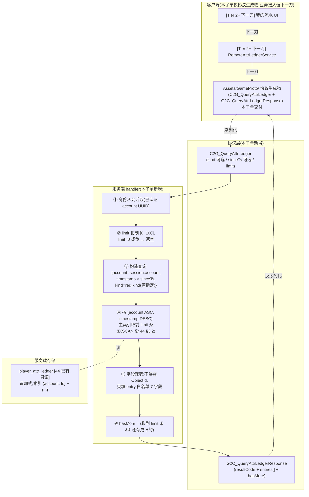
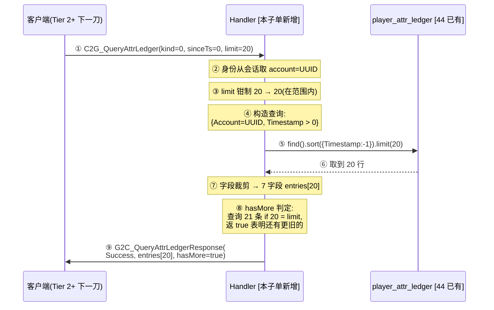
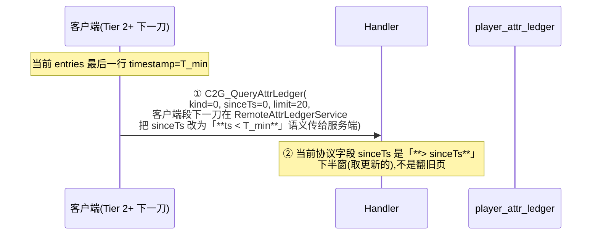
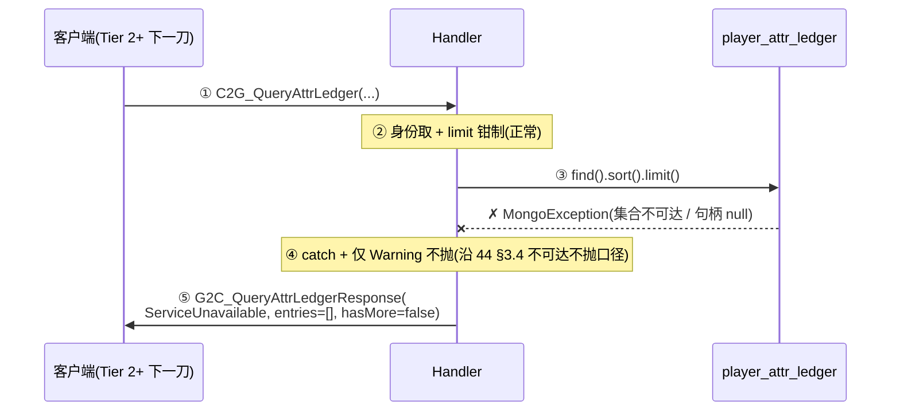

# 玩家属性 ledger 查询协议(Tier 2 第 3 子单 · server 段 + 客户端协议生成物)

> 本子单兑现 [44 §6.2 接口余量声明](#44-player-attr-ledger::tier-next) 的「客户端我的流水 UI + 拉流水 RPC」**协议契约 + 服务端 handler + 客户端协议生成物**三件交付;**客户端业务接入(RemoteAttrLedgerService + 我的流水 UI)留下一刀**。本子单是 Tier 2 玩家属性权威体系第 3 子单的**协议先行刀**,服务端段(协议 + handler + 索引读)落地,客户端协议生成物两端共识,但客户端不接业务代码、不投放 UI。

**读前必看 · 五条边界**

- **本子单是查询协议 + handler 先行刀,不接客户端业务、不投放 UI。** 服务端落 `C2G_QueryAttrLedger` + `G2C_QueryAttrLedgerResponse` 两条协议 + handler(读 `player_attr_ledger` 集合)+ 客户端 `Assets/GameProto/` 生成物同步;**客户端不接** `RemoteAttrLedgerService` 业务调用、**不投放** UI(我的流水窗口),都留 Tier 2+ 客户端段后续刀。可观测验收 = 服务端真往返(起服 + 直接发协议 + 拿响应核数据)+ 客户端工程 protoc 重生成后编译过。
- **承接 44 §6.2 「Tier 2+ 接口余量声明」原文。** 协议名 `C2G_QueryAttrLedger(kind?, sinceTs?, limit)` + `G2C_AttrLedgerResponse(entries[])` 与 44 §6.2 一字不差;handler 按 (account, timestamp DESC) 主索引取前 limit 条,与 44 §3.2 索引设计一致;source 字段用整数枚举码 (= 44 §3.3 已登记的 10 个值),客户端解析为人类可读由客户端段下一刀做。
- **只读集合,不动既有写入路径。** 本子单**不动** `player_attr_ledger` 集合 schema、**不动**索引、**不动** 44 旁路写挂钩、**不动** 37 通用变更入口的 ChangeProperty 行为、**不动**客户端 38 PlayerAttrService 接线点。新增**仅限**协议两条 + handler 一处 + 客户端协议生成物。
- **身份从会话取,客户端不自报 account。** 沿 [30](#30-redeem-code-server) / [31](#31-rank-server) / [32](#32-mail-server) / [37](#37-player-attr-server) / [44](#44-player-attr-ledger) 已确立的同口径:玩家身份是会话属性、非请求参数;客户端**不**把 account UUID 当请求字段发(否则可拉他人 ledger)。
- **本机 MongoDB(`D:\mongodb-portable`,127.0.0.1:27017)必备。** 真往返查 ledger 类 SV 在不可达时判 BLOCKED 非 FAIL(沿 [44 §7.2](#44-player-attr-ledger::bloked-list) + memory `local-mongodb-for-server-roundtrip` + server-test memory `feedback-blocked-vs-fail`)。编译 / Code Review / 客户端协议生成物编译过(SV1 / SV13 / CV1)照常验。

**立项信息**

| 项 | 内容 |
| --- | --- |
| **类型** | 全栈特性 · Tier 2 玩家属性权威体系第 3 子单 · **server 段 + 客户端协议生成物**(纯查询通路,无业务接入,无 UI 投放)。出 code-free 协议契约 + 行为级 handler 语义 + 行为级验收点,交服务端段(handler + 索引读)落地,客户端段同步 protoc 生成物(不接业务)。 |
| **方向约束** | 离线还原 · **去变现**:查询通路是 44 ledger 写入侧的读取面,供未来「我的流水」UI、客服查账(运营经协议查而非 mongo shell 直读)、反作弊溯源(运营按 source 聚合查异常账号)铺协议地基;本子单不含付费 / 充值流水。加法式:新建两条协议 + handler,既有 30 / 31 / 32 / 33 / 35 / 37 / 38 / 39 / 40 / 43 / 44 服务端 + 客户端段零行为变化,既有集合 schema 零迁移。 |
| **需求降层** | **a. 表层要求**(boss brief):按 44 §6.2 落地查询侧——新协议 `C2G_QueryAttrLedger` + `G2C_QueryAttrLedgerResponse`,服务端 handler 读 `player_attr_ledger` 集合 (account, timestamp DESC) 主索引取前 limit 条,支持过滤 kind + sinceTs;客户端段 RemoteAttrLedgerService + 我的流水 UI 留下一刀(本子单 server 段为先行,**包客户端协议生成物但不接业务代码**)。 **b. 底层目的**:① **协议契约先行**——把 44 §6.2 已声明的接口余量从「设计意图」推进到「服务端可调」,Tier 2+ 客户端段刀可基于真实 handler 调试 RemoteAttrLedgerService 而非 stub;② **客户端协议生成物两端共识**——避免 Tier 2+ 客户端段开工时再发现协议字段冲突致 server 段返工(沿 32 邮件 server 段先行同范式,5d0d28e4 邮件协议生成物 + d52dbdd6 排行榜协议生成物先例);③ **服务端 handler 独立可测**——读路径与写路径正交(44 已守住写入完整性 + 索引可用,本子单守住读路径的过滤 + 分页 + 上限语义),server-test 可直接发协议真往返核语义。 **c. 有无更直达 b 的做法**:b 的本质 = 「让查询通路从『纸面接口余量』变成『服务端可发可调的真实协议』,但不强求客户端段同步投放 UI」。**直达做法 = 服务端段先行(协议 + handler + 客户端生成物同步)+ 客户端业务接入与 UI 投放分两刀**(沿 32 / 33 服务端先行 + 客户端段后续同范式)。**备选(已否)**:(1) **客户端段同步投放我的流水 UI** —— UI 需美术稿(塔罗素材无 ledger 流水图、用户提供的 20 屏效果图无此屏),且数据层 RemoteAttrLedgerService 需 LocalAttrLedgerSource 离线降级源(沿 22 RankService 同范式),与查询通路的协议正确性是正交问题,合刀只放大回归面;(2) **不出客户端协议生成物,只留服务端可调** —— Tier 2+ 客户端段开工时若发现协议字段冲突,server 段需返工(违简报「包客户端协议生成物」硬约束);(3) **协议字段升级为客户端不可见枚举** —— 字符串 source 协议字段会让客户端段 RemoteAttrLedgerService 自维护 source ↔ 文本映射表(违 44 §3.3 决策「source 集中映射在服务端」)。无更优解,按表层「server 段 + 客户端协议生成物双件」实现。 |
| **范围(产品 · 玩法)** | **服务端新增**:① 协议 `C2G_QueryAttrLedger`(请求:kind 可选 / sinceTs 可选默认 0 / limit) + `G2C_QueryAttrLedgerResponse`(响应:resultCode + entries[] + hasMore);② handler(身份从会话取 + 按 (account, timestamp DESC) 主索引取前 limit 条 + kind 过滤 + sinceTs 滑动窗口 + limit 上限钳制 + 返回字段裁剪不暴露 ObjectId);③ 错误码集(账号无效 / 查询参数非法 / 服务不可用 / 成功)。 **客户端新增**:仅**协议生成物**(`Assets/GameProto/` 下两条协议的 cs 类、由 protoc / Fantasy 源生成器产出,**不**新增业务代码 RemoteAttrLedgerService / 我的流水 UI / 查询触发点)。 **服务端不动**:`player_attr_ledger` 集合 schema 与索引(44 已建)、44 ledger 旁路写挂钩、37 通用变更入口、35 / 38 任何既有契约。 **协议**:**两条新协议**(C2G + G2C 各一,沿 32 邮件 server 段同口径)。 **客户端业务 UI 零改**(`Assets/GameScripts/HotFix/` git diff 空,沿 32 server 段先行同范式)。 |
| **关键约束** | ① 服务端 handler 只**读**集合,**永不**写 / update / delete(沿 44 §5.4「ledger 永不 update / delete」追加式 invariant);② 查询身份从会话取,**客户端不自报** account(防拉他人 ledger);③ limit 须服务端钳制上限(防 DOS:单次拉超过几百行致网络包过大 + 索引扫描过深),默认上限 100;④ 不暴露内部 ObjectId 给客户端(沿 32 / 33 不暴露内部 id 范式 + conventions「不投机性暴露未来用不上的接口」);⑤ source 字段用**整数枚举码**(= 44 §3.3 登记表,客户端按整数解析),与服务端 `AttrChangeSource` 枚举同源(客户端段下一刀解析为人类可读文本);⑥ 协议字段命名 / 消息名由服务端段按 Fantasy.Net 约定定,本稿写**行为语义**(沿 [32 §三](#32-mail-server::protocol) / [33 §三](#33-rank-settle-server) 同口径)。 |

## 一、前后端职责切分 {#split}

查询通路按「服务端权威 + 客户端只读」一刀切清:**凡涉及『某账号有哪些 ledger 行、按时间序、过滤后取哪些』的存储与计算全在服务端;凡触发查询(玩家打开我的流水)与展示(列表渲染)在客户端**——但本子单**只交付服务端 + 协议生成物**,客户端业务调用与展示留下一刀。

| 环节 | 归属 | 本子单是否交付 |
| --- | --- | --- |
| 玩家触发查询(打开我的流水按钮) | **客户端** 表现 | **不交付**(Tier 2+ 客户端段:UI 投放 + 按钮接线) |
| 查询请求发起 | **客户端** 表现 | **不交付**(Tier 2+ 客户端段:RemoteAttrLedgerService 业务代码) |
| 协议序列化(C2G_QueryAttrLedger 生成物) | **客户端 + 服务端两端共识** | **交付**(本子单:两端 protoc 生成物同源) |
| 身份取(从会话已认证设备账号取) | **服务端**(权威) | **交付**(handler 内,沿 37 / 38 / 44 同范式) |
| 索引读(account, timestamp DESC) | **服务端**(权威) | **交付**(handler 内,直接命中 44 §3.2 主索引) |
| kind 过滤 + sinceTs 滑动窗口 | **服务端**(权威) | **交付**(handler 内,行为见 [§3.2](#45-player-attr-ledger-query::handler)) |
| limit 上限钳制 | **服务端**(权威) | **交付**(handler 内,防 DOS) |
| 返回字段裁剪(不暴露 ObjectId) | **服务端**(权威) | **交付**(handler 序列化时只填白名单字段) |
| 协议响应解析(G2C_QueryAttrLedgerResponse 生成物) | **客户端 + 服务端两端共识** | **交付**(本子单:两端 protoc 生成物同源) |
| 数据源 RemoteAttrLedgerService(切真实 RPC) | **客户端** 表现 | **交付 · 46 客户端段已落**(`IAttrLedgerSource` 接缝 + `RemoteAttrLedgerSource` 经 `FantasyNetwork.Session` 发协议 + `RemoteAttrLedgerService` 编排层挂 `GameContext.AttrLedger`,详见 [46](#46-player-attr-ledger-client)) |
| 我的流水 UI 投放(列表行 / 过滤栏 / 分页) | **客户端** 表现 | **交付 · 46 客户端段已落**(独立窗 `PlayerAttrLedgerWindow` 沿 28 排行榜窗范式 + 过滤栏四档 tab + 列表行四列 + 入口按钮挂 PlayerInfoWindow 改名面板下方;翻旧页留 Tier 2+ 协议加 `untilTs` 字段) |
| source 整数 → 文本映射 | **客户端** 表现 | **交付 · 46 客户端段已落**(硬编码 switch 中文 10 档 + default「其他」;i18n 留 46 O5 Tier 2+) |

> [!NOTE]
> **为什么本子单只交付协议 + handler,客户端业务接入与 UI 投放留下一刀?**
>
> 沿 32 邮件 server 段先行 + 33 排行榜结算 server 段先行 + 44 ledger 写入 server 段先行的范式:**「协议契约确立 + 服务端可调」是查询通路的根**,客户端段是其上层表现 + 数据流编排,合刀只放大回归面(美术 + 数据源切换 + UI 窗口 + 业务调用 + 协议契约一起改,任一处出错 server 段都得返工)。分两刀的取舍:server 段先行守住「协议契约 + 服务端语义」可单独验真往返,客户端段开工时基于已 PASS 的协议接业务,不会有协议层面的返工面。

## 二、系统模型 {#model}

三方参与:**客户端**(协议生成物在场,业务调用留下一刀)→ **协议层**(C2G_QueryAttrLedger / G2C_QueryAttrLedgerResponse 两条)→ **服务端 handler**(身份取 + 索引读 + 过滤 + 钳制 + 字段裁剪)→ **服务端存储**(`player_attr_ledger` 集合,44 已建)。

> [!NOTE]
> **为什么 handler 钳制 limit 上限而非依赖客户端守约?**
>
> 客户端可被改、协议字段可被伪造大值(典型攻击 `limit=999999999` 致服务端扫几百万行 + 返回包过大 → 服务端 OOM / 网络阻塞)。服务端**必须**钳制上限(典型 100,可配置)。客户端正常使用上限远低于此(我的流水首屏 20-50 行,翻页加载 50 行/次)。

## 三、行为级协议契约 {#protocol}

两条协议:**查询 ledger 请求 / 响应**。用**行为语言**描述携带项与语义,服务端段据此定协议消息名 / 字段代码名(沿 Fantasy.Net 约定,本稿不写)。客户端段须按同一契约接收。

### 3.1 查询请求 · `C2G_QueryAttrLedger` {#request}

| 携带项 | 行为语义 | 约束 | 默认值 |
| --- | --- | --- | --- |
| kind(属性种类过滤) | 可选——若指定则只返该 kind 的 ledger 行(如「只查钻石变化」),不指定则返所有 kind | 整数枚举(= 37 `PropertyType`,Coin=1 / Diamond=2 / Stamina=3);0 = 不过滤(返所有 kind);未知 kind 整数返「参数非法」错码 | 0(不过滤) |
| sinceTs(时间下界) | 可选——只返 timestamp > sinceTs 的行(用于滑动窗口翻页:首屏 sinceTs=0 拿最新,翻下一页传当前结果集中最早一行的 timestamp - 1ms) | 应用端 ms UTC(= 44 §3.1 timestamp 字段同源);0 = 不过滤(返所有 ts,等价从最新开始);负数返「参数非法」错码 | 0(从最新开始) |
| limit(单次最多返回行数) | 必填——服务端钳制到 [0, 100];limit=0 返空 entries[] + hasMore=false;limit > 100 钳制为 100 + 正常返(**不**返错码,客户端不需要知道服务端上限) | 整数 [0, 100];超上限钳制不报错(降级语义) | 必填(本子单不设默认,客户端段下一刀按 UI 节奏定) |
| 玩家身份 | **不作为请求字段**:服务端从当前联网会话已认证的设备账号取 | 沿 [37 §3.3.1](#37-player-attr-server::protocol) / [44](#44-player-attr-ledger) 同口径,客户端**不**自报 account UUID(否则可拉他人 ledger) | (无) |

### 3.2 响应 · `G2C_QueryAttrLedgerResponse` {#response}

响应是一个**结果码 + entries[] + hasMore**(便于客户端段下一刀做翻页 UI 状态)。

| 携带项 | 行为语义 | 约束 |
| --- | --- | --- |
| resultCode | 结果码(见 [§3.3](#45-player-attr-ledger-query::error)) | 整数枚举 |
| entries[] | 按 (account, timestamp DESC) 索引取出的 ledger 行白名单字段,**按 timestamp DESC**(最新在前)排;若 limit=0 / 账号无 ledger 返空数组 | 行数 ∈ [0, min(limit, 100)] |
| hasMore | 是否还有更旧的行(供客户端段翻页 UI 显示「加载更多」按钮) | 布尔;true = (取到 limit 条 && 存在比当前最后一行 timestamp 更早的行);false = 取空 / 取不满 limit |

**entry 行字段**(白名单 7 个,**不**含内部 ObjectId,沿 32 / 33 不暴露内部 id 范式):

| 字段 | 来源 44 schema | 含义 |
| --- | --- | --- |
| timestamp | 44 §3.1 `Timestamp` 应用端 ms UTC | 该笔变更的应用端时刻 |
| kind | 44 §3.1 `Kind` 整数枚举 | 属性种类(Coin / Diamond / Stamina) |
| balanceBefore | 44 §3.1 `BalanceBefore` 非负整数 | 变更前余额 |
| balanceAfter | 44 §3.1 `BalanceAfter` 非负整数 | 变更后余额 |
| delta | 44 §3.1 `Delta` 有符号整数 | 相对变更量 |
| source | 44 §3.1 `Source` 整数枚举 | source 枚举码(0=Unknown / 1=ChangeNameSpend / 2=MailClaim / ...,客户端段下一刀解析为人类可读文本) |
| reasonRaw | 44 §3.1 `ReasonRaw` 字符串 | 调用方传入的原 reason(便于运营查 ad-hoc 子分类如 mailId / codeId / rankIdx) |

**不**返回的字段(沿 44 守不变量 + 「不投机暴露未来用不上」):

- `_id`(MongoDB ObjectId)—— 内部主键,客户端无需用(滑动窗口靠 timestamp,不靠 cursor);Tier 2+ 若加 cursor 分页再返(O7)
- `SchemaVersion`(44 §3.1)—— 内部演进字段,客户端无需感知
- `account`(冗余于会话)—— 客户端自己知道自己是谁,服务端返回反而是噪音

### 3.3 错误码集 {#error}

| 结果码 | 触发 | 客户端段下一刀行为 |
| --- | --- | --- |
| Success(=0) | 查询成功(含返空数组的成功:limit=0 / 账号无 ledger / 过滤后无匹配,均是 Success + entries=[]) | 正常渲染 entries[] |
| InvalidRequest(=1) | 参数非法(kind 整数未知 / sinceTs 负数 / limit 负数);**不**包含 limit 超 100(那是钳制不是错) | 客户端段下一刀按提示文案兜底(本子单不投放) |
| ServiceUnavailable(=2) | MongoDB 不可达(Players 集合不可达时 37 已返此,本子单 ledger 集合不可达走同码) | 客户端段下一刀:不本地回退 ledger(无 ledger 可回退,本机无审计副本),提示「暂时不可用」 |

> [!NOTE]
> **为什么不设「账号无效」错码?**
>
> 身份从会话取(§3.1)——会话已认证才能发协议,认证失败在协议进入 handler 前已被 Fantasy.Net 网关拦截(沿 37 / 38 / 44 同范式)。handler 内部不会出现「会话有效但 account 无效」的状态,故不预留此码。

## 四、变更时序 {#flow}

### 4.1 首屏拉前 20 条最新 ledger(典型用例)

### 4.2 翻页拉下 20 条(滑动窗口)

> [!WARNING]
> **本子单 sinceTs 语义 = 「ts > sinceTs」上界过滤,不是翻旧页 cursor。**
>
> 这是「保留最新优先 + 增量同步」语义(典型场景:客户端缓存了部分流水,只想拉 sinceTs 后的新增行)。**翻旧页(拿更早的行)需要相反语义 `ts < cursor` 或 offset 分页**,本子单**不**支持——留 Tier 2+ 客户端段下一刀按 UI 实际需要扩(典型方案 = 加 `untilTs` 字段表示 `ts < untilTs` 上界,或加 offset 字段,沿 32 邮件 server 段同范式留接口余量,O3)。

> [!NOTE]
> **为什么本子单只做 sinceTs > 滑动窗口,不做 untilTs 翻旧页?**
>
> 取舍:① **核心查询模式 = 增量同步**(「自上次刷新以来有什么新变化」),sinceTs > 直达;② Tier 2+ 客户端段下一刀若做「我的流水首屏 + 加载更多」UI,可在协议加 `untilTs` 字段(增量字段,不破协议兼容)或客户端段把首屏拿到的最后一条 timestamp 作为下次请求的 `untilTs`——本子单**预留**此扩展点(协议字段命名时若 server-dev 用 `sinceTs` 而非 `afterTs`,语义自洽);③ **服务端 handler 当前只读「ts > sinceTs」**,Tier 2+ 加 untilTs 时 handler 也只需加一个 AND 条件,不破既有语义。

### 4.3 ServiceUnavailable 失败路径(MongoDB 不可达)

## 五、整局走查与崩法 {#walk}

把本子单的查询通路在「**首次拉取 / 频繁拉取 / 大 limit / kind 未知值 / sinceTs 边界值 / 并发同账号双拉 / MongoDB 抖动 / 身份冒充**」八类场景下走一遍,每个机制点出最可能炸的那类 + 对策:

### 5.1 协议字段相关崩法

| 崩法 | 后果 | 对策 |
| --- | --- | --- |
| 客户端传 `limit=999999999`(典型 DOS) → 服务端扫整集合 + 返回包几百 MB | 服务端 CPU / 内存爆 + 网络阻塞 + 该账号查询返超时 | **handler 钳制 limit ∈ [0, 100]**(`Math.Min(req.Limit, 100)`),钳制不报错(降级语义);SV4 验「limit=999999999 → 实际返 100 行 + Success」 |
| 客户端传 `kind=99`(未知 PropertyType 整数) → handler 构造查询 `{Kind: 99}` 返空 | 玩家看到空列表,误以为「我从没动过钻石」 | **kind 整数白名单校验**:0 / 1 / 2 / 3 之外返 `InvalidRequest`;SV5 验「kind=99 → InvalidRequest」 |
| 客户端传 `sinceTs=-100`(负数) → handler 构造查询 `{Timestamp > -100}` 等价无过滤 | 行为「等价无过滤」语义不清晰,客户端段下一刀可能误以为「我能传负数当 cursor」 | **sinceTs 整数校验 >= 0**;SV6 验「sinceTs=-100 → InvalidRequest」 |
| 客户端伪造协议字段加 account UUID = 他人 → 拉他人 ledger | 隐私泄露 + 反作弊溯源源破 | **身份从会话取**(handler 忽略请求中任何 account 字段,沿 37 / 44 同范式);SV7 验「会话 account=A 但请求中夹带 account=B → 仍返 A 的 ledger」(若协议字段无 account,直接由 Fantasy.Net 拒包) |

### 5.2 服务端 handler 相关崩法

| 崩法 | 后果 | 对策 |
| --- | --- | --- |
| handler 用 `findOneAndUpdate / updateOne / deleteOne` 误操作 `player_attr_ledger` 集合 | ledger 追加式 invariant 破 + 审计完整性破(沿 44 §5.4) | **handler 只用 `Find` 系列只读 API**,Code Review 拦其他写 API;SV13 grep handler 全文无写操作 |
| handler 返字段含 ObjectId / SchemaVersion → 客户端可见内部字段 | 协议契约泄露内部演进字段 + Tier 2+ 删字段时破客户端兼容 | **handler 序列化时只填白名单 7 字段**(§3.2 表),Code Review 拦其他字段;SV8 验响应包字段集 = 白名单 |
| handler 不命中索引,走全表扫(典型实现 bug:查询条件字段顺序错 / 索引名漂移) | 查询延时拉长 + 高频拉拖累整服 | **handler 显式按 (Account, Timestamp DESC) 排序**(确保命中 44 §3.2 `ix_account_ts_desc`);SV9 验 `explain()` 看到 `IXSCAN` 用 `ix_account_ts_desc`(不是 `COLLSCAN`) |
| handler 在 MongoDB 抖动时抛异常致连接断 | 客户端段下一刀 RPC 路径断,玩家可能被踢线 | **handler catch MongoException 返 ServiceUnavailable**(沿 32 / 44 同口径,不抛);SV10 验「Mongo 句柄设 null 模拟 → handler 返 ServiceUnavailable + entries=[]」 |

### 5.3 并发 / 性能崩法

| 崩法 | 后果 | 对策 |
| --- | --- | --- |
| 同账号高频拉(典型刷红点 / 用户连点) → 服务端短时间内大量重复 IXSCAN | 索引压力 + 数据库连接池占用 | 索引设计可支撑(44 §3.2 主索引前缀覆盖,每次扫前 100 条 = 微秒级);**handler 不缓存查询结果**(实时性优先,查询结果即变即取),Tier 2+ 客户端段下一刀按 UI 节奏限频(典型 2s 一次);本子单不做服务端限频(过早优化) |
| 多账号并发拉(典型多玩家在线) | 服务端读 IO 放大 | (account, timestamp) 索引天然按账号隔离;实测 MongoDB 单实例可支撑数万 QPS 读;Tier 2+ 真上量再评估 |
| 单账号 ledger 超大(数万行) | sinceTs=0 + limit=100 时仍 IXSCAN 前 100 条无压力;若客户端段下一刀做「全量导出」类操作可能要拉几十轮 | **本子单 limit 上限 100 死守**;Tier 2+ 若加「全量导出 / BI 分析」类需求另开通路(典型 = 服务端导 CSV + 邮件附件下发,不走实时 RPC) |

### 5.4 诚实边界(本子单守住什么、不守什么) {#honest-edge}

本子单**守住**:
- 协议契约两端共识(`C2G_QueryAttrLedger` + `G2C_QueryAttrLedgerResponse` 双端生成物同源)
- 服务端 handler 只读 ledger 集合,不写不改不删(沿 44 §5.4 追加式 invariant)
- 身份从会话取(防拉他人 ledger)
- limit 上限钳制 100(防 DOS)
- kind 白名单校验(防客户端传未知值致误判空)
- sinceTs 非负校验(防客户端用负数当 cursor)
- 字段裁剪 7 字段(不暴露 ObjectId / SchemaVersion / account)
- 索引命中(IXSCAN 用 44 §3.2 主索引)
- MongoDB 不可达返 ServiceUnavailable 不抛(沿 32 / 44 不可达不抛口径)

本子单**不守**:
- **翻旧页 / cursor 分页**:协议字段 sinceTs 是「> 上界」语义,不是「< 下界」翻旧页;Tier 2+ 客户端段下一刀按 UI 需要扩 `untilTs` / `offset` / `cursor` 任一(O3)
- **客户端业务接入**:`RemoteAttrLedgerService` / 我的流水 UI / source 文本映射 = **46 客户端段已交付**(详见 [46](#46-player-attr-ledger-client))
- **source 整数 → 文本映射**:**46 已交付**(硬编码 switch 中文 10 档,详见 [46 §3.4](#46-player-attr-ledger-client::source-text))
- **客户端缓存 / 离线降级源**:无网络时 RemoteAttrLedgerService 不本地回退 ledger(本机无审计副本,与排行榜「断服回退本地源」语义不同——审计完整性是服务端独占,客户端不应有第二份)
- **运营查询 / 客服后台 GM**:运营仍经 mongo shell / Compass 直读(沿 44 §5.4「不守」),本子单不开「运营经此协议查」入口(身份取的是玩家会话,运营无玩家会话)
- **退款 / 反作弊 / BI 聚合查询**:沿 44 §5.4「不守」继续不做(Tier 2+)
- **跨进程协议路由**:单服务端进程内查 ledger,多进程时不强求(沿 44 同口径)
- **协议层加密 / 签名**:沿用 Fantasy.Net 既有连接层加密(协议层不额外加签)

## 六、与既有稿关系 + Tier 2+ 接口余量 {#tier2plus}

### 6.1 与既有设计稿的关系 {#existing-relation}

| 既有稿 | 关系 | 本子单是否改写 |
| --- | --- | --- |
| [44 玩家属性 ledger(Tier 2 第 2 子单 · server)](#44-player-attr-ledger) | **本子单的基础**:读 44 已建的 `player_attr_ledger` 集合 + 已建索引(44 §3.2)+ 已登记 source 枚举(44 §3.3) | **同任务内同步**:覆盖式重写以下三处(详 [§6.3 同步重写清单](#45-player-attr-ledger-query::sweep))——① §6.2 接口余量表「客户端我的流水 UI + 拉流水 RPC」行从「Tier 2+ 范围」改写为「**45 已交付服务端段 + 协议生成物**;客户端业务接入与 UI 投放留 Tier 2+ 客户端段后续刀」;② §一 切分表「拉流水 / 查历史 / 我的流水 UI」行从「**不做 · Tier 2+**」改写为「**协议契约 + 服务端 handler + 客户端协议生成物 = 45 已交付**;客户端业务接入 + UI 投放留 Tier 2+ 客户端段后续刀」;③ §5.4 不守列表「客户端可查 ledger」行从「**无客户端 RPC、无『我的流水』UI(留 Tier 2+ 客户端段)**」改写为「**45 已交付协议契约 + 服务端 handler + 客户端协议生成物;客户端业务接入(RemoteAttrLedgerService)+ UI 投放留 Tier 2+ 客户端段后续刀**」 |
| [37 玩家属性服务端(Tier 2 第 1 子单)](#37-player-attr-server) | 本子单与 37 正交:37 是属性变更的写入入口(`C2G_PropertyChangeRequest`),本子单是属性变更的查询入口(`C2G_QueryAttrLedger`);两条协议各自独立 | **不改**。37 协议契约 / handler / players 集合 schema 零变化 |
| [38 玩家属性客户端(Tier 2 第 2 子单 · client)](#38-player-attr-client) | 本子单与 38 正交:38 是属性变更的客户端写入业务(PlayerAttrService.TryRename),本子单是属性变更的客户端查询业务**未来**的协议地基(本子单不接业务)| **不改**。38 客户端业务 / PlayerAttrService API 零变化 |
| [30 兑换码服务端化](#30-redeem-code-server) / [31 排行榜服务端化](#31-rank-server) / [32 邮件服务端化](#32-mail-server) / [33 排行榜结算服务端化](#33-rank-settle-server) / [35 账号服务端](#35-account-server) / [39](#39-activity-server) / [40](#40-event-unlock-relay) / [43](#43-activity-login-batch) | 本子单与这些全栈刀正交:它们是属性变更的**触发源**(各自 reason 字符串经 44 §3.3 映射为 source 枚举写 ledger),本子单只读已写好的 ledger | **不改**。这些刀协议 / handler / 业务行为零变化 |
| [42 tarot HUD 三属性绑定(Tier 2 第 3 子单 · client HUD)](#42-tarot-hud-player-attr-bind) | 命名重叠提醒:42 也叫「Tier 2 第 3 子单 · client HUD」,本子单也是「Tier 2 第 3 子单」(server 段 + 协议生成物)——这是 Tier 2 第 3 子单的**两条并行刀**,各管各的(42 是 HUD 绑定既有 38 PlayerAttrService 数据层、本子单是查询通路 server 段),不互相依赖 | **不改**。42 HUD 绑定行为零变化 |

### 6.2 Tier 2+ 接口余量声明 {#tier-next}

| Tier 2+ 目标 | 在本子单 `C2G_QueryAttrLedger` 协议 + handler 上的演进 |
| --- | --- |
| 客户端业务接入(`RemoteAttrLedgerService`) | **46 已交付**:`IAttrLedgerSource` 接缝(沿 32 `IRemoteMailSource` 范式)+ `RemoteAttrLedgerSource` 生产实现(经 `FantasyNetwork.Session` 发协议)+ `RemoteAttrLedgerService` 编排层(挂 `GameContext.AttrLedger`)+ POCO `AttrLedgerEntry / AttrLedgerPage` + 客户端错误码 `AttrLedgerQueryCode`(4 档,加 `NetworkDown` 区分服务端不可用与客户端断网);**不**持本地副本(沿 44 §5.4 服务端独占)。详见 [46](#46-player-attr-ledger-client) |
| 客户端「我的流水」UI 投放 | **46 已交付**:独立窗 `PlayerAttrLedgerWindow`(沿 28 排行榜窗范式,过滤栏全/金/钻/体四档 tab + 列表行四列时间/属性图标/delta/source/余额变化 + 加载更多按钮置灰提示「翻旧页 Tier 2+」 + 关闭按钮 + 状态栏错误兜底);入口按钮挂 PlayerInfoWindow 改名面板下方;属性图标复用 42 §三 占位(Coin → gemstone / Diamond → gemstone2 / Stamina → potion);默认首屏 50 条。详见 [46](#46-player-attr-ledger-client) |
| source 整数 → 人类可读文本映射 | **46 已交付**:硬编码 switch 中文文案(10 档覆盖 44 §3.3:Unknown 其他 / ChangeNameSpend 改名扣钻 / MailClaim 邮件领奖 / RedeemCode 兑换码 / RankSettleReward 排行榜奖励 / ActivityReward 活动奖励 / GameplayConsume 玩法消费 / ShopPurchase 商店购买 / AdminGrant 管理员发放 / Refund 退款),default 「其他」降级;i18n 留 46 O5(Tier 2+ 上 Luban i18n 表再迁)。详见 [46](#46-player-attr-ledger-client) |
| 翻旧页 / cursor 分页 | 协议字段加 `untilTs`(`ts < untilTs` 上界过滤)或 `offset`(skip 跳过 N 行);handler 按 `Find().Skip(offset).Limit(limit)` 实现;Tier 2+ 按 UI 实际需求决定哪种方案 |
| kind 多选过滤 | 协议字段 `kind` 升级为 repeated / List(允许同时查多种 kind);handler 按 `{ Kind: { $in: kinds } }` 实现 |
| source 过滤 | 协议字段加 `source`(整数枚举码,可选);handler 按 `{ Source: source }` 加入查询;**注意**:source 索引未建(44 §3.2 决策低基数无需),全表扫低频可接受,高频则补三键复合索引 |
| 时间范围过滤(beforeTs + afterTs 双端) | 协议字段加 `beforeTs / afterTs`;handler 按 `{ Timestamp: { $gt: afterTs, $lt: beforeTs } }` 实现 |
| 客服后台 GM | 沿 44 §6.2:运营仍经 mongo shell / Compass 直读,本子单不开运营协议入口(身份取的是玩家会话) |
| 全量导出 / BI 分析 | 沿 44 §6.2:导 CSV + 邮件附件下发,不走实时 RPC |
| 退款 / 反作弊 / 跨进程 | 沿 44 §6.2 继续 Tier 2+ |

### 6.3 同步重写清单(本任务内须完成的他篇覆盖式重写,sweep 范围闭合) {#sweep}

按 conventions §6「同任务内同步重写不留漂移窗口」:

- **44 §6.2 接口余量表**「客户端我的流水 UI + 拉流水 RPC」行 演进列覆盖式重写为「**45 已交付**服务端段(协议 `C2G_QueryAttrLedger` + `G2C_QueryAttrLedgerResponse` + handler 读 (account, timestamp DESC) 主索引)+ 客户端协议生成物(`Assets/GameProto/` 同步);客户端业务接入(RemoteAttrLedgerService)+ UI 投放留 Tier 2+ 客户端段后续刀」
- **44 §一 切分表**「拉流水 / 查历史 / 我的流水 UI」行 归属列从「**不做 · Tier 2+**」覆盖式重写为「**协议契约 + 服务端 handler + 客户端协议生成物 = 服务端 · 45 已交付**;客户端业务接入 + UI 投放 = 不做 · Tier 2+ 客户端段后续刀」
- **44 §5.4 不守列表**「客户端可查 ledger」行覆盖式重写为「**45 已交付**协议契约 + 服务端 handler + 客户端协议生成物;客户端业务接入(RemoteAttrLedgerService)+ UI 投放(我的流水窗口)留 Tier 2+ 客户端段后续刀」
- **44 §7.2 BLOCKED 列表**「客户端我的流水 UI / 拉流水 RPC」行覆盖式重写为「**45 已交付**协议契约 + 服务端 handler + 客户端协议生成物(本子单);客户端业务接入(RemoteAttrLedgerService)+ UI 投放(我的流水窗口)留 Tier 2+ 客户端段后续刀」
- **`design-docs/assets/nav.js` GROUPS**:在「全栈 / 服务端」组的 44 / 38 / 36 / 43 / 41 / 40 / 39 / 33 序列里加 45 入口(href `45-player-attr-ledger-query.html`,位置在 44 之后 38 之前 — Tier 2 server 段集中显示);tag / title / desc 详尽度沿 32 / 33 / 44 同口径
- **`design-docs/index.html`**:`?v=9` → `?v=10` 递增防缓存

## 七、验收点 {#accept}

服务端段全部由 server-test 跑;客户端段只验协议生成物编译过 + git diff 限定在 `Assets/GameProto/`(本子单零客户端业务接入)。

### 7.1 服务端段验收(SV)

| # | 验收点 | 完成定义(行为可观测) |
| --- | --- | --- |
| SV1 | 服务端编译通过 + 源生成器产物 | 服务端工程(fantasy-net)`dotnet build` 0 error;新增两条协议(C2G_QueryAttrLedger + G2C_QueryAttrLedgerResponse)经 Fantasy 源生成器产出 cs 类(server-dev 据 Fantasy.Net 既有约定核生成物路径) |
| SV2 | handler 注册 | 服务端启动后 handler 注册到 RPC 路由(沿 37 / 38 / 44 同范式);发 C2G_QueryAttrLedger 不返「无 handler」类网关错 |
| SV3 | Success + 返空(账号无 ledger) | 全新 UUID 钻石 / 金币 / 体力都 0,从未触发任何属性变更 → 发 `C2G_QueryAttrLedger(kind=0, sinceTs=0, limit=20)` → 响应 `{ resultCode=Success, entries=[], hasMore=false }` |
| SV4 | Success + 返非空(账号有 ledger) | UUID 钻石 100,触发 5 笔属性变更(改名扣钻 50 + 进程内 API 调 +5 金币 + +10 金币 + +20 金币 + +5 金币,共 5 行 ledger)→ 发 `C2G_QueryAttrLedger(kind=0, sinceTs=0, limit=20)` → 响应 `{ resultCode=Success, entries=[5 行], hasMore=false }`,entries 按 timestamp DESC(最新在前),每行 7 字段齐(timestamp / kind / balanceBefore / balanceAfter / delta / source / reasonRaw),**不**含 ObjectId / SchemaVersion / account |
| SV5 | limit 钳制上限 100 | 给某 UUID 写 150 行 ledger → 发 `C2G_QueryAttrLedger(kind=0, sinceTs=0, limit=999999999)` → 响应 `{ resultCode=Success, entries=[100 行], hasMore=true }`(limit 被钳到 100 + 还有 50 行未取 → hasMore=true);**不**返错码 |
| SV6 | limit=0 返空 | 发 `C2G_QueryAttrLedger(kind=0, sinceTs=0, limit=0)` → 响应 `{ resultCode=Success, entries=[], hasMore=false }`;**不**报错 |
| SV7 | kind 过滤生效 | 某 UUID 有 5 行 ledger(3 行 Diamond + 2 行 Coin)→ 发 `C2G_QueryAttrLedger(kind=Diamond=2, sinceTs=0, limit=20)` → 响应 entries 仅 3 行 Diamond;再发 `kind=Coin=1` → 响应 entries 仅 2 行 Coin;再发 `kind=0` → 响应 entries 全 5 行 |
| SV8 | kind 未知值返 InvalidRequest | 发 `C2G_QueryAttrLedger(kind=99, sinceTs=0, limit=20)` → 响应 `{ resultCode=InvalidRequest, entries=[], hasMore=false }` |
| SV9 | sinceTs 滑动窗口生效 | 某 UUID 有 10 行 ledger(timestamp 序 T1 < T2 < ... < T10)→ 发 `C2G_QueryAttrLedger(kind=0, sinceTs=T5, limit=20)` → 响应 entries 仅 5 行(T6..T10,按 DESC = T10/T9/T8/T7/T6);**不**含 T5 及更早 |
| SV10 | sinceTs 负数返 InvalidRequest | 发 `C2G_QueryAttrLedger(kind=0, sinceTs=-100, limit=20)` → 响应 `{ resultCode=InvalidRequest }` |
| SV11 | 身份从会话取(防拉他人) | 起 2 个会话:会话 A account=UUID_A(有 3 行 ledger),会话 B account=UUID_B(有 5 行 ledger);用会话 A 发 `C2G_QueryAttrLedger(...)` → 响应 entries 仅 3 行(UUID_A 的);用会话 B 发 → 响应 entries 仅 5 行(UUID_B 的);**不**因协议字段无 account 而互相串(若 server-dev 实现意外加了 account 字段,从会话覆盖,SV12 Code Review 拦) |
| SV12 | MongoDB 不可达 → ServiceUnavailable | 模拟 MongoDB 停服(或 AttrLedger 句柄设 null,沿 44 启动期 null 范式)→ 发 `C2G_QueryAttrLedger(...)` → 响应 `{ resultCode=ServiceUnavailable, entries=[], hasMore=false }`;**不**抛异常致连接断 |
| SV13 | 索引命中(IXSCAN 而非 COLLSCAN) | mongo shell `db.player_attr_ledger.find({Account: UUID, Timestamp: {$gt: 0}}).sort({Timestamp: -1}).limit(20).explain()` → 看到 `IXSCAN` 走 `ix_account_ts_desc`(沿 44 §3.2 主索引,本子单 handler 复用) |
| SV14 | handler 仅只读 ledger 集合 | Code Review grep handler 全文:**无** `InsertOneAsync / UpdateOne / UpdateMany / DeleteOne / DeleteMany / FindOneAndUpdate / FindOneAndDelete` 对 `player_attr_ledger / AttrLedger` 的调用,仅 `Find / FindAsync / Aggregate` 系列读操作 |
| SV15 | 响应字段裁剪(7 字段白名单) | server-test 反序列化 G2C_QueryAttrLedgerResponse 的 entry 行 → 字段集**恰好** 7 个(timestamp / kind / balanceBefore / balanceAfter / delta / source / reasonRaw)+ **无** ObjectId / SchemaVersion / account 字段;不变量逐字段核(balanceAfter = balanceBefore + delta,沿 44 §3.1) |
| SV16 | 既有服务端段零回归 | 30 / 31 / 32 / 33 / 35 / 37 / 39 / 40 / 43 / 44 服务端段已 PASS 的验收点全部仍 PASS;ChangeProperty 行为 / ledger 写入路径行为 / `player_attr_ledger` 集合 schema / 索引零变化(本子单只读) |
| SV17 | hasMore 语义正确 | ① 某 UUID 有 21 行 ledger → 发 `limit=20` → 响应 entries=[20 行] + hasMore=true;② 某 UUID 有 19 行 → 发 `limit=20` → 响应 entries=[19 行] + hasMore=false;③ 某 UUID 有 20 行 → 发 `limit=20` → 响应 entries=[20 行] + hasMore=**false**(取到 limit 条但没有更旧的,边界注意);若实现选「查 limit+1 条判 hasMore」需服务端段在响应序列化时截断,且 hasMore 标记正确 |
| SV18 | Code Review | 服务端段 PR 经 Code Review 通过,重点核:① handler 永不写 ledger 集合(SV14);② handler 身份从会话取,**不**从请求字段取(即使协议字段意外加了 account,handler 覆盖);③ limit 钳制 [0, 100] 不报错;④ kind 整数 0/1/2/3 之外返 InvalidRequest;⑤ sinceTs 负数返 InvalidRequest;⑥ 响应字段裁剪 7 字段白名单(不暴露 ObjectId / SchemaVersion / account);⑦ MongoDB 异常 catch 返 ServiceUnavailable 不抛;⑧ 索引命中 ix_account_ts_desc(SV13);⑨ MongoDB 连接配置沿用工程现有(Scene.World.Database,同 Players / AttrLedger 范式);⑩ 不手改 protoc / Fantasy 源生成器产物(协议两条由源生成器产出) |

### 7.2 客户端段验收(CV)— 仅协议生成物 {#cv}

| # | 验收点 | 完成定义 |
| --- | --- | --- |
| CV1 | 客户端协议生成物存在 + 编译过 | `Assets/GameProto/` 含两条新协议的 cs 生成物(`C2G_QueryAttrLedger.cs` + `G2C_QueryAttrLedgerResponse.cs` 或同义命名,按 Fantasy 源生成器约定);Unity 编辑器 / Player 编译 0 error;**仅**新增协议生成物两文件,生成物之外的 `Assets/GameScripts/HotFix/` 业务代码 git diff 空 |
| CV2 | 客户端 git diff 范围 | `git diff --stat UnityProject/Assets/` 仅 `GameProto/` 下新增两文件 + 索引文件(如 `MessageDispatcherSystem.cs` 等源生成器更新文件);`UnityProject/Assets/GameScripts/HotFix/` git diff 空(本子单零业务接入) |
| CV3 | 既有客户端段零回归 | 既有客户端段 EditMode / PlayMode 测试全 pass;38 客户端段 PlayerAttrService / 42 tarot HUD 三属性绑定 / 其他客户端段已 PASS 行为零变化 |

### 7.3 联调段验收(E)— 真往返 {#e}

| # | 验收点 | 完成定义 |
| --- | --- | --- |
| E1 | 真往返:服务端 handler + 客户端协议生成物双端共识 | 起服 + 客户端发起模拟请求(server-test 写测试 client 或直接用 fantasy-net 测试 framework)→ 服务端 handler 处理 → 客户端反序列化响应成功;字段不漂移(发什么收什么);若客户端段下一刀的 RemoteAttrLedgerService 未开工,本验收点用「server-test 框架直接调」等价 |

### 7.4 不在本子单验收 / BLOCKED {#blocked-list}

- **本机 MongoDB(`D:\mongodb-portable`)不可达** → 真往返查 ledger 类 SV(SV3-SV13 / SV17 / E1)判 **BLOCKED 非 FAIL**(沿 [44 §7.2](#44-player-attr-ledger::bloked-list) + memory `local-mongodb-for-server-roundtrip` + server-test memory `feedback-blocked-vs-fail`);编译 / Code Review / 客户端协议生成物编译(SV1 / SV14 / SV16 / SV18 / CV1 / CV2 / CV3)照常验
- **客户端业务接入(`RemoteAttrLedgerService`)** → **46 客户端段已交付**(详见 [46](#46-player-attr-ledger-client))
- **客户端「我的流水」UI 投放** → **46 客户端段已交付**(独立窗 `PlayerAttrLedgerWindow` 沿 28 排行榜窗范式,详见 [46](#46-player-attr-ledger-client))
- **source 整数 → 人类可读文本映射** → **46 客户端段已交付**(硬编码 switch 中文 10 档,详见 [46 §3.4](#46-player-attr-ledger-client::source-text))
- **翻旧页 / cursor 分页** → Tier 2+(扩 untilTs / offset / cursor 字段,见 O3)
- **kind 多选 / source 过滤 / 时间范围过滤** → Tier 2+ 按 UI 实际需求加协议字段(O5 / O6 / O7)
- **客服后台 GM** → 运营经 mongo shell / Compass 直读(沿 44 §5.4 不开运营协议入口)
- **全量导出 / BI 分析** → 沿 44 §6.2 Tier 2+ 走 CSV + 邮件附件

## 八、待拍板清单 {#open}

范围开关,自治授权下**均取安全默认推进**(本设计自治内拍板);列此备查,要改另开增量。

| # | 开关 | 本设计默认 | 备选 / 触发改动 |
| --- | --- | --- | --- |
| O1 | 协议消息名 / 字段代码名 | **服务端段定**(沿 Fantasy.Net / protobuf 约定,plan 不指字面量) | server-dev 据工程现状取(典型 `C2G_QueryAttrLedger` + `G2C_QueryAttrLedgerResponse`,沿 32 邮件 server 段 `C2G_QueryMailListRequest` 同范式) |
| O2 | limit 上限值 | **100**(默认安全值) | 50 / 200(按 UI 实际首屏行数 + 内存预算调) |
| O3 | 翻页方案(本子单仅 sinceTs > 滑动窗口,翻旧页未做) | **不做**(留 Tier 2+ 客户端段下一刀按 UI 实际需求选 untilTs / offset / cursor) | Tier 2+ 选一加入:① `untilTs`(`ts < untilTs`,推荐——索引天然命中);② `offset`(skip N 行,简单但深翻性能差);③ cursor(用 ObjectId 暴露,违本子单「不暴露 ObjectId」决策) |
| O4 | source 整数 → 文本映射 | **客户端段下一刀做**(协议层只传整数,文本由 i18n 或硬编码 switch) | Luban i18n 文本表(典型 `attr_source.xlsx` 加 10 行 textId)或客户端 Dictionary 硬编码 |
| O5 | kind 多选过滤 | **不做**(本子单仅单 kind / 0 不过滤) | Tier 2+ 协议字段升级为 repeated / List |
| O6 | source 过滤 | **不做**(44 §3.2 决策 source 索引未建,低频运营查 ad-hoc 即可) | Tier 2+ 加协议字段 + handler 加 `{ Source: source }` 条件;高频再补 (account, source, timestamp) 三键复合索引 |
| O7 | 时间范围过滤(双端) | **不做**(本子单仅 sinceTs 下界) | Tier 2+ 加 beforeTs + afterTs 双端字段 |
| O8 | 错误码集 | **3 个**(Success / InvalidRequest / ServiceUnavailable) | Tier 2+ 按需细分(典型 RateLimited / NotAuthorized 等,本子单无限频无授权差异,不预留) |
| O9 | 响应是否含查询元信息(本次返多少行 / 总行数预估 / 索引命中名) | **不含**(只返 entries + hasMore) | Tier 2+ 若运营 GM 需统计可加(本子单运营不经此协议,不预留) |
| O10 | 服务端日志:每次查询是否打 Info 日志 | **服务端段定**(按 Fantasy.Net 既有日志范式,plan 不指) | server-dev 据现状取,典型「每 100 次查询打 1 次 Debug 摘要」 |

## 九、风险表 {#risk}

| 风险 | 应对 |
| --- | --- |
| **handler 误用写 API(InsertOne / UpdateOne / DeleteOne)致破 44 追加式 invariant** | §5.4 守不变量 + SV14 + SV18 ①:Code Review grep handler 全文无写 API,只 Find 系列;此风险只在实现 bug 时触发,Code Review 拦 |
| **响应字段含 ObjectId / SchemaVersion / account → 协议契约泄露内部字段 + Tier 2+ 删字段时破客户端兼容** | §3.2 字段裁剪 7 字段白名单 + SV15 + SV18 ⑥:Code Review 核响应字段集恰好 7 个 |
| **limit 不钳制 → DOS** | §3.1 + SV5 + SV18 ③:handler 钳制 [0, 100] 不报错(降级语义) |
| **客户端伪造协议字段加 account → 拉他人 ledger** | §3.1 + SV11 + SV18 ②:身份从会话取,handler 忽略请求字段任何 account;协议字段层面**不**预留 account 字段(server-dev 定协议时核) |
| **kind 未知值 / sinceTs 负数等非法参数 → 返空致误导玩家** | §3.1 + SV8 + SV10 + SV18 ④⑤:白名单校验返 InvalidRequest |
| **MongoDB 抖动 handler 抛异常致连接断** | §3.3 + SV12 + SV18 ⑦:catch MongoException 返 ServiceUnavailable 不抛 |
| **handler 不命中索引走全表扫致性能崩** | §5.2 + SV13 + SV18 ⑧:显式按 (Account, Timestamp DESC) 排序确保命中 44 §3.2 主索引 |
| **客户端协议生成物与服务端协议生成物字段命名漂移致反序列化失败** | 沿 Fantasy 源生成器范式两端同源(同一份 proto 定义产出两端 cs);CV1 + E1 真往返验字段共识 |
| **客户端误把协议生成物当业务代码改(违「零业务接入」红线)** | CV2:`Assets/GameScripts/HotFix/` git diff 空,Code Review 拦业务代码改动 |
| **既有 44 ledger 写入路径行为被本子单挂钩误改** | SV16 + SV18:本子单 handler 是**只读**新通路,完全不动 44 写入挂钩 / 37 ChangeProperty / 38 PlayerAttrService;Code Review 重点核「`PlayerPropertyServiceHelper.ChangeProperty` + `AttrLedgerHelper.AppendAsync` 调用栈零改动」 |
| **sinceTs 滑动窗口语义被客户端段下一刀误用为翻旧页 cursor** | §4.2 + §5.4「不守」+ O3:协议字段语义 ts > sinceTs 是「增量同步」,翻旧页需 Tier 2+ 扩 untilTs;本设计稿声明清晰,客户端段下一刀按文档实现 |

## 关联文档

- [44 · 玩家属性 ledger 审计日志(Tier 2 第 2 子单 · server)— 本子单的基础,handler 读 44 已建集合 + 索引](#44-player-attr-ledger)
- [37 · 玩家属性服务端(Tier 2 第 1 子单)— 本子单与 37 协议正交(37 写、本子单读)](#37-player-attr-server)
- [38 · 玩家属性客户端(Tier 2 第 2 子单 · client)— 本子单与 38 业务正交;客户端段下一刀的 RemoteAttrLedgerService 会注入 PlayerAttrService](#38-player-attr-client)
- [32 · 邮件服务端化 — server 段先行 + 客户端段后续同范式,本子单沿此分刀策略](#32-mail-server)
- [33 · 排行榜结算服务端化 — 服务端内部触发 + 真往返同范式,本子单 server 段独立验真往返](#33-rank-settle-server)
- [42 · tarot HUD 三属性绑定(Tier 2 第 3 子单 · client HUD)— 同 Tier 2 第 3 子单的并行刀;42 接既有 PlayerAttrService 数据层、本子单是查询通路 server 段,各管各的](#42-tarot-hud-player-attr-bind)
- [22 · 排行榜底层系统 — 客户端段下一刀的 RemoteAttrLedgerService 将沿 22 RankService 远程源同范式](#22-rank-system)
- [28 · 排行榜窗美术换皮 — 客户端段下一刀的我的流水 UI 投放将沿 28 同范式(art 受限 / 列表行渲染)](#28-rank-window-art)
