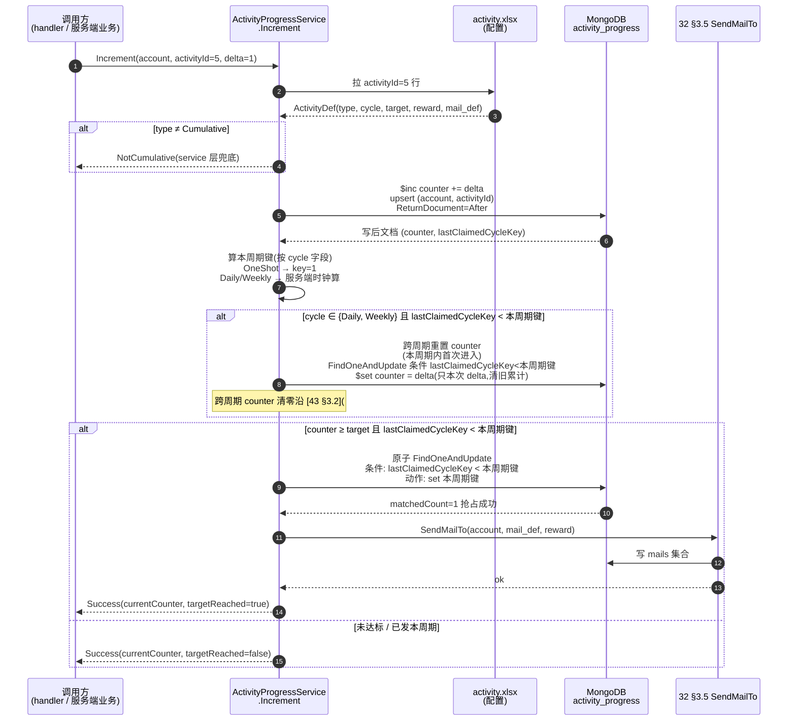
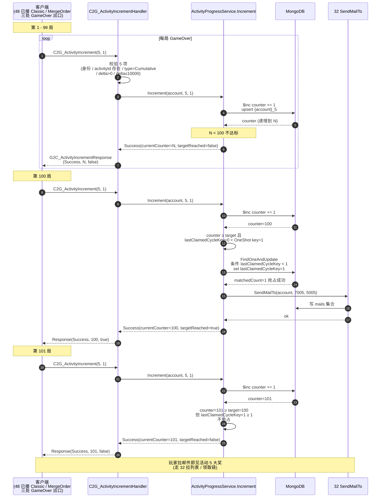

<style>
  pre.code { margin:8px 0; padding:12px; background:#0d1622; border:1px solid var(--border); border-radius:8px; overflow:auto; font-size:13px; line-height:1.55; }
  table.tight td, table.tight th { padding:6px 10px; }
  .pill-srv { display:inline-block; font-size:11px; padding:1px 7px; border-radius:10px; background:rgba(255,176,90,.18); color:#ffb05a; margin-left:6px; }
  .pill-cli { display:inline-block; font-size:11px; padding:1px 7px; border-radius:10px; background:rgba(108,140,255,.16); color:#6c8cff; margin-left:6px; }
  .pill-core{ display:inline-block; font-size:11px; padding:1px 7px; border-radius:10px; background:rgba(91,214,160,.16); color:#5bd6a0; margin-left:6px; }
  .pill-enh { display:inline-block; font-size:11px; padding:1px 7px; border-radius:10px; background:rgba(108,140,255,.16); color:#6c8cff; margin-left:6px; }
  .pill-cut { display:inline-block; font-size:11px; padding:1px 7px; border-radius:10px; background:rgba(255,122,138,.16); color:#ff7a8a; margin-left:6px; }
</style>

# Cumulative 节律落地 + 累计游戏 N 局样例 · server 段(Tier 4 第 4 子单)

把 [Tier 4 第 1 子单 §3.5](#39-activity-server::trigger) 声明的 `Cumulative` 节律接缝(`ActivityProgressService.Increment(account, activityId, delta)`,留 [O3 架构挖坑](#39-activity-server::open))**首次真实做**:加客户端可触发的归一 RPC `C2G_ActivityIncrement(activityId, delta)` + handler 校验 + service 内部 API 实做(沿用 [39 §3.4 发奖编排](#39-activity-server::orchestrate) 一字未改的「累 counter → 判达标 → 抢占 → 发奖」流程,只是把「+counter 起点」从「登录触发」换成「客户端业务推 + 服务端进程内调」),并交付**首套** `type=Cumulative` 活动实例(累计游戏 100 局,OneShot 永发一次)验证通路。

本子单只做 server 段(协议契约 + handler + 通用 Increment service + 1 套样例配置);客户端段已交付:见 [48 · Cumulative 客户端 GameOver hook + RemoteActivityService](#48-activity-cumulative-client)(三处 GameOver 出口 fire-and-forget hook + `RemoteActivityService` 编排 + 离线丢弃不缓存 + 无 UI 反馈沿 EVENT 同范式)。

> [!WARNING]
> **读前必看 · 六条边界**
>
> - **本子单是「Cumulative 节律首次实做 + 1 套 server 端验通路」,不是「9 套 Cumulative 活动全做」。** Cumulative 节律真做 = 1 个归一 RPC `C2G_ActivityIncrement` + 1 个 handler + 1 个 `ActivityProgressService.Increment` service + 1 套样例活动(累计游戏 100 局),共用 [39 §3.4 已实做的发奖编排](#39-activity-server::orchestrate)。后续 Cumulative 类活动(累计交付 / 累计消费 / 累计获得 / 累计签到等)= 加 1 行 `activity.xlsx` 配置 + 客户端业务系统调一次 RPC,**无新 handler / 无新 service / 无新协议**(沿 [设计 43 同范式](#43-activity-login-batch::iterate) 但应用在 Cumulative 上)。
> - **客户端业务接入已交付**(见 [48 客户端段](#48-activity-cumulative-client))**,本子单服务端段 + 客户端协议生成物**。服务端 RPC + handler + service 完整可独立验(server-test mock 客户端 mock 发包),不依赖客户端 GameOver 真触发;客户端业务接入三处 GameOver 出口(Classic GameWindow.TriggerGameOver + MergeOrder MergeOrderWindow.TriggerGameOver / TriggerWin)在 48 已落,沿本子单已定协议契约。
> - **不动 [39 ActivityDef / activity_progress schema](#39-activity-server::config) / [§3.4 发奖编排](#39-activity-server::orchestrate) / [32 SendMailTo 签名](#32-mail-server::source-api)。** 仅加 1 行 `activity.xlsx`(`activity_id=5`)+ 视需要 `mail.xlsx` 1 行(可砍) + `giftrandom.xlsx` 1 行(可砍,可指 [40 6101 EVENT 礼包](#40-event-unlock-relay::gift) 或 [43 5003 钻石礼包](#43-activity-login-batch::rewards) 复用)+ `__enums__.xlsx` 活动 type 加 `Cumulative=2` 档(若 39 第 1 子单已加则零增)+ `AuthoritativeDefs` 注册新行。
> - **handler 校验 `type=Cumulative` 是反作弊硬约束,不可降级。** 客户端 RPC 不应能推 `type=Login` 活动(沿 [39 §3.5 节律](#39-activity-server::trigger)「`Login` 触发是『随路插入』服务端独占」)。handler 拿到 activityId → 查 `activity.xlsx` 行 → 若 `type ≠ Cumulative` → 返 `NotCumulative` 错误码、`activity_progress` 文档零改动。
> - **与 [第 1 / 2 / 3 子单已交付 4 套 Login 活动 + 1 套 EVENT](#39-activity-server) 共存零回归。** Login 活动经 35 登录钩子触发(沿 [39 §3.5](#39-activity-server::trigger) + [43 §3.5](#43-activity-login-batch::iterate)),Cumulative 活动经 RPC + service 触发,两路节律入口完全独立、不交叉(沿 [39 §3.2 复合主键 `{account}_{activityId}`](#39-activity-server::storage) 文档独立)。
> - **EVENT 头像解锁集合与本子单无关。** [设计 18 §3.8](#18-player-info::persist) `PlayerInfo.UnlockedAvatarIds` 仍是客户端存档字段,本子单的 `reward` 字段不带 EVENT 标记(可选指向 [40 6101 EVENT 礼包](#40-event-unlock-relay::gift) 但语义是「累计 100 局解锁限定头像」,沿 EVENT 通路非本子单新建)。

> [!NOTE]
> **立项信息** {#intro}
>
> | 项 | 内容 |
> | --- | --- |
> | **类型** | 全栈特性 · Tier 4 活动系统第 4 子单 · 服务端段。出 code-free 设计意图 + 行为级协议契约 + 行为级验收,交服务端段(协议生成 + handler 实做 + Cumulative service 实做 + 1 行 `activity.xlsx` + 可选 `mail.xlsx` / `giftrandom.xlsx` 行 + `__enums__.xlsx` Cumulative 枚举档 + `AuthoritativeDefs` 注册)落地;客户端段交付协议生成物 + 编译过,客户端业务接入(GameOver hook)由 [48 客户端段](#48-activity-cumulative-client) 承接(已交付)。 |
> | **方向约束** | 离线还原 · **去变现**:Cumulative 类活动奖来自 [16 §3.6 礼包随机库](#16-item-system::gift),不引入付费 / VIP / 充值返利。**加法式 + 复用至上**:不动 [39 ActivityDef schema](#39-activity-server::config) / [activity_progress schema](#39-activity-server::storage) / [§3.4 发奖编排](#39-activity-server::orchestrate) / [§3.5 Login 触发节律](#39-activity-server::trigger) / [32 SendMailTo 签名](#32-mail-server::source-api) / [既有六全栈 + 35-46](#46-player-attr-ledger-client) 任何代码。新增全在:① 客户端可触发的归一 RPC `C2G_ActivityIncrement` + handler(本子单首次新建客户端可触发的活动系统 RPC,沿 [30 兑换码 / 31 排行榜上报](#30-redeem-code-server) 归一专用 RPC 范式);② `ActivityProgressService.Increment` service 实做(39 §3.5 接缝兑现);③ 1 行 `activity.xlsx`(`activity_id=5`)+ 可选 mail / gift 行;④ `__enums__.xlsx` Cumulative 枚举档;⑤ `AuthoritativeDefs` 注册。客户端业务接入(GameOver hook)+ 离线缓存 pending delta + UI 反馈由 [48 客户端段](#48-activity-cumulative-client) 承接(已交付,沿 30/32/46 不本地放行 + EVENT 无 UI 反馈范式)。 |
> | **需求降层** | **a. 表层要求**(简报字面):Tier 4 活动系统第 4 子单 = Cumulative 节律首次实做 + 累计游戏 N 局样例;ActivityProgressService.Increment API + C2G_ActivityIncrement RPC + handler 校验 + 配置 + 客户端 GameOver hook 接入由 [48 客户端段](#48-activity-cumulative-client) 承接(已交付)。 **b. 底层目的**(为玩家 / 运营 / 工程 / 反作弊达成什么):**对玩家**——长期累计目标多元化(除「每日 + 累计登录 + 周累计登录 + EVENT 解锁」外,新增「累计游戏 N 局 / 累计交付 N 单 / 累计消费 N 钻 / 累计获得 N 道具」类成就抓手),与 Login 类「玩家被动登录得奖」互补,Cumulative 类是「玩家主动参与游戏得奖」。**对运营**——Cumulative 节律真做后能配 4-5 套同类活动,运营需求池显著扩大,每套加成本 = 1 行配置 + 1 行客户端 hook 调用。**对工程**——兑现 [39 §3.5 旁注](#39-activity-server::trigger) Cumulative 节律「架构挖接缝、实现待业务接入」的 O3 接口,从「架构上声明」升为「真实可用」+ 同范式可扩展验证(本子单 1 套样例验通路,后续运营加同类活动零代码改)。**对反作弊**——首次新建客户端可触发的活动 RPC,确立「handler 校验 `type=Cumulative` + 身份从会话取 + delta 上限钳」三层防御基线,守住「客户端不可推任意活动 counter」服务端权威。 **c. 有无更直达 b 的做法**:b 的本质 = 「Cumulative 节律真做 + 提供归一 RPC 给客户端业务推」。直达做法对比: **方案 A(本子单采纳)** — 新建归一 RPC `C2G_ActivityIncrement(activityId, delta)`,handler 校验 `type=Cumulative`,统一调 `ActivityProgressService.Increment`;一个 RPC 对应任意 Cumulative 类活动。 **方案 B(放弃)** — 复用现有 `C2G_GameEnd` 协议携活动元数据(`gameEnded + activityId + delta` 一包发)。**方案 B 否的理由**:① 工程 grep 无 `C2G_GameEnd` 协议(GameOver 是客户端进程内事件,未上 RPC),即便有也属「本局结算」语义,扩它携活动 activityId 让协议关注点混杂;② Cumulative 节律的客户端触发源会扩(累计游戏 / 累计交付 / 累计消费 / 累计获得 / 累计签到等),给每个触发源各扩一个现有 RPC 不可持续 — 后续 5 套 Cumulative 各扩 1 个 RPC = 协议表大膨胀;③ 「归一 RPC」是 [设计 30 兑换码 / 31 排行榜上报](#30-redeem-code-server) 同范式(新建专用 RPC 而非塞进既有协议)。 **方案 C(放弃)** — 不开 RPC,Cumulative 全靠服务端内部事件(如服务端拦截每局 `C2G_*GameAction`)算「玩家完成一局」+ 自动 Increment。**方案 C 否的理由**:① 「玩家完成一局」的判据复杂(通关 / 软 GameOver / 硬 GameOver 三出口,服务端无业务上下文判区);② 把客户端业务上下文上推服务端 = 服务端要懂玩法 = 反层级;③ 客户端业务系统直接调归一 RPC 报告「我完成了一局」是更明确的关注点边界。 **结论**:取方案 A — 归一 RPC + handler 校验 + service 内部 API 统一逻辑路径,纯加法式、零现有协议改、客户端业务接入边界清晰。 |
> | **范围(产品 · 玩法)** | **服务端段交付**:① 新建协议 `C2G_ActivityIncrement(activityId, delta)` + `G2C_ActivityIncrementResponse(resultCode, currentCounter, targetReached)`(沿 30/31/32/33/45 协议范式,字段名由 server-dev 据 Fantasy.Net 约定取);② handler `C2G_ActivityIncrementHandler` 实做 5 项校验(身份从会话取 + activityId 配置存在 + `type=Cumulative` + delta > 0 + delta ≤ 10000 钳制) → 调 service;③ `ActivityProgressService.Increment(account, activityId, delta)` service 实做(沿 [39 §3.4 发奖编排](#39-activity-server::orchestrate) 流程,只「+counter 起点」换为本入口);④ `activity.xlsx` 加 1 行(`activity_id=5, type=Cumulative, cycle=OneShot, target=100, reward=5005 或 6101 或 5003 任一, mail_def=7005 或 0`);⑤ `__enums__.xlsx` 活动 type 加 `Cumulative=2` 档(若 39 第 1 子单已加则零增);⑥ 可选:`mail.xlsx` 加 1 行 `mail_def=7005` 邮件模板 + `giftrandom.xlsx` 加 1 行 `5005` 礼包(沿 [43 §3.4 兜底](#43-activity-login-batch::mail) `mail_def=0` 走占位文案、`reward` 复用既有礼包亦合法);⑦ Fantasy.Net `AuthoritativeDefs` 注册新行。 **服务端段不动**:① [32 SendMailTo](#32-mail-server::source-api) 入口签名;② [39 ActivityDef schema](#39-activity-server::config) / [activity_progress schema](#39-activity-server::storage);③ [39 §3.4 发奖编排](#39-activity-server::orchestrate) 流程;④ [39 §3.5 Login 触发节律](#39-activity-server::trigger);⑤ [既有六全栈 + 35/36/37/38/40/41/43/44/45](#43-activity-login-batch) 任何代码。 **客户端段交付**:协议生成物(Unity 工程内 `C2G_ActivityIncrement / G2C_ActivityIncrementResponse` 类编译过)。 **客户端业务接入**:GameOver hook 调 RPC + UI 反馈 + 离线缓存 pending delta → 由 [48 客户端段](#48-activity-cumulative-client) 承接(已交付,Classic + MergeOrder 三出口 hook + 无 UI 反馈沿 EVENT 同范式 + 离线丢弃不缓存沿 30/32/46 同口径)。 |
> | **关键约束** | 服务端遵 Fantasy.Net 既有约定(协议生成 / handler 注册 / MongoDB 存储 / 错误码非异常 / 不手改生成物 / 不手动注册);沿 [39 §3.4 发奖编排](#39-activity-server::orchestrate) 流程不动一行代码,Cumulative 节律共用同一流程;`counter` 累加用 MongoDB `$inc` 原子(沿 [33 §3.2](#33-rank-settle-server::orchestrate)),「判未发 + 写已发」用 [39 §3.4 原子条件写](#39-activity-server::orchestrate);handler 错误码归一(`Success / InvalidRequest / NotCumulative / ServiceUnavailable` 四档);**身份从会话取**(沿 [30 §3](#30-redeem-code-server)),客户端不自报 account。本篇正文为 code-free 设计意图,不含协议消息名 / 字段代码名 / 类名 / 文件路径 / 接缝清单——server-dev 据行为语义定 schema 字段名 / handler 注册 / service 实做。 |

## 二、现状审计(给定基线证据) {#audit}

[39 / 40 / 43 已 PASS 基线](#39-activity-server) + 简报方案 A 与现有范式核实:

| 简报描述 / 现状 | 现状证据 / 设计基线 | 本子单据此处置 |
| --- | --- | --- |
| 简报「ActivityProgressService.Increment(account, activityId, delta) API 形态(已有接缝在 39 §3.5,本子单兑现实装)」 | [39 §3.5 Cumulative 行](#39-activity-server::trigger) 明示「各业务系统经服务端进程内 API 调 `ActivityProgressService.Increment(account, activityId, delta)`」+ 留 O3「架构挖接缝,实现待业务接入。架构层接缝即在 `Login` 实做时已存在」 | **本子单兑现实装**:`ActivityProgressService.Increment` 内部 API 实做 + 加客户端可触发的 RPC handler 让客户端业务方可调;sevice 内部 API 与 RPC handler 共用同一逻辑路径(handler 校验通过后调 service) |
| 简报「新 RPC `C2G_ActivityIncrement(activityId, delta)` 协议字段 + 错误码集,或复用其它 RPC(典型扩 `C2G_GameEnd` 携活动达标元数据)」 | 工程 grep 无 `C2G_GameEnd` 协议;[设计 11 / 29 GameOver](#11-core-loop-completion) 是客户端进程内事件,未上 RPC | **新建专用 RPC**(立项框 c.方案 A);拒方案 B 复用 C2G_GameEnd(无该协议 + 即便有也违协议关注点单一) |
| 简报「handler 校验项: 身份从会话取 / activityId 必须 type=Cumulative / delta 必须正数 + 上限 / 防刷」 | [设计 30 §3 兑换码身份从会话取](#30-redeem-code-server) + [31 §3 排行榜上报身份从会话取](#31-rank-server) + [37 §3.3 PropertyChangeRequest 上界 999999 防客户端推爆](#37-player-attr-server::internal-api) 同源范式 | **handler 校验 4 项**(身份 + activityId 存在 + `type=Cumulative` + delta > 0 + delta ≤ 10000 钳制);**防刷**用「单次 delta 上限钳制 + service 内 type 校验 + counter 跨周期非递减(OneShot 永发停)」三层(详 [§3.3 决策](#47-activity-cumulative::handler) + [§五崩法表](#47-activity-cumulative::walk)) |
| 简报「Increment 后是否走 §3.4 发奖编排(达标即发邮件,与 Login 同路)」 | [39 §3.4 发奖编排](#39-activity-server::orchestrate) 完整流程已实做(原子条件写 + claim-then-act + SendMailTo);[43 §3.5](#43-activity-login-batch::iterate) Login 节律 PASS 验过同流程 | **完全沿用** [39 §3.4](#39-activity-server::orchestrate):Cumulative 节律的「+counter 起点」换为 `Increment` 调用,「+counter 之后」走完全同一发奖编排(判达标 + 抢占 + SendMailTo) |
| 简报「第 1 套样例活动:累计游戏 N 局」(触发源 = 客户端 GameOver) | [设计 29 §三 三出口](#29-gameplay-fusion::v2):通关 / 软 GameOver / 硬 GameOver,「玩完一局」语义客户端独占(服务端无业务上下文判区);[设计 11 §7.3 软 GameOver 三出路](#11-core-loop-completion::energy-empty) | **客户端业务接入(GameOver hook 调 RPC)由 [48 客户端段](#48-activity-cumulative-client) 承接(已交付,三处 GameOver 出口等价计数)**;本子单 server 段 only,server-test 用 mock 客户端 mock 发包验完整 server 通路(SV2-SV10) |
| 简报「客户端业务接入(GameOver hook 调 C2G_ActivityIncrement)留下一刀(本子单 server 段先行,沿 Login 批量 + ledger 写入范式)」 | [设计 43](#43-activity-login-batch) Tier 4 第 3 子单是「server only,客户端段后续刀」范式;[44 / 45](#44-player-attr-ledger) Tier 2 第 1 / 2 / 3 子单是「server 段先行,客户端段后续刀」范式 | 沿此分段范式,本子单只交付 server 段 + 客户端协议生成物;客户端 GameOver hook 接入 + UI 反馈 + 离线缓存策略由 [48 客户端段](#48-activity-cumulative-client) 承接(已交付) |

## 三、设计正文 {#detail}

### 3.1 Cumulative 节律入口形态(对比 Login) {#shape}

```mermaid
graph LR
    L1["35 RegisterOrLogin<br/>(登录链路)"] -.沿 39 §3.5 .-> L2["登录后钩子<br/>遍历 type=Login 活动"]
    L2 --> L3["对每个 Login 活动<br/>调 ActivityProgressService.IncrementForLogin"]
    L3 --> SHARE["共用 §3.4 发奖编排<br/>(判达标 + 抢占 + SendMailTo)"]

    C1["客户端业务系统<br/>(48 已接: Classic / MergeOrder<br/>三处 GameOver 出口)"] -.沿 §3.2 协议契约 .-> C2["C2G_ActivityIncrement<br/>(activityId, delta)"]
    C2 --> HDL["handler 校验 5 项<br/>(身份 + activityId 存在<br/>+ type=Cumulative<br/>+ delta > 0 + delta ≤ 10000)"]
    HDL --> C3["调 ActivityProgressService.Increment<br/>(account, activityId, delta)"]
    C3 --> SHARE

    S1["服务端业务系统<br/>(未来:运营赠送 / GM 调整)"] -.沿 §3.3 服务端进程内 API .-> C3

    style SHARE fill:#1a1a2a,stroke:#5bd6a0
    style HDL fill:#1a1a2a,stroke:#ffb05a
    style C3 fill:#1a1a2a,stroke:#ffb05a
```

**两路节律对照**:

| 节律 | +counter 起点 | 触发来源 | 共用部分 |
| --- | --- | --- | --- |
| `type=Login` | 登录后钩子按 type 全表过滤遍历(沿 [39 §3.5](#39-activity-server::trigger)) | 服务端登录链路 35 内部触发,无客户端触发协议 | [39 §3.4 发奖编排](#39-activity-server::orchestrate)(判达标 + 抢占 + SendMailTo) |
| `type=Cumulative`(本子单首次实做) | 客户端业务方调 `C2G_ActivityIncrement` → handler 调 service / 服务端业务方直调 service `Increment` | 客户端业务系统(GameOver / 交付订单 / 消费货币 / 获得道具等) + 服务端业务系统(未来:运营赠送) | [39 §3.4 发奖编排](#39-activity-server::orchestrate)(完全相同) |

`Cumulative` 节律与 `Login` 共用同一发奖编排流程,**仅入口形态不同**;这意味着 server-dev 实做 Increment service 时,核心代码 = 「`$inc counter` + 调用 §3.4 已有的判达标 + 抢占 + SendMailTo 函数」,新增代码量极小。

### 3.2 协议契约(code-free) {#protocol}

**`C2G_ActivityIncrement`(客户端 → 服务端,RPC)**:

| 携带项 | 行为语义 | 约束 |
| --- | --- | --- |
| `activityId` | 目标活动 id(沿 [39 §3.1](#39-activity-server::config) `activity.xlsx.activity_id`) | 服务端查 `activity.xlsx` 行,不存在 → InvalidRequest |
| `delta` | 本次累计增量(正整数) | 必须 > 0(≤ 0 → InvalidRequest);服务端钳到 ≤ 10000(超过则裁剪到 10000、不报错) |

**身份字段 `account` 不在请求字段中**——服务端从已认证会话取(沿 [设计 30 §3 / 31 §3 / 32 §3](#30-redeem-code-server) 同范式),**客户端不自报 account**(自报 = 可冒充)。

**`G2C_ActivityIncrementResponse`(服务端 → 客户端,RPC 响应)**:

| 携带项 | 行为语义 | 约束 |
| --- | --- | --- |
| `resultCode` | 结果码(枚举,4 档,见 §3.3 错误码集) | 服务端裁定 |
| `currentCounter` | 写后 counter 值(让客户端可显示当前进度) | 仅 `resultCode=Success` 时有意义;其它码取 0 |
| `targetReached` | 本次 Increment 后是否首次达标 + 抢占成功 + 投奖(便于客户端 UI 弹「累计 100 局达成!」类提示) | 仅 `resultCode=Success` 时有意义;`true` ↔ 服务端已投出活动邮件;`false` ↔ 仅 counter 累加未触发发奖(未达标 / 已发周期内重复达标 / OneShot 已发停) |

**错误码集 4 档**(沿 [32 / 33 / 45](#45-player-attr-ledger-query) 已建归一三档 + 1 个本子单专属):

| 码 | 含义 | 触发场景 |
| --- | --- | --- |
| `Success` | 累加成功(已 / 未达标各自处理) | counter 已写入 + 视情况已发奖 |
| `InvalidRequest` | 参数错(activityId 不存在 / delta ≤ 0 / 字段格式异常) | handler 校验拒,`activity_progress` 文档零改动 |
| `NotCumulative` | activityId 对应配置 `type ≠ Cumulative`(典型:客户端尝试推 `type=Login` 活动) | handler 校验拒,`activity_progress` 文档零改动 |
| `ServiceUnavailable` | MongoDB 不可达 / Fantasy.Net 内部异常 | handler 兜底,`activity_progress` 状态未知,客户端不本地放行(沿 [30 §3 不本地放行](#30-redeem-code-server)) |

**为什么 `NotCumulative` 单列而非归 `InvalidRequest`?** ① 语义差异大(`InvalidRequest` 是「客户端发包写错」/ `NotCumulative` 是「活动类型不允许此 RPC」,差异化提示有助客户端诊断);② 客户端 [48](#48-activity-cumulative-client) 据此码落 Error 级日志(代表客户端 / 配置 bug,与 InvalidRequest 同级但触发场景不同);③ 反作弊日志可统计「`NotCumulative` 拒数」识别异常客户端(频繁尝试推非 Cumulative 类活动 = 行为可疑)。

### 3.3 handler 校验链 + 错误码决策 {#handler}

handler 在拿到 RPC 后按以下顺序校验,**任一档失败立即返码,不进 service**:

```mermaid
graph TD
    R["C2G_ActivityIncrement<br/>(activityId, delta)"] --> A["1. 身份从会话取<br/>account = session.Account"]
    A --> B{"2. activity.xlsx<br/>activityId 行存在?"}
    B -- 不存在 --> X1["返 InvalidRequest<br/>不调 service<br/>文档零改动"]
    B -- 存在 --> C{"3. 配置 type == Cumulative?"}
    C -- 不是 --> X2["返 NotCumulative<br/>不调 service<br/>文档零改动"]
    C -- 是 --> D{"4. delta > 0?"}
    D -- 否 --> X3["返 InvalidRequest"]
    D -- 是 --> E["5. clamped = Math.Min(delta, 10000)<br/>(超上限默默钳制 不报错)"]
    E --> F["调 ActivityProgressService.Increment<br/>(account, activityId, clamped)"]
    F --> G{"service 返码?"}
    G -- Success --> S1["返 Success<br/>+ currentCounter<br/>+ targetReached"]
    G -- ServiceUnavailable --> S2["返 ServiceUnavailable"]

    style X1 fill:#1a1a2a,stroke:#ff7a8a
    style X2 fill:#1a1a2a,stroke:#ff7a8a
    style X3 fill:#1a1a2a,stroke:#ff7a8a
    style F fill:#1a1a2a,stroke:#5bd6a0
```



> [!NOTE]
> **校验顺序为什么先 activityId 存在再 type?**
>
> 若 activityId 不存在直接返 `NotCumulative` 会泄露「该 id 配存在但 type 不对」vs「该 id 配不存在」的信息差,虽然本作离线无敌情情景敏感,但归一原则「不存在 = InvalidRequest」更清晰;type 校验仅在配置存在但 type 不符时触发。
>
> **为什么 delta 上限钳制不报错而是默默钳到上限?**
>
> 正常客户端不会单次推 > 10000(累计游戏一局 = +1,极端运营推送 = +1000 < 10000),钳制是「防恶意客户端推爆 counter」的服务端硬约束;若返错码,客户端无法区分「服务端拒」vs 「网络错」,体验劣化;默默钳 + 客户端从 `response.currentCounter` 自查可见实际写入值更友好。10000 上限是经验值(本子单硬编码,运营可调列 [O3](#47-activity-cumulative::open))。

### 3.4 累计游戏 100 局活动配置(`activity.xlsx` 加 1 行) {#activity}

沿 [39 §3.1 字段集](#39-activity-server::config) 不动 schema,加一行:

| `activity_id` | `name_text_id` | `desc_text_id` | `type` | `cycle` | `target` | `reward` | `mail_def` | `start_at` | `end_at` |
| --- | --- | --- | --- | --- | --- | --- | --- | --- | --- |
| 5 | 390009 | 390010 | `Cumulative` | `OneShot` | 100 | 5005 | 7005 | 0 | 0 |

**字段语义**:

- `activity_id=5`:沿 39/40/43 占位段递增(1 = 每日登录奖,2 = EVENT 解锁,3 = 累计 7 天大奖,4 = 周累计 5 天奖,5 = 本子单)
- `type=Cumulative`:首次使用 Cumulative 枚举档(若 `__enums__.xlsx` 39 第 1 子单未加 Cumulative 档则本子单补)
- `cycle=OneShot`:累计 100 局一次性永发(沿 [43 活动 3 OneShot 累计 7 天大奖](#43-activity-login-batch::activities) 同范式);玩家累计到 100 局后服务端发一次邮件,后续游戏 counter 仍可继续累加但 `lastClaimedCycleKey=1` 拦截不重发
- `target=100`:累计目标局数(100 是中期目标,日均 5-10 局玩家 10-20 天可达,运营可调,详 [§七 O5](#47-activity-cumulative::open))
- `reward=5005`:**可选加 `giftrandom.xlsx` 5005 礼包行**(沿 [16 §3.6](#16-item-system::gift) 单项必中 = 钻石包 100 钻 / 或金币包 1000 金 / 或道具包,具体由运营定);**亦可复用** [40 6101 EVENT 礼包](#40-event-unlock-relay::gift)(累计 100 局解锁限定头像,语义合理) **或** [43 5003 钻石礼包](#43-activity-login-batch::rewards)(43 已加,零新增)
- `mail_def=7005`:**可选加 `mail.xlsx` 7005 邮件模板行**;**亦可填 0** 走 [39 §3.4 兜底文案](#39-activity-server::orchestrate)(110805 / 110806 占位标题 / 发件人,reward 仍挂出 — 沿 [43 §3.4 兜底](#43-activity-login-batch::mail))
- `start_at=0, end_at=0`:永远开放,不限时(累计类活动通常长期开放;限时类留 [O4 后续](#47-activity-cumulative::open))

**配置最小增量(可砍 mail / gift 行)**:

| 必加 | 可砍 | 可砍依据 |
| --- | --- | --- |
| `activity.xlsx` 1 行(`activity_id=5`) | `mail.xlsx` 7005 邮件模板行 | 填 `mail_def=0` 走 [39 §3.4 兜底文案](#39-activity-server::orchestrate),邮件标题用占位,reward 仍挂出 |
| `__enums__.xlsx` `type=Cumulative` 档(若 39 第 1 子单未加) | `giftrandom.xlsx` 5005 礼包行 | `reward` 复用 [40 6101](#40-event-unlock-relay::gift) 或 [43 5003](#43-activity-login-batch::rewards),不新增礼包 |
| `AuthoritativeDefs` 注册新 activity 行 | — | — |

**plan 默认决策**:`reward=5005` + `mail_def=7005` 加占位行(沿 [43 默认](#43-activity-login-batch::mail) 加占位 textId,运营后续改文案不返工);若 server-dev 嫌引入 mail / gift 增量繁则砍 2 行,验收等价(SV1 验配置加载,SV4 / SV10 不强制 reward 值)。

### 3.5 ActivityProgressService.Increment service 行为契约 {#service}

`ActivityProgressService.Increment(account, activityId, delta)` 是**服务端进程内 API**(handler 调 / 服务端业务方直调);沿 [39 §3.4 发奖编排](#39-activity-server::orchestrate) 流程,只是「+counter 起点」换为本入口。



**关键不变量**:

- **`$inc` 原子累加**(沿 [33 §3.2](#33-rank-settle-server::orchestrate)):并发两次 Increment 不会漏 delta(MongoDB 文档级原子);
- **「判未发 + 写已发」原子条件写**(沿 [39 §3.4](#39-activity-server::orchestrate)):并发两次达标判定只一次抢占成功,只投一封邮件;
- **抢占必在 SendMailTo 之前**(claim-then-act,沿 [39 §3.4 旁注](#39-activity-server::orchestrate)):漏发可补 + 不超发;
- **service 层兜底 type 校验**:即便上游 handler 漏校验也守住(handler / service 双层校验,纵深防御);
- **跨周期 counter 清零**(Daily / Weekly,沿 [43 §3.2 旁注](#43-activity-login-batch::activities)):本周期内首次进入 → counter 清零再 +delta;本子单 `OneShot` 不涉及清零,但 service 须前瞻支持 Daily / Weekly Cumulative(运营未来配)。

### 3.6 累计游戏 100 局跑通示例 {#example}



**玩家可观测路径**:第 100 局 GameOver 时客户端段 hook 调 RPC([48 fire-and-forget](#48-activity-cumulative-client::fire-forget)) → 服务端响应 `targetReached=true` → 客户端落日志(48 决策无 UI 反馈,沿 EVENT 同范式) → 玩家打开邮箱(走 [21 / 32](#32-mail-server) 客户端表现层)→ 邮件列表多一封「累计游戏 100 局奖励」 → 玩家点领走 [32 领奖链](#32-mail-server::claim) 拿礼包奖励。

## 四、服务异常下的行为 {#degrade}

| 情形 | 服务端行为 | 为什么 |
| --- | --- | --- |
| MongoDB 不可达(读 / 写 `activity_progress` 失败) | handler 返 `ServiceUnavailable`;客户端不本地放行(48 决策累计 delta 直接丢弃不缓存,沿 30/32/46 同口径);server-test 此情形列 **BLOCKED** 非 FAIL | 存储不可达环境问题,沿 [30 / 39 同口径](#39-activity-server::degrade);客户端本地放行 = 服务端复连后丢失 delta 上推违审计完整性 |
| 32 发奖入口投邮件失败(MongoDB / 序列化) | 周期键已写、邮件未投 = 漏发窄窗(沿 [39 §3.4 claim-then-act](#39-activity-server::orchestrate));运营可补,不抛致 handler 中断 | 漏发可补 + 不超发,优于反向次序 |
| `activity.xlsx` activityId=5 行缺(配置未导入) | handler 返 `InvalidRequest`;`activity_progress` 文档零改动 | 沿 §3.3 handler 校验链;运营事后补配置不漏 |
| `mail_def=7005` 邮件模板缺 / `reward=5005` 礼包未登记 | 兜底:邮件用占位文案(110806 / 110805)仍挂未登记 reward 投出;玩家领取时 [32 §3.4 「抽取查无 → 成功但奖励列表空」](#32-mail-server::claim-resp) | 沿 [39 §四 + 32 已有口径](#32-mail-server::claim-resp) |
| 客户端发 `C2G_ActivityIncrement(1, 1000)` 推 `type=Login` 活动 | handler 校验 `type=Cumulative` 失败 → 返 `NotCumulative`;`activity_progress` 文档 activityId=1 counter **零改动** | 沿 §3.3 handler 校验链;反作弊硬约束(防客户端旁路登录节律) |
| 客户端发 `(5, -1)` / `(5, 0)` / `(999, 1)` | handler 返 `InvalidRequest`;`activity_progress` 文档零改动 | 沿 §3.3 校验链;参数错就地拒,不进 service |
| 客户端发 `(5, 50000)` 超上限 | handler 钳到 10000 → 调 service +10000;返 `Success` + `currentCounter=10000`(若达标则 `targetReached=true`) | 沿 §3.3 上限钳制(不报错,客户端从 response 自查) |
| 同账号并发两次 Increment | `$inc counter += delta` MongoDB 文档级原子 + 「判未发 + 写已发」原子条件写 → 一次抢占 + 一次邮件;另一次 counter 累加但 `lastClaimedCycleKey` 已写 → 不抢占 | 沿 §3.5 service 不变量;[39 §3.4 原子](#39-activity-server::orchestrate) |
| 客户端伪造 `account` 字段(若协议字段表错加 account) | **协议字段表不含 account**(身份从会话取);若客户端硬塞 account 字段服务端忽略 | 沿 §3.2 协议契约 + [设计 30 §3 同范式](#30-redeem-code-server) |

## 五、整局走查 · 每个机制的崩法与对策 {#walk}

把「玩家 100 次 GameOver 累计 → 服务端判达标 → 投邮件 → 玩家邮箱领奖」整条链跑一遍,逐机制点出最可能崩的类(零值 / 满值 / 并发 / 中途存档 / 恶意利用)+ 对策:

| 机制 | 最可能的崩法 | 类别 | 对策 |
| --- | --- | --- | --- |
| handler `type=Cumulative` 校验 | server-dev 漏校验 type → 客户端发 `(1, 1000)` 推每日登录奖 counter → 旁路登录节律 = 一次性刷 1000 次「登录」 | 恶意利用 | [§3.3 校验链](#47-activity-cumulative::handler) 顺序声明 + service 层兜底 type 校验(双层防御) + SV5 模拟客户端推 type=Login 活动验拒 + Code Review SV12 ② 核 |
| delta 上限钳制 | server-dev 漏钳制 → 客户端发 `(5, Long.MaxValue)` 致 counter 溢出 / counter 显示乱 | 恶意利用 / 满值 | [§3.3 钳制](#47-activity-cumulative::handler) 单次 10000 + SV7 模拟超上限验钳到 10000 + Code Review SV12 ⑦ 核 |
| counter 累加并发 | 「读 + 客户端层 +delta + 写」并发场景下两个 Increment 各读旧值 → 漏 delta | 并发 | [§3.5 `$inc` 原子](#47-activity-cumulative::service)(沿 [33 §3.2](#33-rank-settle-server::orchestrate));SV8 模拟同账号并发验 counter 最终值 = 旧值 + 所有 delta 之和 + Code Review SV12 ④ 核 |
| 判达标 + 写已发周期键非原子 | 并发两次 Increment 都达标 → 各自抢占 → 双发邮件 | 并发 | [§3.5 原子条件写](#47-activity-cumulative::service)(沿 [39 §3.4](#39-activity-server::orchestrate));SV8 验仅一次抢占 + 一次邮件 |
| SendMailTo 中途崩 | 周期键已写、邮件未投 → 漏一封 | 中途存档 | [§3.5 claim-then-act](#47-activity-cumulative::service)(沿 [39 §3.4 旁注](#39-activity-server::orchestrate));接受漏发窄窗(运营可补);**不**接受反过来超发 |
| Daily / Weekly Cumulative counter 跨周期不清零 | server-dev 用 OneShot 实现路径处理 Daily Cumulative → counter 跨日不清零 → 越累越多 → 跨日 1 次登录直接达标 | 中途存档 / 边界 | [§3.5 service 跨周期清零](#47-activity-cumulative::service)(沿 [43 §3.2 旁注](#43-activity-login-batch::activities));本子单样例是 OneShot 不涉及,但 service 须前瞻支持(SV9 提示);Code Review SV12 ⑤ 核 |
| 服务端不可达 → 客户端本地放行 | 客户端断网时客户端本地累计 delta + 服务端复连后丢失 delta 上推 = 永久漏奖 | 恶意利用 / 中途存档 | [§四 不本地放行](#47-activity-cumulative::degrade)(沿 [30 §3](#30-redeem-code-server));客户端 [48 §3.3](#48-activity-cumulative-client::offline) 决策不本地缓存直接丢弃(沿 30/32/46 同口径) |
| 协议字段缺失 / 格式错(activityId / delta) | handler 拿不到字段 / 解析抛 | 零值 / 边界 | [§3.3 校验链](#47-activity-cumulative::handler) 返 `InvalidRequest` 兜底;不抛致连接中断 |
| handler 校验顺序错(先 type 后 activityId 存在) | activityId 不存在时返 `NotCumulative` 泄露「该 id 在配但 type 不对」vs「该 id 不在配」信息差 | 边界 | [§3.3 顺序声明](#47-activity-cumulative::handler) 先 activityId 存在再 type;Code Review SV12 ⑥ 核 |
| 客户端伪造 account 字段 | 客户端硬塞 account 字段企图推他人活动 counter | 恶意利用 | [§3.2 身份从会话取](#47-activity-cumulative::protocol) + 协议字段表不含 account 字段(服务端忽略客户端任何 account 字段) + Code Review SV12 ① 核 |
| service 层 type 校验漏 | handler 校验通过后 service 不再校验 → 未来若另一调用方(运营 GM 工具)绕过 handler 直调 service 推 type=Login 活动 | 恶意利用 / 未来扩展 | [§3.5 service 层兜底 type 校验](#47-activity-cumulative::service)(双层防御);Code Review SV12 ② 核 |

> [!WARNING]
> **承认的固有限制(诚实边界)**
>
> 本子单**守的**:① Cumulative 节律服务端真做(归一 RPC + handler + service);② handler 校验 5 项防客户端推非 Cumulative 类活动 / 负 delta / 上限溢出 / 伪 account / 不存在 activityId;③ counter 累加原子(`$inc` 文档级)+ 抢占原子(`FindOneAndUpdate` 条件写)+ claim-then-act;④ service 层兜底 type 校验(纵深防御未来扩展);⑤ 1 套样例活动累计 100 局通路验通(SV4 / SV10);⑥ 与 [39 / 40 / 43 已交付 5 套活动](#43-activity-login-batch) 共存零回归(SV11)。
>
> 本子单**不守的**:① 客户端业务接入(GameOver hook 调 RPC)→ [48 客户端段已落](#48-activity-cumulative-client);② 离线缓存 pending delta + 网络恢复重试 → [48 决策不缓存直接丢弃](#48-activity-cumulative-client::offline)(沿 30/32/46 同口径);③ Daily / Weekly Cumulative 节律的样例验证(service 须前瞻支持但本子单只 OneShot 样例验过 — SV9 验跨会话 / 重启幂等限 OneShot;Daily / Weekly Cumulative 样例验证留运营加新活动行后随访);④ 其它 4 套 Cumulative 活动(累计交付 / 累计消费 / 累计获得 / 累计签到)→ 留运营后续逐套刀加 1 行配置 + 客户端业务接入(48 已建归一服务可直接复用);⑤ 客户端 UI 反馈「累计 100 局达成!」类提示 → [48 决策无 UI 反馈](#48-activity-cumulative-client::ui)(沿 EVENT 同范式);⑥ 反过来「漏发」窄窗(`SendMailTo` 失败,玩家漏一封,运营可补;严格不漏 = 账号级事务沿 [39 O7](#39-activity-server::open));⑦ counter 上限钳 10000 运营可配 → 留 [O3 后续](#47-activity-cumulative::open);⑧ 服务端业务方直调 service 的场景(运营 GM 工具 / 自动赠送) → 接口已留但本子单不实做调用方;⑨ 多端跨设备 counter 同步 → Tier 3 跨设备识别另开;⑩ 反作弊「客户端是否真完成 1 局」(客户端可调 RPC 但本局未真打完)→ 服务端不验「玩法本身真假」(沿 [31 排行榜诚实边界](#31-rank-server) 同源,反作弊另开特性)。

## 六、与既有特性的关系 {#relations}

| 既有 | 本子单与其关系 | 是否改动 |
| --- | --- | --- |
| [设计 39 Tier 4 第 1 子单](#39-activity-server) | **兑现 §3.5 Cumulative 节律接缝**(从「留 O3」升「已交付」);§3.5 节律表 + §七 O2 / O3 状态行 + §3.1 旁注 type 扩展点表 + §八 BLOCKED 列表本子单同任务内同步重写 | **39 设计稿同步重写**(§3.5 节律表 + §七 O2 / O3 + §3.1 旁注 + §八 BLOCKED,由本子单同任务内落) |
| [设计 40 Tier 4 第 2 子单 server 段](#40-event-unlock-relay) | EVENT 活动 `type=Login` 与本子单 `type=Cumulative` 完全正交,各走各的节律入口 | 零改动 |
| [设计 41 Tier 4 第 2 子单 client 段](#41-event-unlock-client) | 客户端 EVENT 解析与本子单正交,本子单 reward 走货币 useEffect=1 路径(默认)或 EVENT 路径(若 reward 复用 6101 — 沿 41 已实做) | 零改动 |
| [设计 43 Tier 4 第 3 子单](#43-activity-login-batch) | 43 是 Login 类活动批量(4 套并存),本子单是 Cumulative 类活动首套;两类节律入口独立(Login 走 35 登录钩子 / Cumulative 走 RPC + service),发奖编排共用 [39 §3.4](#39-activity-server::orchestrate);[43 §3.5 按 type 遍历](#43-activity-login-batch::iterate) 是「按 type=Login 过滤遍历」,不会触及 activity_id=5(type=Cumulative) | 零改动 |
| [设计 32 §3.5 SendMailTo](#32-mail-server::source-api) | 完全沿用,签名零改 | 零改动 |
| [设计 33 §3.2 `$inc` + FindOneAndUpdate 原子](#33-rank-settle-server::orchestrate) | 本子单 counter 累加 + 抢占都沿用此范式 | 零改动 |
| [设计 30 兑换码服务端](#30-redeem-code-server) / [31 排行榜上报](#31-rank-server) | 本子单 RPC 沿其归一专用 RPC + 身份从会话取 + 服务端不可达不本地放行范式 | 零改动 |
| [设计 11 核心补全 / 29 玩法融合 / 49 无尽模型](#49-infinite-no-rounds) | 「累计游戏 N 局」样例活动原以客户端 GameOver 为触发源(hook 接入在 [48](#48-activity-cumulative-client))。<mark class="r">无尽模型([设计 49](#49-infinite-no-rounds))取消融合玩法的通关 / GameOver 离散事件</mark>——该样例活动的触发语义随之失效,需重定事件源或退役该样例。**Cumulative 节律基础设施(本子单 server 段交付)与触发源解耦、不受影响** | 零改动(触发源重定义是无尽模型衍生影响,见 [48](#48-activity-cumulative-client) 与交接区,由 boss/dev 裁) |
| [设计 16 道具系统 `giftrandom`](#16-item-system::gift) | 活动 5 `reward` 字段可指向 5005(可选新建) / 6101 / 5003 任一,沿 22/32/33/39/40/43 同范式 | 零改动(若新建 5005 行则 16 同任务内加 1 行,沿 [43 同任务内加礼包行](#43-activity-login-batch::rewards) 范式) |
| [设计 21 邮件 / 32 客户端段领奖链](#21-mail-system) | 活动 5 奖落玩家邮箱,沿既有拉列表 + 领奖链(已落地) | 零改动 |
| [设计 37 玩家属性服务端](#37-player-attr-server) | 若 reward 含「+N 钻石 / 金币 / 体力」类货币,客户端经 [32 领取链](#32-mail-server::claim-resp) + [16 §3.7 货币 useEffect=1](#16-item-system::useeffect) + [37 PropertyChangeRequest](#37-player-attr-server::internal-api) 落地 | 零改动 |
| [设计 38 玩家属性客户端](#38-player-attr-client) / [44 / 45 / 46 ledger 通路](#46-player-attr-ledger-client) | 与本子单正交;若活动 5 奖含货币领奖时 38 / 44 / 45 / 46 自然联动(玩家属性变更 + ledger 写一行 + 「我的流水」窗可查) | 零改动 |
| 既有六全栈(30/31/32/33)+ 35/36/37/38 + 39/40/41/43 + 44/45/46 | 本子单正交 + 同范式扩展,均不依赖其内部状态 | 零改动 |

## 七、待拍板清单(范围开关 + 可砍档) {#open}

自治授权下均取安全默认推进;列此交 boss / 用户复核,要改另开增量。

| # | 开关 | 安全默认 | 备选 / 触发改动 |
| --- | --- | --- | --- |
| O1 | 协议形态:新建专用 RPC vs 复用 `C2G_GameEnd` | **新建专用 RPC `C2G_ActivityIncrement`** <span class="pill-core">核心</span> | 复用现有 GameEnd / 各业务系统扩自身 RPC — 违协议关注点单一 + Cumulative 类触发源多元化不可持续,详 [立项框 c.方案 B](#47-activity-cumulative::intro) |
| O2 | handler 错误码扩展 | **4 档**(Success / InvalidRequest / NotCumulative / ServiceUnavailable) <span class="pill-core">核心</span> | 客户端 [48](#48-activity-cumulative-client) 已沿 4 档 + 加 `NetworkDown` 区分客户端断网;后续若需扩 `ActivityNotFound`(归 InvalidRequest 拆) / `DeltaTooLarge`(钳制不报错,默默裁剪)按需 |
| O3 | delta 上限钳制 = 10000 硬编码 vs 运营可配 | **硬编码 10000** <span class="pill-core">核心</span> | 运营调控需求时扩 `activity.xlsx` 加 `max_delta_per_call` 字段或全局 `cumulative.xlsx` 配置;违 [39 ActivityDef schema 零字段加](#39-activity-server::config) 守不变量,本子单不动,留后续 |
| O4 | Daily / Weekly Cumulative 样例验证 | **本子单只验 OneShot Cumulative**(累计 100 局)<span class="pill-cut">后续</span> | service 须前瞻支持 Daily / Weekly Cumulative(SV9 提示),但样例验证留运营加新活动行后随访(如「每日累计交付 5 单」Daily / 「周累计消费 1000 钻」Weekly) |
| O5 | 累计 100 局 target 数值 | **100**(中期目标,日均 5-10 局 10-20 天可达)<span class="pill-core">核心</span> | 运营据玩家活跃度调,典型档:50 / 100 / 200 / 500;数值由运营定后改 `activity.xlsx target` 字段即可(SV1 验配置加载,SV4 验达标行为不依赖具体数值) |
| O6 | 客户端 GameOver hook 接入 + UI 反馈 + 离线缓存策略 | **48 已交付**(客户端段)<span class="pill-core">核心</span> | 48 决策:① GameOver 三处出口等价计数(Classic GameWindow + MergeOrder 软/硬 GameOver + MergeOrder 通关);② 无 UI 反馈(沿 EVENT 同范式);③ 服务端不可达 → fire-and-forget 丢弃不缓存(沿 30/32/46 同口径);④ HotFix 业务层不直引 Fantasy.*(沿 38 §五 IRpcGateway 范式)。详 [设计 48](#48-activity-cumulative-client) |
| O7 | 其它 Cumulative 类活动清单(累计交付 / 累计消费 / 累计获得 / 累计签到) | **不在本子单**:本子单只交付 1 套样例验通路 <span class="pill-cut">后续</span> | 运营 / 产品后续逐套定具体名称 + target + reward,每套 = 加 1 行 `activity.xlsx` + 客户端业务系统调 RPC,无新 handler / service / 协议(沿 [43 同范式](#43-activity-login-batch::iterate)) |
| O8 | 服务端业务方调 `Increment` service 的场景(运营 GM 工具 / 自动赠送) | **接口留**:service 已实做,任意服务端业务方可直调 <span class="pill-cut">后续</span> | 运营后续接 GM 工具时直调 service `Increment`,本子单 service 层兜底 type 校验保障(handler 路径 / service 直调两路统一 + 校验) |

> **核心 / 增强 / 可砍三档**:核心 = 归一 RPC + handler + service + 1 套样例配置 + AuthoritativeDefs 注册。砍掉所有「后续」档(O4 Daily/Weekly 样例 / O6 客户端业务接入 / O7 其它 4 套 Cumulative / O8 服务端业务方直调)后,核心循环「mock 客户端发 RPC → handler 校验 → service Increment → counter 累加 → 100 局达标 → 抢占 + 投邮件 → mock 客户端拉邮件领奖」仍成立,只是无客户端真实业务接入(server-test mock 完整验完整 server 通路)。

## 八、验收点 {#accept}

按段拆:**服务端验收**(server-test 跑服真往返 + Code Review 核,本增量主验)、**客户端协议生成物验收**(本子单交付,Unity 编译过)、**联调验收**(本子单与已落地的 32 客户端段拉邮件 / 领奖链路自然形成联调)。完成定义均为**行为可观测**,不含代码定位。

服务端 RPC handler + service 可**直接真往返验证**(无需客户端 GameOver 触发):起服 + 预置 activity.xlsx 含累计 100 局行 + mock 客户端发 100 次 `C2G_ActivityIncrement(5, 1)` → 查 MongoDB `activity_progress` 文档 + 查 `mails` 集合该账号活动邮件 + 拉邮件 / 领奖。**力争真往返 PASS**;真往返写库依赖 MongoDB,本机不可达时按 **BLOCKED** 处理(非 FAIL):编译 / 源生成器产物 / Code Review 照常验。

### 8.1 服务端验收(server-test,本增量主验) {#accept-server}

| # | 验收点(完成定义,可逐条核) |
| --- | --- |
| SV1 | **配置同源导出**:`activity.xlsx` 加 1 行 `activity_id=5`(字段值与 [§3.4](#47-activity-cumulative::activity) 一致 — `type=Cumulative, cycle=OneShot, target=100, reward=5005 或 6101 或 5003 任一, mail_def=7005 或 0`),Luban 产物两端(c+s)可加载;`__enums__.xlsx` 活动 type 含 `Cumulative` 枚举档(若 39 第 1 子单已加则零增,若未加则本子单补);若选加 `mail.xlsx` 7005 行 + `giftrandom.xlsx` 5005 行则 Luban 产物可加载 |
| SV2 | **`ActivityProgressService.Increment` service 实装**(沿 [§3.5 行为契约](#47-activity-cumulative::service)):接受 `(account, activityId, delta)` 入参;读 activity.xlsx 行;`type ≠ Cumulative` → 返 NotCumulative 等价码(service 层兜底);`$inc counter += delta` upsert(MongoDB 文档级原子);算本周期键(按 cycle 字段,OneShot → 1 / Daily → today 0:00 ticks / Weekly → 本周一 0:00 ticks);Daily / Weekly 跨周期 counter 清零(沿 [43 §3.2 旁注](#43-activity-login-batch::activities));`counter ≥ target` 且 `lastClaimedCycleKey < 本周期键` → `FindOneAndUpdate` 原子条件写抢占 + 调 [32 SendMailTo](#32-mail-server::source-api);抢占失败跳过不抛 |
| SV3 | **`C2G_ActivityIncrement` RPC handler 实装**:protocol 字段 `(activityId, delta)`,**身份从会话取 account**(非客户端字段);handler 5 项校验链(沿 [§3.3](#47-activity-cumulative::handler)):身份 + activityId 存在 + `type=Cumulative` + delta > 0 + delta ≤ 10000(超上限钳制不报错);校验通过后调 service;返 `G2C_ActivityIncrementResponse(resultCode, currentCounter, targetReached)` |
| SV4 | **累计 100 局达标 + 发邮件 + 后续无重发**:mock 客户端发 100 次 `C2G_ActivityIncrement(5, 1)`(或 1 次 `(5, 100)`)→ 服务端 counter 累计到 100 → 抢占 OneShot key=1 + 投邮件(`mail_def=7005` 或兜底文案 + reward=5005 或选用值);第 101 次 Increment → counter=101 但 `lastClaimedCycleKey=1` ≥ 1 → 跳过不重发;`targetReached` 在第 100 次返 true,其它返 false |
| SV5 | **`type` 校验拒不符活动**:mock 客户端发 `C2G_ActivityIncrement(1, 1)` 推 `type=Login` 活动 1 → handler 返 `NotCumulative` 错误码;查 `activity_progress` 文档 `{account}_1` counter **零改动**(防客户端用此 RPC 旁路登录类活动计数);同理 activityId=2 / 3 / 4 推 → 返 `NotCumulative` |
| SV6 | **delta 负数 / 零 / 缺失字段 / activityId 不存在拒**:`(5, -1)` → `InvalidRequest`;`(5, 0)` → `InvalidRequest`;`(999, 1)` activityId 不存在 → `InvalidRequest`;`activity_progress` 文档零改动;handler 返码不进 service 流程 |
| SV7 | **delta 上限钳制**:`(5, 50000)` → 服务端钳到 10000 → counter += 10000 → 不抛 + 返 `Success` + `currentCounter=10000`;若 10000 ≥ target=100 则同时 `targetReached=true` + 投邮件 |
| SV8 | **同账号并发原子幂等**:同账号同时发两次 `(5, 50)` → `$inc` 原子保证 counter 最终 = 100(沿 [33 §3.2](#33-rank-settle-server::orchestrate));counter 第一次达 100 时抢占 OneShot key=1 + 投邮件;另一次抢占失败跳过(matchedCount=0);**仅 1 封邮件**,无双发 |
| SV9 | **跨会话 / 重启幂等**:counter 达 100 + 发奖后重启服务端 + 同账号再 Increment → 读 `lastClaimedCycleKey=1` ≥ 1 → 跳过不重发(OneShot 永发停);若 cycle=Daily(非本子单样例,但 service 须支持)→ 跨日 `lastClaimedCycleKey < 今日键` + counter 清零后重新累计;SV9 主验 OneShot,Daily / Weekly Cumulative 样例验证留 [O4 后续](#47-activity-cumulative::open) |
| SV10 | **真往返**(力争):起服(本机 mongod 127.0.0.1:27017) + 预置 Luban 表新行 + AuthoritativeDefs 注册:① mock 客户端登录 + 发 100 次 `C2G_ActivityIncrement(5, 1)` → server 响应第 100 次 `targetReached=true`;② mongod 探针验 `activity_progress` 集合 `{account}_5` 文档 `counter=100, lastClaimedCycleKey=1, lastUpdatedAt` 为最新;③ `mails` 集合该账号收件箱多一封活动邮件挂 reward=5005(或选用值);④ mock 客户端走 [32 客户端拉列表协议](#32-mail-server::pull) 可见活动邮件 + 走 [32 领取协议](#32-mail-server::claim) 拿礼包奖励 |
| SV11 | **既有 39 / 40 / 43 PASS 行为零回归**:① 活动 1(每日登录奖)行为完全等同 39 第 1 子单 PASS 后(登录触发 + Daily 跨日重发);② 活动 2(EVENT 解锁)行为完全等同 40 第 2 子单 PASS 后(累计 7 次登录抢占 OneShot key=1 + 投 EVENT 礼包);③ 活动 3 / 4(43 累计 7 天 OneShot + Weekly 周累计 5 天)行为完全等同 43 第 3 子单 PASS 后;④ `activity_progress` schema 字段集与 [39 §3.2](#39-activity-server::storage) 一致(零字段加);⑤ `activity.xlsx` schema 字段集与 [39 §3.1](#39-activity-server::config) 一致(零字段加;`type` 枚举档加值不算 schema 改);⑥ [32 SendMailTo](#32-mail-server::source-api) 签名零改;⑦ [39 §3.4 发奖编排](#39-activity-server::orchestrate) 流程零改(Cumulative 走完全相同流程);⑧ 既有六全栈 + 35/36/37/38/40/41/43 + 44/45/46 PASS 不破 |
| SV12 | **Code Review**:服务端遵 Fantasy.Net 约定(协议生成 / handler 注册 / MongoDB 存储 / 错误码非异常 / 不手改生成物 / 不手动注册);重点核 ① **身份从会话取 account**(非客户端字段);② **handler `type=Cumulative` 校验 + service 层兜底 type 校验**(双层防御,防 handler 漏校验 + 未来服务端业务方绕 handler 直调 service);③ **`ActivityProgressService.Increment` 统一逻辑路径**(handler 校验通过后调,服务端业务方直调也调,不复制两份发奖编排);④ **counter 累加用 MongoDB `$inc` 原子**(非「读 + 客户端层 +delta + 写」);⑤ **跨周期 counter 清零**(Daily / Weekly,沿 [43 §3.2 旁注](#43-activity-login-batch::activities) 「本周期内首次进入 → counter 清零再 +delta」);⑥ **校验顺序先 activityId 存在再 type**(防泄露信息差,沿 [§3.3 顺序](#47-activity-cumulative::handler));⑦ **delta 上限钳制**(单次 10000 防恶意推爆);⑧ **抢占必在 SendMailTo 之前**(claim-then-act,沿 [39 §3.4 旁注](#39-activity-server::orchestrate));⑨ 发奖必经 [32 §3.5](#32-mail-server::source-api) 入口(不另造);⑩ 无新 MongoDB 集合 / schema 字段加 / 既有协议改 |

### 8.2 客户端协议生成物验收(本子单交付) {#accept-client}

| # | 验收点 |
| --- | --- |
| PVC1 | **客户端协议生成物加载**:Unity 工程内 `Assets/GameScripts/HotFix/GameProto/` 或 `Assets/Fantasy/Scripts/` 下生成的 `C2G_ActivityIncrement / G2C_ActivityIncrementResponse` 类编译过 + 字段集与 [§3.2 协议契约](#47-activity-cumulative::protocol) 一致;Unity 编辑器 / Player 编译 0 error |
| PVC2 | **客户端业务接入已交付**:见 [48](#48-activity-cumulative-client)(三处 GameOver 出口 hook + `RemoteActivityService` 编排 + `GameContext.Activity` 挂入);本子单只交付协议生成物 + Unity 编译过,业务接入由 48 落 |

### 8.3 联调验收(本子单与既有 32 客户端段) {#accept-e2e}

本子单与已落地的 [32 客户端段](#32-mail-server)(拉邮件 / 领奖)+ [38 PASS 后客户端段 ItemGrant + PlayerAttrService](#38-player-attr-client) + [46 ledger 客户端段](#46-player-attr-ledger-client) 自然联调到「mock 客户端推 100 局 → 邮件领奖 → 属性变化 → ledger 写一行」。

| # | 验收点 |
| --- | --- |
| E1 | 真往返:mock 客户端登录 + 推 100 次 `(5, 1)` → 服务端发活动邮件(`mail_def=7005` 或兜底 + reward=5005 或选用值);mock 客户端走 32 拉邮件列表见活动邮件 → 领取得 reward(若 reward 含货币如钻石 100 → 客户端 16 货币 useEffect=1 落地 → [37 PropertyChangeRequest](#37-player-attr-server::internal-api) 加余额 → [38 PlayerAttrService](#38-player-attr-client) 推送 G2C_PropertyDeltaPush → 玩家 HUD 见钻石变化 + [44/45/46 ledger](#46-player-attr-ledger-client) 写一行 source=MailClaim) |
| E2 | 跨会话:mock 客户端累计 100 局发奖后 → 重启服务端 + 同账号再推 `(5, 1)` → 服务端不重发(OneShot 永发停);activity_progress 文档 counter=101, lastClaimedCycleKey=1 |
| E3 | 全栈零回归:本子单不破既有六全栈(30/31/32/33/35/37)+ 客户端 38 + 39 第 1 子单 + 40/41 第 2 子单 + 43 第 3 子单 + 44/45/46 ledger 通路 PASS;登录链路、改名扣钻、邮件运营推送、排行榜结算 / 数据源、兑换码、EVENT 头像解锁、Login 类活动批量、ledger 查询全行为不变 |

> [!WARNING]
> **不在本特性验收 / 视环境 BLOCKED**
>
> - 客户端业务接入(GameOver hook 调 RPC)+ UI 反馈 + 离线缓存策略([O6](#47-activity-cumulative::open))→ **48 已交付**(客户端段)
> - 其它 4 套 Cumulative 类活动(累计交付 / 累计消费 / 累计获得 / 累计签到)([O7](#47-activity-cumulative::open))→ 运营后续逐套刀
> - Daily / Weekly Cumulative 样例验证([O4](#47-activity-cumulative::open))→ 运营加新活动后随访
> - delta 上限运营可配([O3](#47-activity-cumulative::open))→ 需扩 ActivityDef schema,违守不变量,留后续
> - 客户端段对 `NotCumulative` 错误码的差异化提示([O2](#47-activity-cumulative::open))→ [48 §3.1](#48-activity-cumulative-client::poco) 落 Error 级日志
> - 严格账号级幂等(沿 [39 O7](#39-activity-server::open))→ 漏发零容忍场景另开
> - 跨设备同 UUID counter 同步 → Tier 3 跨设备识别另开
> - 反作弊「客户端是否真完成 1 局」(玩法本身真假)→ 反作弊另开特性,沿 [31 排行榜诚实边界](#31-rank-server) 同源
> - 服务端跑服手验(SV / E)依赖本机 mongod 可达;**mongod 不可达列 BLOCKED 非 FAIL**(沿 [39 BLOCKED 边界](#39-activity-server::accept))

## 九、风险表 {#risk}

| 风险 | 应对 |
| --- | --- |
| **handler 漏校验 `type=Cumulative`**:客户端旁路登录节律刷 counter | [§3.3 校验链](#47-activity-cumulative::handler) 顺序声明 + service 层兜底 type 校验(双层防御);SV5 模拟客户端推 type=Login 活动验拒;Code Review SV12 ② 核 |
| **delta 上限漏钳制**:客户端发 `Long.MaxValue` 致 counter 溢出 | [§3.3 钳制](#47-activity-cumulative::handler) 单次 10000;SV7 验钳到 10000;Code Review SV12 ⑦ 核 |
| **counter 累加并发漏 delta**:用「读 + 客户端层 +delta + 写」非原子致并发漏 | [§3.5 `$inc` 原子](#47-activity-cumulative::service);SV8 验并发最终值正确;Code Review SV12 ④ 核 |
| **判达标 + 写已发周期键非原子**:并发双发 | [§3.5 原子条件写](#47-activity-cumulative::service);SV8 验仅 1 封邮件 |
| **SendMailTo 中途崩漏发**:周期键已写邮件未投 | [§3.5 claim-then-act](#47-activity-cumulative::service)(沿 [39 §3.4 旁注](#39-activity-server::orchestrate));接受漏发窄窗(运营可补);**不**接受反过来超发;诚实边界明示 |
| **Daily / Weekly Cumulative counter 跨周期不清零**(本子单只 OneShot 但 service 须前瞻支持) | [§3.5 跨周期清零](#47-activity-cumulative::service)(沿 [43 §3.2](#43-activity-login-batch::activities) 范式);Code Review SV12 ⑤ 核;Daily / Weekly 样例验证留 [O4 后续](#47-activity-cumulative::open) |
| **服务端不可达客户端本地放行 counter** | [§四 不本地放行](#47-activity-cumulative::degrade)(沿 [30 §3](#30-redeem-code-server));客户端 [48 §3.3](#48-activity-cumulative-client::offline) 决策不本地缓存直接丢弃;本子单服务端只保证「返 ServiceUnavailable + 文档零改动」 |
| **客户端伪造 account 字段** | [§3.2 协议字段表不含 account](#47-activity-cumulative::protocol) + [身份从会话取](#47-activity-cumulative::protocol);Code Review SV12 ① 核 |
| **service 层 type 校验漏致未来服务端业务方绕 handler 推非 Cumulative 活动** | [§3.5 service 层兜底 type 校验](#47-activity-cumulative::service)(双层防御);Code Review SV12 ② 核 |
| **handler 校验顺序错泄露信息差**(activityId 不存在时返 NotCumulative) | [§3.3 顺序声明](#47-activity-cumulative::handler) 先 activityId 存在再 type;Code Review SV12 ⑥ 核 |
| **抢占在 SendMailTo 之后致超发**:崩在中间 → 重启重达标 → 重发邮件 | [§3.5 claim-then-act](#47-activity-cumulative::service)(抢占必在 SendMailTo 之前);Code Review SV12 ⑧ 核 |
| **另造发奖路径**:Cumulative 自己写一套「投活动邮件」绕过 32 §3.5 入口 → 与邮件领取链漂移 | 读前必看第 3 条 + [§3.5 发奖经 32](#47-activity-cumulative::service);Code Review SV12 ⑨ 核 |
| **范围溢出做客户端 GameOver hook 接入** | 立项框范围 + 读前必看第 2 条:本子单纯 server only + 协议生成物,客户端业务接入在 [48](#48-activity-cumulative-client) 已落 |
| **范围溢出做其它 4 套 Cumulative 活动** | 读前必看第 1 条 + [§七 O7](#47-activity-cumulative::open):本子单只交付 1 套样例验通路,运营后续逐套刀 |
| **新建 RPC 致协议表膨胀**(后续多类 Cumulative 各扩 1 个 RPC) | [立项框 c.方案 A](#47-activity-cumulative::intro):本子单是「归一 RPC」(一个 RPC 对应任意 Cumulative 活动),后续运营加同类活动零 RPC 新建,只加配置行 + 客户端业务 hook 调用 |

## 相关文档

- [← 返回总览](#)
- [设计 39 活动系统服务端地基(Tier 4 第 1 子单)](#39-activity-server)(本子单兑现 §3.5 Cumulative 接缝,同任务内同步重写 §3.5 节律表 + §3.1 旁注 + §七 O2 / O3 + §八 BLOCKED)
- [设计 40 EVENT 头像解锁通路(Tier 4 第 2 子单 server)](#40-event-unlock-relay)(与本子单正交,EVENT 是 Login 类)
- [设计 43 Login 类活动批量(Tier 4 第 3 子单)](#43-activity-login-batch)(与本子单正交,Login 类节律 vs Cumulative 类节律两路独立)
- [设计 32 邮件服务端化 §3.5 SendMailTo](#32-mail-server::source-api)(本子单复用,签名零改)
- [设计 33 排行榜结算服务端 §3.2 `$inc` + `FindOneAndUpdate` 原子](#33-rank-settle-server::orchestrate)(本子单 counter 累加 + 抢占同范式)
- [设计 30 兑换码服务端](#30-redeem-code-server) / [31 排行榜上报](#31-rank-server)(本子单 RPC 沿归一专用 RPC + 身份从会话取 + 不本地放行范式)
- [设计 11 核心补全 / 29 玩法融合](#11-core-loop-completion)(GameOver 三出口是客户端业务上下文,GameOver hook 接入在 [48](#48-activity-cumulative-client) 已落)
- [设计 48 Cumulative 客户端 GameOver hook + RemoteActivityService(Tier 4 第 5 子单 · 客户端段)](#48-activity-cumulative-client)(本子单的客户端段收口刀,三处 GameOver 出口 hook + service / source 编排 + 离线丢弃 + 无 UI 反馈)
- [设计 16 道具系统 §3.6 礼包随机库](#16-item-system::gift)(活动 5 `reward` 字段指向)
- [设计 37 玩家属性服务端 §3.5 内部变更 API](#37-player-attr-server::internal-api)(若 reward 含货币时领奖落点)
- [设计 38 玩家属性客户端](#38-player-attr-client) / [44 / 45 / 46 ledger 通路](#46-player-attr-ledger-client)(若 reward 含货币时 E1 自然联动)
