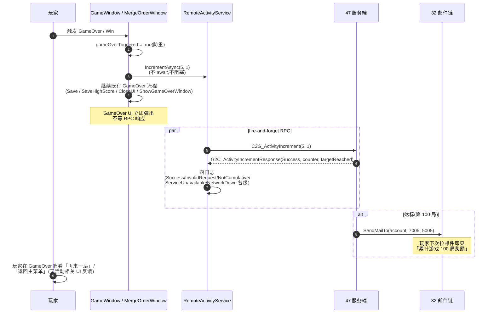

# Cumulative 客户端 GameOver hook + RemoteActivityService(Tier 4 第 5 子单 · 客户端段)

把 [Tier 4 第 4 子单](#47-activity-cumulative) 已交付的服务端归一 RPC `C2G_ActivityIncrement` 接进客户端业务:新建 `RemoteActivityService` 远程数据源(沿 [46 RemoteAttrLedgerService](#46-player-attr-ledger-client) + [32 RemoteMailService](#32-mail-server) 编排范式)+ 在客户端「玩了一局」出口 fire-and-forget 调一次 `IncrementAsync(activityId=5, delta=1)`,达累计 100 局后服务端走 [47 §3.4 发奖编排](#47-activity-cumulative::activity) 投邮件,玩家从邮箱领奖。

**本子单纯客户端业务 hook 接入,无 UI 投放、无 toast 弹窗、无离线缓存**——沿 [EVENT 解锁通路](#40-event-unlock-relay) 同范式:服务端达标自动投活动邮件,客户端从邮件领奖入背包/属性,不需要额外达标提示。

**读前必看 · 六条边界**

- **本子单是 Cumulative 节律客户端段首次实做**,服务端段在 47 已交付(协议 + handler + service + 累计 100 局样例配置)。客户端**只消费**已有协议 `C2G_ActivityIncrement / G2C_ActivityIncrementResponse`;不动 [47 协议契约](#47-activity-cumulative::protocol)、不动 [47 handler 校验链](#47-activity-cumulative::handler)、不动 [47 service 行为契约](#47-activity-cumulative::service)、不动 [37 通用变更入口](#37-player-attr-server::internal-api)、不动 [38 `PlayerAttrService`](#38-player-attr-client::service) 核心契约、不动 Classic 玩法循环。
- **GameOver hook 落「客户端两路 GameOver 出口 + MergeOrder 通关出口」三个时机**:Classic 棋盘无法继续触发 GameOver(沿 [29 玩法融合](#29-gameplay-fusion::v2)) → +1;MergeOrder「精力耗尽」/「GAME OVER」(沿 [11 §7.3 软 GameOver 三出路](#11-core-loop-completion::energy-empty)) → +1;MergeOrder 通关(`TriggerWin`) → +1。三个出口对玩家视角都是「玩了一局」,等价计数。Tarot 模式与 Classic 复用同一 `GameWindow` ([26 tarot_mode HUD](#26-tarot-mode-hud-art)),不分模式重复计数。
- **离线 / 服务不可达:不本地缓存 pending delta,直接放弃本次计数**(沿 [30 兑换码](#30-redeem-code-server) / [32 邮件领奖](#32-mail-server) / [46 ledger query](#46-player-attr-ledger-client) 「不本地放行」同口径)。47 §四 已声明「服务端不可达 → ServiceUnavailable;客户端不本地放行(累计 delta 丢弃 / 缓存重试由客户端段下一刀决策)」——本子单兑现「丢弃」一档,理由详 [§3.3 离线策略决策](#48-activity-cumulative-client::offline)。
- **UI 反馈:无 toast、无进度条、无窗口**。GameOver 时 +1 在玩家无感的「fire-and-forget」后台 RPC 中完成;达标第 100 局服务端投邮件,客户端通过 [21 / 32 邮件](#32-mail-server) 自然收到,**不在 GameOver 流程中插入任何 UI 提示**。详 [§3.4 UI 反馈决策](#48-activity-cumulative-client::ui)。
- **fire-and-forget 不阻塞 GameOver 流程**。`IncrementAsync` 异步发出后不等响应,不影响 GameOver 后续 UI 流程(`GameOverWindow` / `MergeOrderWinWindow` 立即弹出);响应回来后仅落日志(Success / 错误码),**不弹窗、不重试、不缓存**。
- **本机 MongoDB(`D:\mongodb-portable`,127.0.0.1:27017)真往返必备**。真往返达标 + 邮件投递类 PV(E1 / E2)在不可达时判 BLOCKED 非 FAIL(沿 [47 §八 BLOCKED 边界](#47-activity-cumulative::accept) + [46 §7.3](#46-player-attr-ledger-client::blocked-list))。编译 / EditMode 单测 / 零回归 / Code Review 照常验。

**立项信息**

| 项 | 内容 |
| --- | --- |
| **类型** | 全栈特性 · Tier 4 活动系统第 5 子单 · **客户端段(收口 Cumulative 节律)**。承接 [47 协议契约 + handler + service + 协议生成物](#47-activity-cumulative) 已 PASS 地基;本子单在客户端建数据源接缝 + 远程实现 + GameOver hook 业务接入,**收口** Cumulative 节律首套样例(累计游戏 100 局)的客户端段。出 code-free 设计意图 + 行为级数据源契约 + GameOver hook 落点规范 + 验收点,交客户端段(dev)落地,服务端零改。 |
| **方向约束** | 离线还原 · **去变现**:累计游戏 N 局是**无感后台累计**,无付费 / VIP / 充值返利;UI 反馈无(沿 EVENT 解锁同范式);加法式:新增独立服务 + 三处 GameOver hook fire-and-forget 调用,既有 Classic / MergeOrder 玩法循环 / 47 server 段 / 46 ledger 通路 / 42 HUD 三属性绑定零行为变化;**复用至上**:服务编排沿 46 / 32 同范式,业务接入沿 [25 / 38 / 42 客户端业务接入](#38-player-attr-client) 「在已有出口加一行 fire RPC」范式。 |
| **需求降层** | **a. 表层要求**(boss brief):新建 `RemoteActivityService` 沿 RemoteAttrLedgerService / RemoteMailService 范式调 `C2G_ActivityIncrementRequest`,在客户端 GameOver 时机调一次 `IncrementAsync(activityId=5, delta=1)` 累计游戏局数;plan 拍板离线策略 / UI 反馈 / GameOver 落点 / Tarot 模式是否共计。 **b. 底层目的**:① **让 [47 已交付的 Cumulative 节律真实跑起来](#47-activity-cumulative)** ——47 完整可独立验(SV2-SV10 mock 客户端发包)但**没有真实客户端业务推 counter**,本子单是 Cumulative 节律首次真实业务接入,把「服务端可用」升为「服务端在用」;② **为后续 4 套 Cumulative 类活动(累计交付 / 累计消费 / 累计获得 / 累计签到)铺接入范式** ——本子单给的 `RemoteActivityService` 是归一服务编排层,后续运营加同类活动只需在对应业务出口加一行 fire RPC 调用,无新服务 / 无新协议;③ **验证 47 反作弊三层防御在真客户端流量下不破** ——47 SV5 mock 验「客户端推 type=Login 活动拒」,本子单跑通真实客户端流量后,运营 / QA 可以观察 NotCumulative 拒数 = 0 = 正常无攻击;④ **完成 Tier 4 第 4 子单整刀闭环** ——47 是「server 段先行」,本子单是「客户端段收口」,合起来 Tier 4 第 4 + 5 子单合为「Cumulative 节律全栈通路」一刀。 **c. 有无更直达 b 的做法**:b 的本质 = 「让客户端在玩家完成一局时把计数推上服务端 + 服务端达标后玩家能收到奖」。直达做法对比: **方案 A(本子单采纳)** — 沿 32 / 46 同范式新建 `RemoteActivityService` 编排层 + `IActivityIncrementSource` 接缝 + `RemoteActivityIncrementSource` 生产实现,在 Classic + MergeOrder 三个 GameOver 出口加 fire-and-forget 调用,离线丢弃 + UI 无反馈(达标走 [32 邮件](#32-mail-server) 自然到账)。 **方案 B(已否)** — **直接在 GameWindow.TriggerGameOver 调 `FantasyNetwork.Session.Call`**:省 service / source 接缝,代码量少。**否的理由**:① 违 [38 §五 IRpcGateway](#38-player-attr-client::wiring) 范式(HotFix 业务层不直引 `Fantasy.*` 命名空间);② 单测桩无法注入(`FantasyNetwork.Session` 是单例 + 真实网络);③ 客户端业务出口分散(三处)各自调 RPC 会重复网络/异常处理代码,违 DRY;④ 未来加同类 Cumulative 活动各自重复一遍范式,违复用至上。 **方案 C(已否)** — **本地累计 + 定时批量上报**:GameOver 时本地 +1,每 N 局或每 N 秒批量发一次 RPC。**否的理由**:① 47 §3.5 单次 delta 上限钳制 10000 已防爆,本地批量优化收益边际;② 本地累计需持久化(防玩家关闭客户端丢失) + 重复防护(防同步成功后本地未清致重复推) + 失败重试,复杂度大;③ GameOver 频率本身低(玩家几分钟一局,RPC 一次/局是低频),不需要批量;④ 本地累计延迟会让玩家「完成 100 局」时服务端还没收到 → 触发达标延后 → 玩家体验上「我都玩到 105 局了才收到奖」混乱。 **方案 D(已否)** — **服务端拦截 `C2G_*GameAction` 等玩法协议自动 +1**:客户端零改。**否的理由**:① 当前玩法协议无「报告本局结束」语义协议(GameOver 是客户端进程内事件);② 服务端无玩法上下文判区「玩家是否真完成了一局」(三出口语义客户端独占);③ 把客户端业务上下文上推服务端 = 服务端要懂玩法 = 反层级。 **结论**:取方案 A — service / source / 接缝沿 46 同范式 + 三处 GameOver 出口 fire-and-forget + 离线丢弃 + 无 UI 反馈。 |
| **范围(产品 · 玩法)** | **客户端新增**:① 数据源接缝 `IActivityIncrementSource`(纯接口,沿 [46 `IAttrLedgerSource`](#46-player-attr-ledger-client::source) / [32 `IRemoteMailSource`](#32-mail-server) 范式)+ 生产实现 `RemoteActivityIncrementSource`(经 [38 `IRpcGateway`](#38-player-attr-client::wiring) 范式发 `C2G_ActivityIncrement` + 收 `G2C_ActivityIncrementResponse`,反序列化为客户端 POCO `ActivityIncrementResult`);② 客户端服务 `RemoteActivityService`(沿 [46 `RemoteAttrLedgerService`](#46-player-attr-ledger-client::orchestrator) / [32 `RemoteMailService`](#32-mail-server) 范式,持 `IActivityIncrementSource` 接缝,提供 `IncrementAsync(activityId, delta)` 返结构化结果);③ POCO `ActivityIncrementResult`(3 字段映射 47 §3.2 响应:Code / CurrentCounter / TargetReached);④ 结果码枚举 `ActivityIncrementCode`(Success / InvalidRequest / NotCumulative / ServiceUnavailable / NetworkDown 五档,沿 [46 `AttrLedgerQueryCode`](#46-player-attr-ledger-client::poco) 范式 + `NotCumulative` 补);⑤ 三个 GameOver 出口的 fire-and-forget hook 调用(Classic `GameWindow.TriggerGameOver` + MergeOrder `MergeOrderWindow.TriggerGameOver` + MergeOrder `MergeOrderWindow.TriggerWin`);⑥ `GameContext.Activity` 挂入(沿 [38 `GameContext.PlayerAttr`](#38-player-attr-client::wiring) + [46 `GameContext.AttrLedger`](#46-player-attr-ledger-client::orchestrator) 范式)。 **客户端不动**:Classic / MergeOrder 玩法循环核心逻辑(只在 GameOver 后才调 hook,不在 hook 前);GameOverWindow / MergeOrderWinWindow 行为(无 UI 改);38 / 42 / 46 已落客户端段;Atlas / Sheet 图集;HUD 接线。 **协议**:**零新增**(沿用 47 已交付两条协议生成物)。 **服务端零改**(本子单纯 client 段)。 **配置零改**(47 已加 activity_id=5 行)。 |
| **关键约束** | ① 客户端**不持** counter 本地副本(无审计副本,服务端独占);② 离线 / 服务不可达 / 网络异常**不本地缓存 pending delta**(直接放弃本次计数,沿 [§3.3](#48-activity-cumulative-client::offline));③ **fire-and-forget**:hook 调用不 `await`、不阻塞 GameOver 后续流程,响应回来仅日志;④ **三出口等价计数**:Classic GameOver + MergeOrder 软 GameOver + MergeOrder 通关都算 1 局(玩家视角等价);⑤ **Tarot / Classic 模式不分别计数**:复用同一 `GameWindow` 实例,GameWindow.TriggerGameOver 触发一次 = 1 局,与玩法模式正交;⑥ HotFix 业务层**不引** `Fantasy.*` 命名空间(沿 [38 §五 IRpcGateway 范式](#38-player-attr-client::wiring));⑦ 错误码客户端处理:Success / NotCumulative 静默(Info / Error 日志);InvalidRequest / NetworkDown / ServiceUnavailable 各级日志 + 不重试 + 不缓存;⑧ `_gameOverTriggered` / `_finished` 等防重标记沿用(避免同一局 GameOver 触发两次 hook); |

## 一、前后端职责切分(本子单视角) {#split}

| 环节 | 归属 | 本子单交付 |
| --- | --- | --- |
| 协议 `C2G_ActivityIncrement` / `G2C_ActivityIncrementResponse` | **服务端 · 47 已交付** | 不动(消费) |
| Handler:身份取 + 5 项校验 + 调 service | **服务端 · 47 已交付** | 不动(消费) |
| Service `ActivityProgressService.Increment` + 累计 + 达标判定 + 发奖编排 | **服务端 · 47 已交付** | 不动(消费) |
| 累计游戏 100 局活动配置(`activity.xlsx` 行) | **47 已交付** | 不动(消费) |
| 协议生成物两端共识 | **47 已交付** | 不动(消费) |
| 数据源接缝 `IActivityIncrementSource` | **客户端 · 本子单新增** | ✓ 交付 |
| 远程实现 `RemoteActivityIncrementSource`(经 `IRpcGateway` 发协议) | **客户端 · 本子单新增** | ✓ 交付 |
| `RemoteActivityService` 编排层(`IncrementAsync` + 错误码归一) | **客户端 · 本子单新增** | ✓ 交付 |
| POCO `ActivityIncrementResult` + `ActivityIncrementCode` 枚举 | **客户端 · 本子单新增** | ✓ 交付 |
| `GameContext.Activity` 挂入 + 启动期实例创建 | **客户端 · 本子单新增** | ✓ 交付 |
| Classic `GameWindow.TriggerGameOver` 加 hook 调用 | **客户端 · 本子单新增** | ✓ 交付 |
| MergeOrder `MergeOrderWindow.TriggerGameOver` 加 hook 调用(精力耗尽 + GAME OVER 两路共用) | **客户端 · 本子单新增** | ✓ 交付 |
| MergeOrder `MergeOrderWindow.TriggerWin` 加 hook 调用(通关也算一局) | **客户端 · 本子单新增** | ✓ 交付 |
| 我的活动进度 UI / 达标 toast / 进度条 | **不做 · Tier 4+** | 沿 EVENT 同范式无 UI 反馈,留 [O5](#48-activity-cumulative-client::open) |
| 离线缓存 pending delta + 重试 | **不做 · 沿 30/32/46 不本地放行**([§3.3](#48-activity-cumulative-client::offline)) | 留 [O3](#48-activity-cumulative-client::open) |
| 其它 4 套 Cumulative 类活动接入 | **不做 · Tier 4+** | 留 [O6](#48-activity-cumulative-client::open) |

## 二、与既有稿关系 {#related}

| 既有稿 | 关系 | 本子单是否触发同步重写 |
| --- | --- | --- |
| [47 Cumulative 节律落地 + 累计游戏 N 局样例(Tier 4 第 4 子单 · server)](#47-activity-cumulative) | **本子单的协议地基**:消费 47 已交付的 `C2G_ActivityIncrement` + `G2C_ActivityIncrementResponse` + handler + service + 累计 100 局活动配置 + 客户端协议生成物,行为按 47 §3 契约 | **同任务内同步**(§六同步重写):① 47 §一立项框「客户端业务接入(GameOver hook 调 RPC)留下一刀」覆盖式重写为「**48 已交付**」;② 47 §3.6 跑通示例图示「下一刀 GameOver hook 接」覆盖式重写为「48 已接(Classic + MergeOrder 三出口)」;③ 47 §七 O6「客户端 GameOver hook 接入 + UI 反馈 + 离线缓存策略」覆盖式重写为「**48 已交付**:GameOver hook 已接三出口 / UI 反馈无(沿 EVENT 同范式) / 离线丢弃(不本地缓存,沿 30/32/46 不本地放行)」;④ 47 §八 8.2 PVC2「客户端业务接入零 diff」覆盖式重写为「**48 已接**(三出口 hook + `RemoteActivityService` 已落)」;⑤ 47 §八 BLOCKED 列表「客户端业务接入」行覆盖式重写为「**48 已交付**」 |
| [11 核心补全 / 29 玩法融合 / 49 无尽模型](#49-infinite-no-rounds) | **「玩了一局」事件源参照**:本子单三处 hook 挂在 Classic `GameWindow.TriggerGameOver` + MergeOrder `TriggerGameOver` / `TriggerWin`。<mark class="r">无尽模型([设计 49](#49-infinite-no-rounds))取消融合玩法的通关 / 软 / 硬 GameOver 离散事件</mark>——这些 hook 所依赖的「一局结束」事件在无尽模型落地后不再触发,「玩了一局」需重新定义事件源(如改计「会话进入次数」「累计交付单数」,或退役该样例活动) | **本子单不改 11 / 29 / 49**;事件源重定义是无尽模型落地的**衍生影响**(见交接区:cross-doc 冲突 · 47/48 GameOver 计数),由 boss/dev 裁后续适配。**注**:Cumulative 节律基础设施(RPC / handler / `$inc` counter / 邮件投奖)与触发源解耦、不受影响,只「累计游戏 N 局」样例活动的触发语义随无尽模型重定 |
| [25 个人信息窗(PlayerInfoWindow 钻石余额行)](#25-player-info-window-art) / [38 玩家属性客户端](#38-player-attr-client) / [42 HUD 三属性绑定](#42-tarot-hud-player-attr-bind) / [46 我的流水 UI](#46-player-attr-ledger-client) | **正交**:本子单不改这些客户端段(钻石余额 / 属性服务 / HUD / 流水窗);若 reward=5005 含钻石或 6101 含 EVENT 头像,达标后玩家从邮箱领奖时这些客户端段自然联动 | **不改 25 / 38 / 42 / 46** |
| [32 邮件服务端化 + 客户端段](#32-mail-server) | **达标投奖通路**:Cumulative 达标后服务端经 [32 §3.5 SendMailTo](#32-mail-server::source-api) 投活动邮件,玩家从客户端 [32 邮件窗](#32-mail-server) 拉列表 + 领奖;沿邮件通路天然完成奖励到账 | **不改 32** |
| [40 EVENT 解锁通路(Tier 4 第 2 子单 · server)](#40-event-unlock-relay) / [41 EVENT 客户端段](#41-event-unlock-client) | **正交**:EVENT 是 Login 类活动(累计登录达标),本子单是 Cumulative 类(累计游戏达标),两路节律入口完全独立;EVENT 与本子单都通过 32 邮件链投奖,客户端通用通路无差异 | **不改 40 / 41** |
| [43 Login 类活动批量(Tier 4 第 3 子单)](#43-activity-login-batch) | **正交**:43 是 Login 类活动批量(4 套并存),本子单是 Cumulative 类首套客户端接入;两类节律两路独立 | **不改 43** |
| [38 §五 `IRpcGateway` 范式](#38-player-attr-client::wiring) | **网络层薄壳范式参照**:本子单 `RemoteActivityIncrementSource` 沿 `IRpcGateway` 范式经 RpcGatewayProd 间接调 Fantasy,业务层不直引 `Fantasy.*` | **不改 38**(沿其范式,无新增接口需求) |
| [GameContext 单例](#23-settings-window-art) | **服务挂入宿主**:本子单加 `GameContext.Activity` 字段(沿 38 / 46 / 32 同范式);GameApp 启动期实例创建 + 注入生产源 | **同任务内同步**:GameContext 类加 `Activity` 字段(沿 38 `PlayerAttr` / 46 `AttrLedger` / 32 `Mail` 范式) |
| [26 tarot_mode HUD = Classic GameWindow 再主题](#26-tarot-mode-hud-art) | **GameWindow 复用关系**:Tarot 与 Classic 共用同一 `GameWindow` 实例,GameWindow.TriggerGameOver 调一次 hook = 1 局,与玩法模式正交;不分别计数 | **不改 26** |

> [!NOTE]
> **plan 视角:38 / 46 命名一致性**
>
> 46 § 二 NOTE 已提到 38 设计稿正文写 `Gold / Diamond / Energy`,实际代码用 `Coin / Diamond / Stamina`。本子单沿**代码现状**(`AttrType.Coin / Diamond / Stamina`),与本子单业务无直接关系(本子单不动属性枚举),仅作为客户端段命名参照。

## 三、客户端数据源与服务行为 {#service}

### 3.1 POCO 与结果包 {#poco}

`ActivityIncrementResult` 字段集与 [47 §3.2](#47-activity-cumulative::protocol) 协议响应一一映射(3 字段);**不**含额外内部字段。

| 字段 | 类型 | 含义 / 约束 | 对位 47 §3.2 |
| --- | --- | --- | --- |
| `Code` | `ActivityIncrementCode` 枚举(本子单新建) | 结果码(5 档),映射 47 `resultCode` + 客户端补 `NetworkDown` | `resultCode` |
| `CurrentCounter` | `long` | 写后 counter 值(仅 Code=Success 时有意义,其它码取 0) | `currentCounter` |
| `TargetReached` | `bool` | 本次 Increment 是否首次达标 + 抢占成功 + 投奖(仅 Code=Success 时有意义) | `targetReached` |

`ActivityIncrementCode` 枚举(5 档,**比 47 §3.3 多一档 `NetworkDown`**,沿 [46 `AttrLedgerQueryCode`](#46-player-attr-ledger-client::poco) + [38 `ChangeReject`](#38-player-attr-client) 范式区分「服务端返 ServiceUnavailable」与「客户端连接断 / RPC 异常」):

| 枚举值 | 触发 | 客户端处理 |
| --- | --- | --- |
| `Success` | 47 §3.3 Success | 落 Info 日志(`[Activity] +{delta} → counter={N}, targetReached={bool}`);若 TargetReached=true 落额外 Info 日志(`[Activity] 累计达标 activity={id}`) |
| `InvalidRequest` | 47 §3.3 InvalidRequest(activityId 不存在 / delta ≤ 0 / 字段格式异常)— 理论上客户端发的参数都合法,出现此码 = 客户端 / 配置 bug | Error 日志(`[Activity] InvalidRequest activity={id} delta={delta} — 客户端 bug 或配置缺`);**不重试** |
| `NotCumulative` | 47 §3.3 NotCumulative(activityId 对应配置 `type ≠ Cumulative`)— 理论上客户端推的都是 Cumulative 活动,出现 = 客户端 / 配置 bug 或攻击 | Error 日志(`[Activity] NotCumulative activity={id} — 客户端传错 id 或活动类型不符`);**不重试** |
| `ServiceUnavailable` | 47 §3.3 ServiceUnavailable(MongoDB 不可达 / Fantasy.Net 内部异常) | Warning 日志(`[Activity] ServiceUnavailable activity={id} — 本次累计丢弃`);**不重试 + 不缓存**(沿 [§3.3 离线策略](#48-activity-cumulative-client::offline)) |
| `NetworkDown` | 客户端 catch 网络异常(连接断 / 超时 / Session 未建立) | Warning 日志(`[Activity] NetworkDown activity={id} — 本次累计丢弃`);**不重试 + 不缓存** |

### 3.2 `IActivityIncrementSource` 接缝 + `RemoteActivityIncrementSource` 生产实现 {#source}

沿 [46 `IAttrLedgerSource`](#46-player-attr-ledger-client::source) + [32 `IRemoteMailSource`](#32-mail-server) 范式:

| 项 | 内容 |
| --- | --- |
| **接缝 `IActivityIncrementSource`** | 唯一方法 `UniTask<ActivityIncrementResult> IncrementAsync(int activityId, int delta)`;返 `ActivityIncrementResult`(失败时 `Code != Success` + `CurrentCounter=0` + `TargetReached=false`);**不抛**(失败转结果码) |
| **生产实现 `RemoteActivityIncrementSource`** | 构造期注入 `IRpcGateway`(沿 [38 §五](#38-player-attr-client::wiring) 范式,具体 RPC 方法签名由 dev 据 47 协议生成物取);`IncrementAsync` 内:① 构造 `C2G_ActivityIncrement(activityId, delta)`(身份从会话取,客户端不自报 account,沿 [47 §3.2](#47-activity-cumulative::protocol));② 经 `IRpcGateway.CallActivityIncrementAsync` 发送等响应;③ try-catch 网络异常 → 返 `ActivityIncrementCode.NetworkDown`;④ 检查 Session 未建立 → 返 `NetworkDown`;⑤ 响应反序列化为 `ActivityIncrementResult`(逐字段拷贝)+ 按 `resultCode` 映射 `ActivityIncrementCode` |
| **单测桩** | `FakeActivityIncrementSource`(EditMode 单测注入,可配置返特定 Result / 特定 Code / 异常,验服务编排逻辑) |
| **不持本地状态** | 无缓存、无本地副本(每次调真请求);**禁**在客户端持久化 pending delta(本机无审计副本,沿 47 §四「不本地放行」服务端独占) |

> [!NOTE]
> **`IRpcGateway` 是否需要扩接口?**
>
> [38 §五 IRpcGateway](#38-player-attr-client::wiring) 现有接口(沿其范式,具体方法集由 dev 据工程现状取);本子单需「调 `C2G_ActivityIncrement` 返 `G2C_ActivityIncrementResponse`」一个方法。dev 落地时有两选:① 给 `IRpcGateway` 加 `CallActivityIncrementAsync(int activityId, int delta)` 方法(沿 38 现有 `CallPropertyChangeAsync` 同范式);② `RemoteActivityIncrementSource` 直引 `IRpcGateway` 现有方法 + 内部 Fantasy.Net 调用(若 38 已提供「通用 Call」入口)。**plan 不指代码定位**,dev 据 38 工程现状取。无论哪选,业务层 `RemoteActivityIncrementSource` / `RemoteActivityService` / GameOver hook 调用方都**不直引** `Fantasy.*` 命名空间,守 [38 PV14 ⑦](#38-player-attr-client) 约束。

### 3.3 `RemoteActivityService` 编排层 {#orchestrator}

沿 [46 `RemoteAttrLedgerService`](#46-player-attr-ledger-client::orchestrator) / [32 `RemoteMailService`](#32-mail-server) 范式:

| 项 | 内容 |
| --- | --- |
| **职责** | 1. 注入 `IActivityIncrementSource`;2. 提供 `IncrementAsync(activityId, delta)` 转发(本子单当前与接缝同 1:1,但服务层保持便于 Tier 4+ 加交叉编排 / 批量上报 / 重试);3. **不持本地状态**(无缓存) |
| **挂入** | `GameContext.Activity`(沿 [38 `GameContext.PlayerAttr`](#38-player-attr-client::wiring) + [46 `GameContext.AttrLedger`](#46-player-attr-ledger-client::orchestrator) + [32 `GameContext.Mail`](#32-mail-server) 范式),启动期 `GameApp.StartGameLogic` 创建实例 + 注入生产 `RemoteActivityIncrementSource` |
| **API** | `UniTask<ActivityIncrementResult> IncrementAsync(int activityId, int delta)`;activityId 1-9 由调用方据 `activity.xlsx` 取(本子单首套 = 5);delta 客户端不钳制(服务端 47 §3.3 钳制上限 10000) |
| **错误兜底** | source 层已返结构化 `ActivityIncrementCode`,服务层不再 catch;调用方(GameOver hook)据 Code 出日志(不弹窗、不重试、不缓存,沿 §3.4) |

### 3.4 离线 / 服务不可达策略:**不缓存,直接放弃本次计数** {#offline}

**决策**:服务端不可达 / 网络异常 / RPC 失败时,客户端**不本地缓存 pending delta**,直接放弃本次计数(沿 [30 兑换码](#30-redeem-code-server) / [32 邮件领奖](#32-mail-server) / [46 ledger query](#46-player-attr-ledger-client) 「不本地放行」同口径)。

**为什么不本地缓存 pending delta?**(决策理由)

| 角度 | 不缓存(默认) | 缓存 + 重试(否) |
| --- | --- | --- |
| **审计完整性** | 服务端 counter 是单一真值,漏一次 = 玩家少一格,不破信任 | 本地累计 pending 是「客户端可篡改的伪 counter」,若同步成功但本地未清致重复推 = counter 多推;若同步失败但显示「已累计」=客户端伪态 |
| **复杂度** | 一行 fire-and-forget,失败日志即止 | 需持久化(PlayerPrefs / Json) + 重启时上报 + 重复防护(本地 nonce) + 服务端 idempotency key(违 47 协议不动) + 失败重试退避(指数 backoff) |
| **玩家体验** | 漏一局 / 100 局 = 1% 进度,玩家无感(达 100 需 ~13-25 天) | 同步失败「我刚玩了一局怎么进度没动」 → 用户认知混乱;批量推时一次推多个 delta 服务端日志看不清触发源 |
| **服务端权威** | 沿 47 §四 「客户端不本地放行」服务端独占 | 客户端可断网刷 counter + 复连后推 = 永久漏奖判定权(玩家「以为完成」服务端不知) |
| **同范式参照** | 30 兑换码 / 32 邮件领奖 / 46 ledger query 全是「不本地放行」 | 与现有客户端段范式不一致,需要新建本地缓存通路 |

**漏窗诚实**:服务端不可达期间玩家完成的局数会被丢弃。这是 Cumulative 类活动「玩家少一格进度」类窄窗,与 [22 排行榜断服回退本地源](#22-rank-system) 无超发风险 / 可降级语义**不同源** —— 本子单是「服务端权威 counter」,本地放行 = 服务端复连后丢失推送 = 审计裂缝。**不可降级**。

**真做替代(运营若有「玩家漏奖反馈」诉求,Tier 4+)**:[O3 备选 = 本地 PendingIncrements 队列](#48-activity-cumulative-client::open) — 持 List<(activityId, delta, attemptTs)> 在 PlayerPrefs / 元层 save,启动时 / 每 N 秒批量上报,**需服务端补 idempotency key 字段**(协议 → 47 协议改 → 违 47 不改协议守不变量)。本子单不做。

### 3.5 GameOver hook 落点 {#hook}

**三处 fire-and-forget 调用点**(行为级,具体代码定位由 dev 据工程现状取):

```mermaid
graph TD
    A["Classic 棋盘无法继续<br/>(GameWindow 内核)"] --> B["GameWindow.TriggerGameOver()"]
    B --> B1["_gameOverTriggered 防重<br/>(已有,不动)"]
    B --> B2["GameContext.Activity.IncrementAsync(5, 1)<br/>fire-and-forget"]
    B --> B3["既有 GameOverWindow 弹出"]

    C["MergeOrder 精力耗尽 / GAME OVER"] --> D["MergeOrderWindow.TriggerGameOver(title)"]
    D --> D1["_finished 防重<br/>(已有,不动)"]
    D --> D2["GameContext.Activity.IncrementAsync(5, 1)<br/>fire-and-forget"]
    D --> D3["既有 GameOverWindow 弹出"]

    E["MergeOrder 通关达成"] --> F["MergeOrderWindow.TriggerWin(lines)"]
    F --> F1["_finished 防重<br/>(已有,不动)"]
    F --> F2["GameContext.Activity.IncrementAsync(5, 1)<br/>fire-and-forget"]
    F --> F3["既有 MergeOrderWinWindow 弹出"]

    style B2 fill:#1a1a2a,stroke:#6c8cff
    style D2 fill:#1a1a2a,stroke:#6c8cff
    style F2 fill:#1a1a2a,stroke:#6c8cff
```

**落点规则**:

| 出口 | 落点描述(行为级) | 防重依据 |
| --- | --- | --- |
| Classic GameOver | Classic 棋盘无法继续触发的 GameOver 处理函数,在防重标记守卫之后、UI 弹窗之前/之后(任一,因 fire-and-forget 不阻塞)调一次 `IncrementAsync(5, 1)` | 既有防重标记守 GameOver 只触发一次 |
| MergeOrder 软 / 硬 GameOver(精力耗尽 + GAME OVER 两路共用同一处理) | MergeOrder GameOver 处理函数,在防重标记守卫之后、`FlushSaveIfDirty` 之后调一次 `IncrementAsync(5, 1)` | 既有 finished 标记守 GameOver / Win 只触发一次 |
| MergeOrder 通关 | MergeOrder 通关处理函数(独立于 GameOver 处理),在防重标记守卫之后、`MergeOrderWinWindow` 弹窗之前/之后调一次 `IncrementAsync(5, 1)` | 同上 finished 标记 |

**为什么三出口等价计数?**

| 出口 | 玩家视角 | 是否算「玩了一局」 |
| --- | --- | --- |
| Classic GameOver | 我玩了一局 BlockBlast,没法继续了 | 是 |
| MergeOrder 软 GameOver(精力耗尽) | 我玩了一局合成订单,精力用完没法继续 | 是 |
| MergeOrder 硬 GameOver | 我玩了一局合成订单,没法继续 | 是 |
| MergeOrder 通关 | 我玩了一局合成订单,赢了 | **是**(通关也是「玩了一局」,与 GameOver 等价计数 — 否则玩家「玩得越好越没奖」反直觉) |

**为什么 Tarot 模式与 Classic 不分别计数?**

- Tarot 模式与 Classic 复用同一 `GameWindow` 实例(沿 [26 tarot_mode HUD](#26-tarot-mode-hud-art) 「Tarot 模式 = Classic GameWindow 再主题」决策);GameWindow.TriggerGameOver 在 Tarot / Classic 任一模式下都触发同一函数;hook 调一次 = 1 局。
- 累计活动语义本身就是「玩了 N 局游戏」,不区分玩法子模式;若运营未来想分模式(如「累计 50 局 Tarot 模式」)是新活动配置(activityId 不同,client 业务接入点不同),由运营定 + 业务层加单独 hook(本子单留 O7)。

### 3.6 fire-and-forget 不阻塞 GameOver 流程 {#fire-forget}

**fire-and-forget 实现要点**(行为级):

- hook 调用**不**使用 `await`,直接 `_ = GameContext.Activity.IncrementAsync(5, 1)` 或 `.Forget()`(UniTask 标准 fire-and-forget 范式);
- `IncrementAsync` 内部 try-catch 全部异常(网络 / RPC / 反序列化),返结构化错误码,**不抛**;
- 调用方(GameWindow / MergeOrderWindow)不订阅响应,响应由 service 层落日志即止;
- GameOver 后续流程(保存 / SaveHighScore / 关窗 / 弹 GameOverWindow)与 hook 并行,不互相阻塞;
- 若 RPC 响应延迟到 GameOverWindow 已弹出之后 / 玩家已开新局,响应日志仍正常落,不影响 UI;
- 若玩家在响应未回时**关闭 App**,本次 hook 推送在 OS 层取消(无持久化、无重试,沿 §3.3 不缓存)。

### 3.7 UI 反馈:无 toast、无进度条、无窗口 {#ui}

**决策**:本子单**不**做任何活动相关 UI 反馈。

**为什么无 UI 反馈?**

| 角度 | 无 UI 反馈(默认) | 加 toast / 进度条(否) |
| --- | --- | --- |
| **同范式参照** | 沿 EVENT 解锁([40 / 41](#40-event-unlock-relay))「服务端达标自动投活动邮件,客户端从邮件领奖」无额外达标提示 | 与 EVENT 同范式不一致,需新建「累计达标」UI |
| **GameOver 焦点** | GameOver 时玩家关注「再来一局 / 返回主菜单」,无干扰 | 「累计 100 局达成」toast 与 GameOverWindow 抢焦点,玩家可能错过领奖路径(以为 toast 是奖,实际要去邮箱领) |
| **达标频率** | 累计 100 局是长期成就(13-25 天达 1 次),低频 | 每次 GameOver 都更新「99/100、100/100」进度条 = 频繁分散注意力 |
| **达标后玩家可观测** | 邮箱 badge 因新邮件自动刷新(沿 [32 邮件](#32-mail-server)),玩家自然能看到 | 双重提示(toast + 邮件)冗余 |
| **离线无 UI 干扰** | 离线时 fire-and-forget 失败仅落日志,玩家完全无感 | 离线时 toast 「活动累计失败」给玩家造成「我刚玩的不算了?」焦虑 |
| **复杂度** | 零 UI 改 | 需新建 toast 组件 + 美术 + 动画 + 防重(防短时间多次达标弹双 toast) |
| **去变现守不变量** | 玩家无感累计,不主动诱导「再玩一局」 | toast 「99/100 还差 1 局!」是变现诱导文案(虽不付费但是行为操控) |

**「我的活动进度」UI 入口?**

本子单**不**做「我的活动进度」UI 入口(如挂 PlayerInfoWindow tab 显示当前 counter / 目标 / 已发奖)。**理由**:① 当前 Cumulative 类活动只有 1 套(累计 100 局),信息密度极低,不值新建窗口;② 玩家发现达标走邮箱 badge 通路即可;③ 若 Tier 4+ 运营加多套 Cumulative 活动(累计交付 / 累计消费 / 累计获得 / 累计签到),可考虑做「我的活动进度」窗集中展示 + 需服务端加「查询 counter」协议(47 无此协议)+ UI 投放设计 — 留 [O5 后续](#48-activity-cumulative-client::open)。

**「最简 toast」替代档(本子单不取,留 O4)**:仅在达标(`TargetReached=true`)时弹一个最简 toast「累计活动达成,请查收邮件」+ 1.5s 自动消失。**否的理由**:① 弱诱导文案仍属诱导;② 文案中「邮件」字眼是内部术语,玩家可能不知是「邮箱」;③ 与 EVENT 范式不一致(EVENT 也无达标 toast);④ 增加美术 / 动画 / 防重成本,与「最简」自相矛盾。

### 3.8 错误码客户端处理 {#error-handling}

| 错误码 | 客户端处理 | 日志级别 | 重试 / 缓存 | 触发 UI |
| --- | --- | --- | --- | --- |
| `Success` | 累加成功;若 `TargetReached=true` 落额外 Info(便于 QA 验证达标) | Info | 不重试(无需) | 无 |
| `InvalidRequest` | 客户端 bug 或配置缺(activityId 不在 `activity.xlsx` / delta 异常)— 代码层 bug,需修代码 | Error | 不重试(重试不会成功) | 无(玩家无感) |
| `NotCumulative` | 客户端推错 activityId(传了 Login / 未来其它类活动 id)或活动 type 配错 — 代码 / 配置 bug | Error | 不重试 | 无 |
| `ServiceUnavailable` | 服务端 MongoDB / Fantasy.Net 抖动 — 本次累计丢弃(沿 §3.3 不缓存) | Warning | 不重试 + 不缓存 | 无 |
| `NetworkDown` | 客户端网络异常 / Session 未建 — 本次累计丢弃 | Warning | 不重试 + 不缓存 | 无 |

**为什么 InvalidRequest / NotCumulative 是 Error 级?**

这两档代表「客户端代码 bug 或配置缺」(理论上正常客户端流量不会触发),Error 级日志可让 QA / 运营在生产环境快速发现异常;**ServiceUnavailable / NetworkDown 是 Warning 级**(运营环境抖动或玩家网络问题,不是 bug,降到 Warning 避免噪音)。

**为什么不弹错误窗给玩家?**

- Cumulative 累计是「后台累计」,玩家本就无感,失败也无感更一致;
- 弹错误窗破坏 GameOver 焦点;
- 玩家发错误窗也无法行动(网络问题让玩家联系客服无意义,bug 让玩家联系开发也无意义);
- 沿 38 `ChangeReject` 「失败安静」范式(38 改名失败有 reject 提示是因为「玩家主动点改名」需要反馈,本子单是「玩家无感后台」无需反馈)。

## 四、整局走查与崩法 {#walk}

把本子单的客户端段在「**首次 GameOver / 99 次正常累计 / 第 100 次达标 / 101 次跳过 / 服务不可达 / 网络断 / 玩家关 App / 同一局触发两次 GameOver / Tarot 模式 / 通关**」十类场景下走一遍。

### 4.1 GameOver 路径相关崩法 {#walk-gameover}

| 崩法 | 后果 | 对策 |
| --- | --- | --- |
| 同一局 GameOver 触发两次(玩家点 GameOverWindow「再来一局」时旧 GameOver 流程残留) | 同一局推 +2 → counter 多 1 | 既有 `_gameOverTriggered` / `_finished` 防重标记守 GameOver 处理函数只跑一次 → hook 也只调一次;**hook 调用在防重标记**之后**(沿 §3.5 落点规则);PV6 验「同一局 GameWindow.TriggerGameOver 触发两次,hook 只调一次」 |
| Tarot 模式与 Classic 都触发各自 GameOver(理解错) | 一次 GameOver 推 +2 → counter 多 1 | 沿 §3.5 决策:GameWindow.TriggerGameOver 在 Tarot / Classic 任一模式下都触发同一函数(共用 GameWindow 实例);hook 调一次 = 1 局 |
| MergeOrder 通关被理解为「不算一局」(因不是 GameOver 而是 Win) | 通关玩家 counter 不增 → 玩家「我赢了反而没奖」反直觉 | 沿 §3.5 决策:MergeOrder `TriggerWin` 也加 hook 调用;通关与 GameOver 等价计数 |
| MergeOrder 双 GameOver 路径(精力耗尽 + GAME OVER)漏接一路 | 某一路 GameOver 无 hook → counter 漏推 | 沿 §3.5 决策:精力耗尽 + GAME OVER 两路都进同一 `TriggerGameOver(title)` 函数(grep 工程确认两路调用方都是同一函数),hook 加在该函数内 = 两路共用 hook |
| GameWindow / MergeOrderWindow 在 hook 调用时 `GameContext.Activity` 为 null(启动期未初始化) | NRE 抛在 GameOver 流程中 → 玩家 GameOver 卡死 | null-safe:hook 内 `if (GameContext.Instance?.Activity != null)` 守卫;**首选**:GameApp.StartGameLogic 启动时同步创建 `GameContext.Activity = new RemoteActivityService(prodSource)`(沿 38 / 46 同范式),启动后立即可用 |

### 4.2 网络 / 服务异常相关崩法 {#walk-network}

| 崩法 | 后果 | 对策 |
| --- | --- | --- |
| GameOver 时网络断 / Session 未建 | RPC 抛 → 若不 catch 会污染 GameOver 流程 | `RemoteActivityIncrementSource.IncrementAsync` try-catch 全部网络异常 → 返 `NetworkDown`;fire-and-forget 调用方不订阅响应,日志即止;PV9 单测验「Session=null 时返 NetworkDown 不抛」 |
| GameOver 时服务端 MongoDB 抖 → handler 返 ServiceUnavailable | UI 显错误窗破坏 GameOver 流程 | §3.4 决策无 UI 反馈;响应返 ServiceUnavailable → 落 Warning 日志即止,不弹窗 |
| 玩家 GameOver 后立即关闭 App(响应未回) | OS 关闭 RPC socket → 服务端可能已收到请求但客户端无响应 | 服务端 47 §3.3 handler 是「收到请求即处理」(`$inc counter` 原子,即使客户端不读响应 counter 也已写入),无影响;客户端无响应 = 无日志,无副作用 |
| 玩家 GameOver 后立即开新局,新局 GameOver(短时间内两次)| 第一次 RPC 还在飞,第二次 RPC 发起 → 同账号并发两次 IncrementAsync | 服务端 47 SV8 已验「同账号并发原子幂等」(`$inc` 文档级原子) → counter 最终 = 旧值 + 1 + 1 = 旧值 + 2 ✓;客户端两次 fire-and-forget 互不影响 |
| 玩家长时间离线(数小时)+ 大量游戏 | 全部丢弃(沿 §3.3 不缓存)→ 玩家进度漏多格 | 沿 §3.3 决策接受漏窗;离线本就是边缘场景(玩家通常连网玩);Tier 4+ 若需补漏走 [O3 PendingIncrements 队列](#48-activity-cumulative-client::open) 但需服务端补 idempotency |

### 4.3 数据 / 协议相关崩法 {#walk-data}

| 崩法 | 后果 | 对策 |
| --- | --- | --- |
| 客户端传错 activityId(本子单硬编码 5,未来扩多个易传错) | handler 返 `InvalidRequest`(99 不在配)或 `NotCumulative`(传了 Login 类 id) | 本子单只调一处 `IncrementAsync(5, 1)`,硬编码 5;未来加同类活动时新建常量类 `ActivityIds`(`AccumulatePlayCount=5 / AccumulateOrderDeliver=6 / ...`)集中常量(Tier 4+),避免散落魔数 |
| delta 传 0 / 负数 / 大数 | handler 返 `InvalidRequest`(delta ≤ 0)/ 钳到 10000(delta > 10000) | 本子单硬编码 delta=1,不传变量;未来加同类活动若需 delta=N 时调用方自查 N > 0 |
| 服务端响应 `currentCounter` / `targetReached` 字段缺失(协议生成物 bug) | 反序列化 default → CurrentCounter=0 / TargetReached=false → 日志可见但不影响 GameOver 流程 | 47 协议生成物已在 47 PVC1 验过;若实际出 = 47 协议 bug,联调 E1 拦 |
| 47 协议未来扩字段(Tier 4+ 加 progress / cycleKey 等)| 客户端 POCO 不感知新字段 = 旧字段仍正常 | 沿 protobuf 演进规范(向后兼容);客户端 POCO 不破 |
| `_ = IncrementAsync(...)` 写法漏 `.Forget()` 导致 UniTask 未处理 | 编译警告 / 运行期 warning 「UniTask was not awaited」 | dev 落地用 `.Forget()` 显式标记 fire-and-forget(UniTask 范式);Code Review PV14 ⑤ 核 |

### 4.4 诚实边界(本子单守住什么、不守什么) {#honest-edge}

本子单**守住**:
- Cumulative 节律首次客户端业务接入(三出口 hook + service / source 编排)
- 三出口等价计数(Classic + MergeOrder 软/硬 GameOver + MergeOrder 通关)
- Tarot / Classic 复用同一 GameWindow 不分别计数
- 离线 / 服务不可达**不本地放行**(沿 30 / 32 / 46 同口径)
- fire-and-forget 不阻塞 GameOver 流程
- 既有防重标记(`_gameOverTriggered` / `_finished`)守 hook 每局只调一次
- 错误码归一 5 档(Success / InvalidRequest / NotCumulative / ServiceUnavailable / NetworkDown)+ 各级日志
- `GameContext.Activity` 启动期挂入(沿 38 / 46 / 32 范式)
- HotFix 业务层**不直引** Fantasy.* 命名空间(沿 38 §五 IRpcGateway 范式)
- 47 协议 / handler / service / 配置零改
- 38 / 42 / 46 / Classic / MergeOrder 玩法循环零回归

本子单**不守**:
- **离线 pending delta 缓存 + 重试** → 沿 §3.3 不本地放行;真做需服务端补 idempotency(Tier 4+,O3)
- **达标 toast / 进度条 / 「我的活动进度」窗口** → 沿 EVENT 同范式无 UI 反馈(O4 / O5)
- **多套 Cumulative 类活动接入**(累计交付 / 累计消费 / 累计获得 / 累计签到) → 留运营加新活动行 + 业务层加 hook(O6)
- **Tarot / Classic 分别计数** → 沿 §3.5 不分(O7)
- **GameOver 失败重试 / 网络恢复后补推** → 沿 §3.3 不缓存
- **服务端业务方直调 47 service**(运营 GM 工具)→ 留 [47 O8 后续](#47-activity-cumulative::open)
- **Daily / Weekly Cumulative 客户端接入** → 留运营加新活动后业务方接(O6)
- **反作弊「玩家是否真完成 1 局」** → 服务端 47 不验「玩法本身真假」(沿 [31 排行榜诚实边界](#31-rank-server) 同源,反作弊另开特性);客户端可在 GameOverWindow / hook 之间篡改本机 build 强行多调几次 hook,这是反作弊系统的职责非本子单

## 五、UI 投放 {#ui-deploy}

**本子单零 UI 投放**(沿 §3.7 决策无 UI 反馈)。

| 既有 UI | 是否动 |
| --- | --- |
| Classic `GameWindow` | **不动**(仅在 TriggerGameOver 函数内加一行 fire-and-forget 调用,无 UI 节点变化) |
| MergeOrder `MergeOrderWindow` | **不动**(仅在 TriggerGameOver / TriggerWin 函数内各加一行 fire-and-forget 调用,无 UI 节点变化) |
| `GameOverWindow` | **不动**(无任何活动相关 UI) |
| `MergeOrderWinWindow` | **不动**(无任何活动相关 UI) |
| `PlayerInfoWindow` | **不动**(本子单不加「我的活动进度」入口) |
| HUD(42 三属性绑定)| **不动**(无活动进度显示) |
| `Sheet_*` / Atlas 图集 | **不动**(无新切图、无打表) |

**「我的活动进度」UI 入口** 留 Tier 4+(O5):当运营加多套 Cumulative 活动后再做集中展示窗,需服务端加「查询 counter」协议(47 无此协议),本子单不做。

## 六、同步重写清单(本任务内须完成的他篇覆盖式重写,sweep 范围闭合) {#sweep}

按 conventions §6「同任务内同步重写不留漂移窗口」:

- **47 §一立项框「客户端业务接入(GameOver hook 调 RPC)留下一刀」** 覆盖式重写为「**48 已交付**:Classic GameWindow.TriggerGameOver + MergeOrder TriggerGameOver / TriggerWin 三出口 hook + `RemoteActivityService` 已落」
- **47 §3.6 跑通示例图示「下一刀 GameOver hook 接」** 覆盖式重写为「**48 已接**(Classic + MergeOrder 三出口)」
- **47 §四 服务异常表「客户端本地放行(累计 delta 丢弃 / 缓存重试由客户端段下一刀决策)」** 覆盖式重写为「**48 决策**:不本地缓存,直接放弃本次计数(沿 30/32/46 同口径)」
- **47 §五崩法表「客户端本地放行 counter」对策行** 覆盖式重写为「**48 决策**:服务端不可达 → fire-and-forget 失败丢弃,详 [48 §3.3](#48-activity-cumulative-client::offline)」
- **47 §七 O6「客户端 GameOver hook 接入 + UI 反馈 + 离线缓存策略」** 覆盖式重写为「**48 已交付**:GameOver hook 已接三出口 / UI 反馈无(沿 EVENT 同范式) / 离线丢弃(不本地缓存)」
- **47 §八 8.2 PVC2「客户端业务接入零 diff」** 覆盖式重写为「**48 已接**(三出口 hook + `RemoteActivityService` + `GameContext.Activity`)」
- **47 §八 BLOCKED 列表「客户端业务接入(GameOver hook 调 RPC)+ UI 反馈 + 离线缓存策略 → 客户端段下一子单」** 覆盖式重写为「**48 已交付**」
- **47 §九风险表「范围溢出做客户端 GameOver hook 接入」对策行** 覆盖式重写为「**48 已交付**(本子单 = 客户端段收口)」
- **47 §相关文档** 列表加 48 入口
- **`design-docs/assets/nav.js` GROUPS** 在 47 之后加 48 入口(`href: '48-activity-cumulative-client.html'`,Tier 4 客户端段;tag / title / desc 详尽度沿 41 / 46 同口径)
- **`design-docs/index.html`** `?v=12` → `?v=13` 递增防缓存

> [!NOTE]
> **39 / 40 / 41 / 43 / 11 / 29 / 32 / 38 / 42 / 46 设计稿无需改动**
>
> - 39 / 40 / 43:Login 类活动批量 / EVENT 解锁,与本子单 Cumulative 节律正交(zero overlap)
> - 41:EVENT 客户端段,与本子单正交(EVENT 是 Login,本子单是 Cumulative)
> - 11 / 29:GameOver 三出口的语义层不动,本子单只是在出口加 hook
> - 32:邮件投奖通路完全沿用,签名零改
> - 38:`PlayerAttrService` 核心契约不动,`IRpcGateway` 范式沿用
> - 42:HUD 三属性绑定不动
> - 46:我的流水通路与本子单正交,服务编排同范式但不耦合

## 七、验收点 {#accept}

客户端段(dev)PV(PlayerView)+ EditMode 单测 + Code Review;联调段 E(End-to-end,真往返)。

### 7.1 客户端段验收(PV) {#accept-pv}

| # | 验收点 | 完成定义(行为可观测) |
| --- | --- | --- |
| PV1 | **Unity 工程编译通过** | Unity 编辑器 / Player 编译 0 error;新增 `IActivityIncrementSource` / `RemoteActivityIncrementSource` / `RemoteActivityService` / `ActivityIncrementResult` / `ActivityIncrementCode` 类编译过;`GameContext.Activity` 字段新增;Classic GameWindow / MergeOrder MergeOrderWindow 三处 hook 调用行加入但编译过 |
| PV2 | **既有客户端段零回归** | Classic GameWindow / MergeOrder MergeOrderWindow / GameOverWindow / MergeOrderWinWindow / 38 PlayerAttrService / 42 HUD 三属性绑定 / 25 PlayerInfoWindow / 27 主玩法 HUD / 46 我的流水窗 / 32 邮件窗 / 22 排行榜窗 EditMode + PlayMode 测试全 pass;Classic 一局完整玩(开局 → 落子 → GameOver → GameOverWindow 弹出 → 再来一局)行为不变;MergeOrder 一局完整玩(开局 → 合成 → 精力耗尽 → GameOverWindow)行为不变;MergeOrder 通关流程(达成通关 → MergeOrderWinWindow)行为不变;改名扣钻 + HUD 三属性显示正常 |
| PV3 | **Classic GameOver 触发 hook 调用 + 日志可见** | Classic 玩到棋盘无法继续 → GameWindow.TriggerGameOver 触发 → Unity 控制台见 `[Activity] +1 → counter={N}, targetReached={bool}`(若服务端可达)或 `[Activity] ServiceUnavailable activity=5 — 本次累计丢弃`(若不可达)或 `[Activity] NetworkDown activity=5 — 本次累计丢弃`(若网络断);GameOverWindow 正常弹出**无额外延迟**(fire-and-forget 不阻塞);hook 调用行可在 dev 日志中追踪 |
| PV4 | **MergeOrder 软 / 硬 GameOver 触发 hook 调用 + 日志可见** | MergeOrder 玩到精力耗尽 → TriggerGameOver(「精力耗尽」)触发 → 控制台见 `[Activity] +1 → ...` 日志;GAME OVER 路径同上;GameOverWindow 正常弹出无额外延迟 |
| PV5 | **MergeOrder 通关触发 hook 调用 + 日志可见** | MergeOrder 玩到通关 → TriggerWin 触发 → 控制台见 `[Activity] +1 → ...` 日志;MergeOrderWinWindow 正常弹出无额外延迟 |
| PV6 | **同一局 GameOver 触发 hook 只调一次**(防重) | Classic 玩到 GameOver → 既有 `_gameOverTriggered` 防重标记守 → hook 在防重之后调,只调一次;EditMode 单测可注入 `FakeActivityIncrementSource` 计数 IncrementAsync 调用次数,验同一局 TriggerGameOver 触发两次时 hook 调用次数仍为 1;MergeOrder `_finished` 标记同验 |
| PV7 | **Tarot / Classic 模式不分别计数** | Tarot 模式玩一局 GameOver → 控制台见 `[Activity] +1` 一次(不是两次);Classic 模式玩一局 GameOver → 同样 +1 一次;两模式连续玩(Tarot 一局 + Classic 一局)→ 服务端 counter +2(若可达);PV7 锚在「GameWindow.TriggerGameOver 触发计数」(EditMode 单测 + PlayMode 手验) |
| PV8 | **`GameContext.Activity` 启动期挂入 + null-safe** | GameApp.StartGameLogic 完成后 `GameContext.Instance.Activity` 非 null,可调 IncrementAsync;若启动期未到(早期 hook 异常触发),hook 调用守 `if (GameContext.Instance?.Activity != null)` 不抛;PV8 锚在「启动期未完成时 hook 调用不抛 NRE」(EditMode 单测) |
| PV9 | **fire-and-forget 错误码归一 + 各级日志**(EditMode 单测) | 注入 `FakeActivityIncrementSource` 返各档结果(Success / InvalidRequest / NotCumulative / ServiceUnavailable / NetworkDown / throw NetworkException) → 验:① 各码对位日志级别(Success/Info,InvalidRequest+NotCumulative/Error,ServiceUnavailable+NetworkDown/Warning);② 抛网络异常 catch 转 NetworkDown 不抛;③ 任何返码都不弹 UI;④ 不重试(单次调用) |
| PV10 | **fire-and-forget 不阻塞 GameOver 流程** | EditMode 单测:注入 `FakeActivityIncrementSource` 延迟 5s 返(模拟慢网)→ TriggerGameOver 触发 hook → GameOver 后续流程(Save / SaveHighScore / CloseUI / ShowGameOverWindow)立即执行不等响应;响应回来后日志正常;PlayMode 手验:可达服务端正常状态下 GameOver 流程秒级完成,无可感延迟 |
| PV11 | **ServiceUnavailable 兜底 + 无 UI 反馈**(EditMode 单测) | 注入 `FakeActivityIncrementSource` 返 `ServiceUnavailable` → 日志见 Warning「本次累计丢弃」;Unity 屏幕**无**错误窗 / toast / 进度条等任何活动相关 UI;玩家完全无感(PV2 既有 GameOver 流程同样行为) |
| PV12 | **NetworkDown 兜底 + 无 UI 反馈**(EditMode 单测) | 注入 `FakeActivityIncrementSource` 抛 NetworkException / 模拟 Session=null → IncrementAsync 内 catch → 返 NetworkDown;日志见 Warning;Unity 屏幕**无**错误窗;玩家无感 |
| PV13 | **离线不缓存 pending delta**(Code Review + 反证)| Code Review 核 `RemoteActivityService` / `RemoteActivityIncrementSource` 无任何持久化字段 / `PlayerPrefs` 调用 / 元层 save 字段加;无 `Queue<PendingIncrement>` / `List<PendingIncrement>` 类似数据结构;无「失败重试」「网络恢复后重发」逻辑 |
| PV14 | **HotFix 业务层不直引 Fantasy.\*** | Code Review 核 `using Fantasy` / `using Fantasy.*` 不出现在 `RemoteActivityService.cs` / `IActivityIncrementSource.cs` / `GameWindow.cs` / `MergeOrderWindow.cs` 等业务层文件;`RemoteActivityIncrementSource.cs` 可经 `IRpcGateway` 范式间接调 Fantasy(沿 [38 §五](#38-player-attr-client::wiring))或在「网络层薄壳」文件内引(具体边界由 dev 据 38 工程现状取) |
| PV15 | **Code Review** | 重点核 9 项:① fire-and-forget 调用用 `.Forget()` 显式标记(UniTask 范式)避免编译警告;② hook 调用在既有防重标记之后(`_gameOverTriggered` / `_finished` 之后);③ hook null-safe(`if (GameContext.Instance?.Activity != null)` 守卫);④ `RemoteActivityIncrementSource` catch 网络异常转 `NetworkDown` 不抛;⑤ `RemoteActivityService` 不持本地状态(无缓存 / 无 pending 队列,守 47 §四 不本地放行);⑥ activityId / delta 在 hook 处硬编码(本子单 5 / 1,不传变量);⑦ `GameContext.Activity` 启动期 GameApp.StartGameLogic 创建实例 + 注入生产 source;⑧ 不动 Classic / MergeOrder 玩法循环核心逻辑(`PlaceAndResolve` / `CollectClearedElements` / 落子 / ghost / 拖拽);⑨ 不动 GameOverWindow / MergeOrderWinWindow / PlayerInfoWindow / HUD 等任何 UI 节点 |

### 7.2 联调段验收(E)— 真往返 {#accept-e}

| # | 验收点 | 完成定义 |
| --- | --- | --- |
| E1 | **真往返:Classic 玩一局后服务端 counter +1** | 起服(mongod + Fantasy.Net)+ 客户端登录 → Classic 玩一局到 GameOver → 控制台见 `[Activity] +1 → counter=1, targetReached=false`;**核**:mongod 探针验 `activity_progress` 集合 `{account}_5` 文档 `counter=1, lastClaimedCycleKey=0`,`lastUpdatedAt` 为最新;服务端 47 SV4 已验通路,本子单 E1 锚在「真客户端推 + 服务端落值」 |
| E2 | **真往返:累计 100 局达标 + 邮件可见** | 起服 + 客户端登录 → 玩 100 局(或加测试快捷:1 局 +100 即可,需 dev 加 dev-only 测试按钮一次性推 99 局后再玩 1 局)→ 第 100 局响应 `targetReached=true` 见日志 `[Activity] 累计达标 activity=5`;**核**:① mongod `activity_progress` 集合 counter=100, lastClaimedCycleKey=1;② mongod `mails` 集合该账号收件箱多一封活动邮件挂 reward=5005(或选用值);③ 客户端 32 邮件窗拉列表见活动邮件;④ 客户端 32 领取链领奖,reward 落地(若含钻石 → 38 PlayerAttrService 推送 G2C_PropertyDeltaPush → HUD 钻石变 → 46 ledger 写一行 source=MailClaim) |
| E3 | **真往返:第 101 局服务端不重发** | E2 之后继续玩第 101 局 → 控制台见 `[Activity] +1 → counter=101, targetReached=false`;mongod `mails` 集合该账号活动邮件仍只有 1 封(未投第二封) |
| E4 | **真往返:MergeOrder 三路 hook 服务端均收到** | MergeOrder 玩一局精力耗尽 → 服务端 counter +1;MergeOrder 玩一局通关 → 服务端 counter +1;两局共 +2;mongod 探针验 counter 增量正确 |
| E5 | **真往返:Tarot 模式与 Classic 共享 counter** | Tarot 模式玩一局 → counter +1;Classic 模式玩一局 → counter +1;两模式共 +2(同账号 counter 同源,不分模式) |
| E6 | **真往返:断服时玩 GameOver 不报错 + counter 不动 + 玩家无感** | 起服 + 客户端登录 → 玩一局 → 停 mongod(或 stop Fantasy.Net handler)→ 玩另一局 GameOver → 客户端控制台见 Warning「ServiceUnavailable」/「NetworkDown」;**无**异常 / 错误窗 / toast;GameOverWindow 正常弹出无延迟;mongod 恢复后(若停 mongod 而非 stop Fantasy)新一局可见 counter +1 但断服期间 counter 不动(沿 §3.3 不缓存) |
| E7 | **真往返:fire-and-forget 不延迟 GameOver UI** | 服务端正常状态下 → Classic 玩到 GameOver → GameOverWindow 弹出**秒级完成**(典型 <100ms);无「先等几秒才弹窗」体感(fire-and-forget 不 await,与 RPC 响应时间解耦) |

### 7.3 不在本子单验收 / BLOCKED {#blocked-list}

- **本机 MongoDB(`D:\mongodb-portable`)不可达** → 真往返查 ledger / counter / mail 类 E(E1-E7 全部依赖真往返)判 **BLOCKED 非 FAIL**(沿 [47 §八 BLOCKED](#47-activity-cumulative::accept) + [46 §7.3](#46-player-attr-ledger-client::blocked-list));编译 / EditMode 单测(PV1 / PV6 / PV7 / PV8 / PV9 / PV10 / PV11 / PV12 / PV13 / PV15)+ Code Review(PV14 / PV15)+ 行为级 hook 触发(PV3 / PV4 / PV5 中的「控制台 Warning 日志」部分,无真服务时降级显 NetworkDown 日志)照常验
- **多套 Cumulative 类活动接入**(累计交付 / 累计消费 / 累计获得 / 累计签到)→ Tier 4+([O6](#48-activity-cumulative-client::open))
- **达标 toast / 进度条 / 「我的活动进度」UI 入口** → Tier 4+([O4 / O5](#48-activity-cumulative-client::open))
- **离线 PendingIncrements 缓存 + 重试** → Tier 4+,需服务端补 idempotency 字段(违 47 协议不改)([O3](#48-activity-cumulative-client::open))
- **Tarot / Classic 分别计数** → 本子单不做,沿 §3.5([O7](#48-activity-cumulative-client::open))
- **Daily / Weekly Cumulative 类活动客户端接入** → 留运营加新活动后业务方接([O6](#48-activity-cumulative-client::open))
- **服务端业务方直调 47 service(运营 GM 工具)** → 留 [47 O8](#47-activity-cumulative::open)
- **反作弊「玩家是否真完成 1 局」** → 反作弊另开特性,沿 [31 排行榜诚实边界](#31-rank-server) 同源

## 八、待拍板清单 {#open}

范围开关,自治授权下**均取安全默认推进**(本设计自治内拍板);列此备查,要改另开增量。

| # | 开关 | 本设计默认 | 备选 / 触发改动 |
| --- | --- | --- | --- |
| O1 | GameOver hook 落点 | **Classic GameWindow.TriggerGameOver + MergeOrder TriggerGameOver / TriggerWin 三处** 核心 | 备选:① 仅 Classic GameOver(否——MergeOrder 玩家漏推);② 仅 MergeOrder GameOver(否——Classic 玩家漏推);③ 通关不算一局(否——「玩得越好越没奖」反直觉);本设计选三处等价 |
| O2 | Tarot 模式与 Classic 共计 vs 分别计数 | **共计**(GameWindow 复用,GameWindow.TriggerGameOver 调一次 = 1 局)核心 | 备选:分别计数(需新建 Tarot 专属 activityId + 客户端业务出口判区模式)— 本子单不做;若运营加「累计 50 局 Tarot 模式」类活动需新接入(Tier 4+,O7) |
| O3 | 离线 / 服务不可达策略 | **不缓存,直接放弃本次计数**(沿 30 / 32 / 46 同口径) 核心 | 备选:本地 PendingIncrements 队列 + 上线补发(否——需服务端补 idempotency key 字段违 47 协议不改 + 持久化 + 重复防护 + 复杂度);详 [§3.3 决策表](#48-activity-cumulative-client::offline) |
| O4 | UI 反馈:达标 toast / 进度条 | **无**(沿 EVENT 同范式)后续 | 备选:最简 toast「累计活动达成,请查收邮件」(否——违 EVENT 范式 + 「邮件」字眼是内部术语 + GameOver 焦点干扰);备选:HUD 加进度条(否——99/100 类文案是变现诱导);详 [§3.7 决策](#48-activity-cumulative-client::ui) |
| O5 | 「我的活动进度」UI 入口 | **不做**(当前只 1 套 Cumulative 活动,信息密度低)后续 | Tier 4+ 运营加多套 Cumulative 后做集中展示窗;需服务端加「查询 counter」协议(47 无此协议)+ UI 投放设计;**plan 建议**:留待运营添加第 3 套 Cumulative 活动时再做(信息密度才足) |
| O6 | 其它 Cumulative 类活动接入(累计交付 / 累计消费 / 累计获得 / 累计签到 等) | **不做**(本子单只接入累计游戏 N 局首套样例)后续 | 运营 / 产品后续逐套定具体名称 + target + reward,每套 = 加 1 行 `activity.xlsx`(沿 [47 §3.4](#47-activity-cumulative::activity))+ 客户端业务出口加 `IncrementAsync(newId, 1)` 调用(沿本子单范式);本子单 `RemoteActivityService` 已是归一服务,可直接复用 |
| O7 | activityId 常量集中化 | **本子单硬编码 5**(单点) | Tier 4+ 加多套 Cumulative 时新建常量类 `ActivityIds`(`AccumulatePlayCount=5 / AccumulateOrderDeliver=6 / ...`)集中常量;本子单不做(单点足) |
| O8 | hook 落点防重检查 | **沿用既有 `_gameOverTriggered` / `_finished` 标记**(在防重之后调) 核心 | 备选:在 RemoteActivityService 层加「最近 N 秒内同 activityId 推过则跳过」(否——增加服务层复杂度 + 与既有 GameOver 防重重复 + 易引入新 bug;若需服务层防重则需缓存 nonce 表违不持本地状态) |
| O9 | fire-and-forget vs await 等响应 | **fire-and-forget**(不 await,GameOver 流程不阻塞)核心 | 备选:await 响应后再弹 GameOverWindow(否——慢网时玩家 GameOver 卡住 5-30s 体验差;违 §3.6 决策) |
| O10 | 错误码日志级别 | **Success/Info, InvalidRequest+NotCumulative/Error, ServiceUnavailable+NetworkDown/Warning** | 备选:全 Info(否——bug 类丢失 Error 信号);全 Warning(否——Success 也 Warning 噪音过多) |
| O11 | activityId / delta 是否硬编码 | **硬编码 5 / 1**(本子单单点)| 备选:从配置读 / 从 GameWindow 配置参数取(否——增加配置面 + 单点直接硬编码可读 + 未来加同类活动用 O7 常量集中) |

> **核心 / 增强 / 可砍三档**:核心 = 三出口 hook + service / source / 接缝 + 离线丢弃 + 错误码归一 + GameContext.Activity 挂入。砍掉所有「后续」档(O4 UI 反馈 / O5 我的活动进度 UI / O6 多套 Cumulative 接入 / O7 activityId 常量集中)后,核心循环「客户端玩一局 → fire-and-forget RPC → 服务端 counter +1 → 累 100 局达标 → 投邮件 → 玩家邮箱领奖」仍成立(本子单本就是这个核心循环的客户端段实做)。

## 九、风险表 {#risk}

| 风险 | 应对 |
| --- | --- |
| **hook 调用阻塞 GameOver 流程**(玩家 GameOver 后 5-30s 才弹窗) | fire-and-forget(不 await);PV10 验「响应延迟 5s 时 GameOver 流程立即完成」;PV7 真往返手验「秒级弹窗」;Code Review PV15 ① 核「`.Forget()` 显式标记」 |
| **同一局 GameOver 触发 hook 两次致 counter 多推** | 既有 `_gameOverTriggered` / `_finished` 防重标记守 hook 在防重之后调;PV6 单测验「同一局触发两次 hook 调用次数仍为 1」;Code Review PV15 ② 核「hook 在防重之后」 |
| **Tarot / Classic 模式被理解为分别计数致 counter 双推** | §3.5 决策 + PV7 验「Tarot / Classic 都用 GameWindow.TriggerGameOver 一次调一次 hook」;若未来需分别计数走 O7 新增 activityId 范式 |
| **MergeOrder 通关被漏接 hook 致「玩得越好越没奖」** | §3.5 决策 + PV5 验「TriggerWin 调 hook」 |
| **MergeOrder 双 GameOver 路径(精力耗尽 + GAME OVER)漏接一路** | §3.5 决策两路共用同一 `TriggerGameOver(title)` 函数,hook 在该函数内 = 两路共用;PV4 同一 PV 覆盖两路触发 |
| **离线 / 网络断时 hook 抛异常致 GameOver 卡死** | `RemoteActivityIncrementSource` try-catch 全部网络异常转 `NetworkDown` 不抛;fire-and-forget 不订阅响应;PV9 / PV12 验;Code Review PV15 ④ 核 |
| **`GameContext.Activity` 启动期未挂入致 NRE** | GameApp.StartGameLogic 启动期同步创建实例(沿 38 / 46 同范式);hook null-safe `if (GameContext.Instance?.Activity != null)`;PV8 验;Code Review PV15 ③ / ⑦ 核 |
| **HotFix 业务层直引 Fantasy.\*** | Code Review PV14 / PV15 ⑨ 核;沿 [38 §五 IRpcGateway 范式](#38-player-attr-client::wiring) |
| **客户端缓存 pending delta 致服务端复连后重复推 / 伪 counter** | 沿 §3.3 不缓存;PV13 反证;`RemoteActivityService` 不持本地状态;Code Review PV15 ⑤ 核「无 PendingQueue / 无 PlayerPrefs」 |
| **达标 toast / UI 反馈被加进 GameOver 流程致焦点干扰** | §3.7 决策 + PV11 / PV12 验「无任何 UI 反馈」;Code Review 拦 toast / 进度条 / 错误窗类调用 |
| **`_ = IncrementAsync(...)` 漏 `.Forget()` 致 UniTask warning** | UniTask 范式 dev 用 `.Forget()` 显式标记;Code Review PV15 ① 核 |
| **GameWindow / MergeOrderWindow 玩法循环被本子单意外改动** | 本子单只在 TriggerGameOver / TriggerWin 函数内加一行 fire-and-forget,不改其它函数;Code Review PV15 ⑧ 核「PlaceAndResolve / 落子 / ghost / 拖拽 等核心逻辑零改」 |
| **活动配置 activityId=5 误传致 InvalidRequest** | 本子单硬编码 5;Code Review PV15 ⑥ 核「activityId / delta 硬编码不传变量」;若未来扩 O7 常量集中 |
| **达标 toast 文案带「Tier N+」「邮件」「内部术语」字眼**(本子单不做 toast,但若 Tier 4+ 加注意) | 沿 [feedback-loadmore-no-tier-jargon.md](memory) 同口径;若 Tier 4+ 真加达标 toast 文案用 plain-language(典型「累计活动达成,请查看奖励通知」/ 不用「邮件」「Tier」) |
| **服务端不可达期间玩家进度漏窗** | 沿 §3.3 不缓存接受;漏一局 / 100 局 = 1% 进度玩家无感;若运营有「玩家漏奖反馈」诉求 Tier 4+ 走 O3 PendingIncrements + 服务端补 idempotency |

## 关联文档

- [47 · Cumulative 节律落地 + 累计游戏 N 局样例(Tier 4 第 4 子单 · server 段)— 本子单的协议地基](#47-activity-cumulative)
- [46 · 我的流水 UI + RemoteAttrLedgerService(Tier 2 第 4 子单 · 客户端段)— 服务编排范式参照](#46-player-attr-ledger-client)
- [32 · 邮件服务端化 + 客户端段 — 达标投奖通路 + `RemoteMailService` 范式参照](#32-mail-server)
- [38 · 玩家属性客户端(Tier 2 第 2 子单)— `IRpcGateway` 范式](#38-player-attr-client)
- [40 · EVENT 头像解锁通路(Tier 4 第 2 子单 · server)— 无 UI 反馈同范式](#40-event-unlock-relay)
- [41 · EVENT 客户端段(Tier 4 第 2 子单 · client)— 无达标 toast 同范式](#41-event-unlock-client)
- [43 · Login 类活动批量(Tier 4 第 3 子单)— 与本子单正交,Login 类节律](#43-activity-login-batch)
- [39 · 活动系统服务端地基(Tier 4 第 1 子单)— ActivityProgressService 接缝起点](#39-activity-server)
- [30 · 兑换码服务端 — 不本地放行同口径](#30-redeem-code-server)
- [49 · 无局 · 无尽核心模型 — 取消融合玩法 GameOver,本子单「玩了一局」触发源待重定(见 §二关系表)](#49-infinite-no-rounds)
- [11 · 核心补全 / 29 · 玩法融合 — 旧 GameOver 三出口语义(已被 49 覆盖)](#11-core-loop-completion)
- [26 · tarot_mode HUD = Classic GameWindow 再主题 — Tarot / Classic 共用 GameWindow 实例依据](#26-tarot-mode-hud-art)
