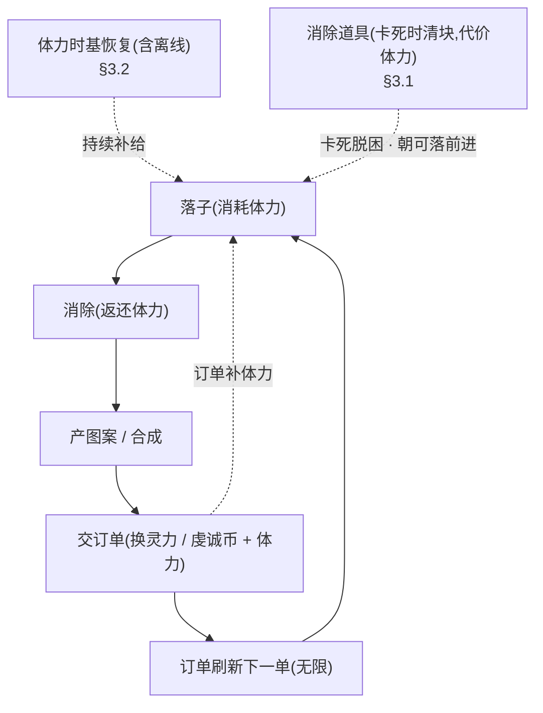

<style>
  /* 本篇专用：兜底机制 / 分档表小样式 */
  pre.code { margin:8px 0; padding:12px; background:#0d1622; border:1px solid var(--border); border-radius:8px; overflow:auto; font-size:13px; line-height:1.55; }
  table.tight td, table.tight th { padding:6px 10px; }
  .pill-core { display:inline-block; font-size:11px; padding:1px 7px; border-radius:10px; background:rgba(108,140,255,.16); color:#6c8cff; margin-left:6px; }
  .pill-enh  { display:inline-block; font-size:11px; padding:1px 7px; border-radius:10px; background:rgba(91,214,160,.16); color:#5bd6a0; margin-left:6px; }
  .pill-cut  { display:inline-block; font-size:11px; padding:1px 7px; border-radius:10px; background:rgba(255,207,92,.16); color:#ffcf5c; margin-left:6px; }
</style>

# 无局 · 无尽核心模型

合成订单融合玩法从「分场次、有通关、可 GameOver」改为**单条持续运营的无尽循环**:无「局」概念、订单无限、无任何 GameOver、局内态整盘跨会话续存。两条兜底机制保证「真·无尽」成立——**体力时基恢复**(含离线)与**消除道具**(代价体力、无限可用)。本篇定义新核心模型 + 两条兜底机制的设计与数值,并指明被它覆盖的旧结束模型在他篇的同步落点。

> [!WARNING]
> **读前必看 · 模型替换的四条不变量**
>
> 本篇定义的无尽模型**覆盖**旧「分场次 + 通关 + 三出口 GameOver」结束模型(旧模型散见设计 [01](#01-gameplay-overview) / [11](#11-core-loop-completion) / [29](#29-gameplay-fusion) / [09](#09-merge-order-energy),本任务已同步)。四条不变量先确定:
>
> - **无「局」**:不分场次、不重开。游戏是一条从首次进入起持续运营、永不主动终止的循环。「再来一局」「通关」「单局」「本局」等概念全部退役。
> - **订单无限**:循环订单池本就无限取用,删「完成目标单数 → 通关」这一胜利终点。订单是持续的经营节奏,不是通往终点的计数器。
> - **无任何 GameOver**:既无「无处可落硬 GameOver」,也无「体力耗尽软 GameOver」。卡死与体力归零都不结束游戏,由两条兜底脱困(见 [§三](#49-infinite-no-rounds::fallback))。
> - **局内态整盘续存**:棋盘 / 手牌 / 合成区 / 进行中订单 / 体力 退出重进从原状态继续(存档边界见 [设计 14](#14-save-system))。

> [!NOTE]
> **立项信息**
>
> | 项 | 内容 |
> | --- | --- |
> | **类型** | 玩法核心模型修正 · 出设计稿 + 验收标准 |
> | **方向约束** | 离线还原 · **去变现**(两条兜底都不引入任何付费 / 广告入口:体力恢复纯时间驱动,消除道具只消耗局内体力)。在已落地融合玩法之上修正,不引入新存储框架 / 不新增窗口(消除道具按钮挂既有玩法窗) |
> | **范围(产品)** | ① 删旧结束模型(通关 / 软 / 硬 GameOver)→ 无尽循环;② 体力被动时基恢复(含离线);③ 消除道具(主动清块、代价体力、无限可用);④ 局内态整盘续存(存档细节在设计 14)。被覆盖旧文字的他篇同步在本任务内完成 |
> | **需求降层** | **a. 表层要求**:把游戏改成「无局、订单无限、永不 GameOver、退出重进整盘续存」。<br>**b. 底层目的**:让玩家进入一条**没有失败惩罚、随时可玩、长期经营**的休闲循环——失败感(GameOver / 通关后无事可做)是退坑点,去掉它使玩家「想玩就玩、不想玩就停、停了进度还在」;时基恢复 + 整盘续存把游戏的节奏从「一坐下打一整局」改为「碎片时间随时续上」。<br>**c. 有无更直达 b 的做法**:核心诉求(无失败、可续、长期经营)已由本模型直达;唯一需 boss 拍的是「卡死脱困」的体验形态——本篇取「消除道具清块」(玩家主动、有代价),备选「自动重排棋盘」(无代价、无操作),见 [§五 待拍板](#49-infinite-no-rounds::open)。 |

## 一、改什么与为什么 {#what}

现状(融合玩法,见设计 [29](#29-gameplay-fusion) / [11](#11-core-loop-completion)):游戏分「场次」运行,一场有三条出口——完成目标单数**通关**、体力耗尽**软 GameOver**、无处可落**硬 GameOver**;局内态(棋盘 / 手牌 / 合成区 / 订单 / 体力)每场重建、不跨会话续存;只有元层进度跨会话存盘(设计 14)。

这套「有局、有终点、有失败」的结构服务的是「一坐下打一整局、打完结算」的关卡式体验。与产品定位(无失败惩罚的长期休闲经营)冲突:通关使玩家「打完没事可做」、GameOver 制造失败挫败、每场重建使「碎片时间续不上」。本模型把这三处全部去掉,换成一条持续运营的无尽循环。逐条对应:

| # | 改动 | 落法 |
| --- | --- | --- |
| 1 | 删「局」与场次 | 单条持续循环,无重开 / 无结算场次;局内态整盘续存([设计 14](#14-save-system) 重定边界) |
| 2 | 删通关 | 订单无限取用,无「完成目标单数」胜利终点([§二](#49-infinite-no-rounds::loop)) |
| 3 | 删全部 GameOver | 卡死与体力归零都不结束;两条兜底脱困([§三](#49-infinite-no-rounds::fallback)) |
| 4 | 体力时基恢复(含离线) | 无条件、纯时间驱动、含离线累计的被动恢复([§3.2](#49-infinite-no-rounds::regen)) |
| 5 | 消除道具脱困卡死 | 玩家主动清块、代价体力、无限可用([§3.1](#49-infinite-no-rounds::cleartool)) |

**不做(本设计明确排除):**云存档 / 账号绑定(本地单机,沿任务边界);任何付费 / 广告续命(去变现);新窗口(消除道具按钮挂既有玩法窗,本设计不开新窗)。

## 二、无尽循环模型 {#loop}

一条循环、无起止边界:落子 → 消除 → 产图案 / 合成 → 交订单换奖励 → 订单刷新下一单 → 继续。体力是这条循环的**节流资源**(不是单场预算),消除返、订单补、时基恢复持续补给;卡死与体力归零由兜底脱困而非结束。



**与旧模型的根本差异(口径写明):**

| 维度 | 旧模型(分场次) | 无尽模型(本篇) |
| --- | --- | --- |
| 运行边界 | 一场有起止,通关 / GameOver 结束 | 无起止,永不主动结束 |
| 订单 | 完成目标单数 → 通关 | 无限取用,无终点 |
| 体力角色 | 单场落子预算(预算耗尽 → 软 GameOver) | 持续运营的节流资源(归零不结束,等恢复 / 清盘) |
| 卡死(无处可落) | 硬 GameOver | 消除道具脱困,不结束 |
| 局内态 | 每场重建 | 整盘续存,退出重进继续 |
| 完成单数 / 交付分 | 通关判定 / 单场结算 | 无通关用途,作生涯累计统计([设计 14](#14-save-system) 重定) |

> [!NOTE]
> **「无尽」如何成立(脱困闭环)**:玩家可能同时撞上「棋盘卡死(无处可落)+ 体力为 0」这个最坏点。脱困路径:**等体力时基恢复**(无条件、含离线,迟早回到可用量)→ **用消除道具清块**(消耗体力、朝可落前进)→ 棋盘重新可落,循环继续。两条兜底缺一不可:只有恢复无清块,体力回满也搬不动卡死的棋盘;只有清块无恢复,体力 0 时清块也用不起。二者合起来保证任何状态都能脱困,这正是「无任何 GameOver」的数学依据(见 [§3.3](#49-infinite-no-rounds::deadlock-proof))。

## 三、两条兜底机制 {#fallback}

### 3.1 消除道具(主动清块、代价体力) {#cleartool}

卡死(手持候选块但棋盘无任何合法落点)时,玩家主动使用消除道具清掉棋盘上的方块,让棋盘重新可落。这是「能不能继续落子」的脱困闸,不是常规玩法手段。

| 项 | 设计 | 说明 |
| --- | --- | --- |
| **触发** | 玩家主动点击玩法窗内的消除道具按钮 | 非自动;玩家自己判断卡了才用 |
| **清除范围** | 清掉**一整行 + 一整列**(玩家指定一格,清该格所在行与列的全部已占格)| 用一次必能腾出至少一行一列的空间,从结构上保证「朝可落前进」(见下「朝可落前进」论证) |
| **代价** | 消耗体力 `ClearToolCost`,**默认 = 25**(`≤ 体力软上限 30`,见硬约束) | 肉痛但用得起:约等于「白做 3 单的体力回血」,使「卡了就清」有真实成本 |
| **可用性** | **无限可用**,只 gate 体力:体力 `≥ ClearToolCost` 即可用,`< ClearToolCost` 不可用(置灰 + 提示「等体力恢复」)| 绝不做成有限消耗品(否则重开「持有=0 + 卡死」死结,见硬约束) |
| **gate 之外无任何限制** | 不限每日次数、不限每盘次数、不要任何持有道具 | 唯一门槛是体力;体力门槛由时基恢复保证迟早跨过 |

**「清整行 + 整列」如何保证「朝可落前进」**:8×8 棋盘卡死 = 当前手持的任一候选块在任何位置都放不下。清掉一整行(8 格)+ 一整列(8 格,去重共 15 格)后,棋盘必然出现一条贯通的空行与空列。候选块最大形状(大 L / 2×2 等)占格远小于一条空行,故清完后**必然存在合法落点**——用一次消除道具必能把棋盘从「无处可落」拉回「有处可落」,不会出现「清了还是卡死、白扣体力」。

> [!WARNING]
> **崩法(玩家恶意利用 / 满值 / 零值)**:最可能炸的是「**卡了就清、挂机等体力**」的无脑循环——玩家不动脑摆放,故意卡死后清盘,把游戏退化成「等体力 → 清盘 → 再卡 → 再等」。**对策(配平取向)**:① cost 调到肉痛(默认 25,约 3 单回血),清一次的体力够正常玩很久,无脑清的体力收支长期为负、推不动经营进度(攒不出灵力 / 修不动神庙),自然不划算;② 清除范围只腾「一行一列」而非清空全盘,既保证脱困又不附赠「全清大奖」(全清奖励仍须靠玩家自己消出,不被消除道具白嫖,见 [§四](#49-infinite-no-rounds::balance));③ 消除道具**只在真卡死时有意义**——棋盘没卡死时清盘是纯亏体力、无收益,设计上不奖励、不引导,玩家自然只在卡死才用。三条合起来使「挂机等体力清盘」成为一条体力净负、进度停滞的下策,而非最优解。

### 3.2 体力时基恢复(含离线) {#regen}

体力随**真实时间**被动恢复,无条件、纯时间驱动、含离线累计。这是兜底的最终保险:任何「体力不足以继续」的状态,只要等待足够真实时间,体力必然回到可用量。

| 项 | 设计 | 默认 |
| --- | --- | --- |
| **恢复速率** | 每 `RegenIntervalSec` 真实秒恢复 `RegenPerTick` 点 | 每 120 秒 +1 点 |
| **触发条件** | **无条件、纯时间驱动**——不依赖落子 / 消除 / 交付任何玩法动作 | — |
| **含离线** | 离线期间按真实流逝时间累计恢复:重进时按「上次记录时刻 → 当前时刻」的真实秒数补算应恢复点数 | — |
| **封顶** | 恢复只补到**体力软上限** `EnergyCap`(默认 30);**不溢出软上限** | 30 |
| **溢出体力的来源** | 订单奖励仍可把体力顶到软上限**之上**(沿现状「订单奖励可溢出」);时基恢复只负责把低于软上限的体力**补回到软上限**,不动溢出部分 | — |

**离线恢复 = 预期行为,非漏洞**(反转旧论据):旧设计 14 §3.1 O3 把「体力跨会话保留」判为「关掉游戏养体力」漏洞而不进盘。无尽模型下这条论据**反转**——离线恢复正是兜底的最终保险:玩家体力耗尽时「关掉游戏等一会再回来体力恢复了」恰恰是设计要的脱困路径,而非要堵的漏洞。故体力进盘 + 离线恢复是无尽模型的**必需项**,不是被容忍的副作用。

> [!WARNING]
> **崩法(中途存档 / 时钟被改)**:① **离线时长计算**依赖「上次记录时刻」与「当前时刻」两个本地时间戳之差。本地单机 + 去变现,无防作弊收益对象,改系统时间最多让自己早点恢复体力,不影响他人、不超发任何稀缺资源(体力封顶软上限),故**不做时钟防作弊**(沿设计 14 §3.6 跨天重置同口径)。② **负时差兜底**:若当前时刻 < 上次记录时刻(玩家把系统时间往回调),按 0 秒处理(不倒扣体力、不抛),恢复点数取 `max(0, 应恢复)`。③ **首次无记录**:存档无「上次恢复时刻」字段(旧档 / 首次)→ 以当前时刻初始化,本次不补恢复(宽松,不凭空给)。

### 3.3 无尽成立的脱困证明 {#deadlock-proof}

把「卡死 + 0 体力」这个最坏点走一遍,确认必能脱困、无死结:

```text
最坏初始态：棋盘无处可落（卡死）+ 体力 = 0
  步骤 1：等待。体力时基恢复无条件含离线（§3.2），
          经 ClearToolCost × RegenIntervalSec 真实秒后，体力 ≥ ClearToolCost。
          （默认 25 × 120s ≈ 50 分钟，或离线挂着，回来即满足）
  步骤 2：用消除道具。体力 ≥ ClearToolCost → 可用 → 清一行一列（§3.1）。
          清后棋盘必有合法落点（"朝可落前进"已证），体力扣 ClearToolCost 后 ≥ 0。
  步骤 3：落子。棋盘已可落 → 循环继续。
结论：任何状态都能在有限真实时间内脱困 → 无任何 GameOver 成立。
```

**两条兜底的硬约束(test 逐条核,见 [§六](#49-infinite-no-rounds::accept) B 组):**

1. `ClearToolCost ≤ EnergyCap`(默认 25 ≤ 30)——否则体力封顶后仍不够用一次消除道具,步骤 2 永远跨不过去,死结重现。
2. 消除道具**无限可用**,只 gate 体力——做成有限消耗品则「持有=0 + 卡死」时无法脱困,死结重现。
3. 时基恢复**无条件、纯时间驱动、含离线**——若恢复依赖落子 / 消除触发,则卡死(无法落子)时体力永不恢复,步骤 1 跨不过去,死结重现。

## 四、配平要点 {#balance}

无尽 + 两条兜底引入两个必须配平的口子,设计取向写明:

| 口子 | 风险 | 配平取向 |
| --- | --- | --- |
| 消除道具 cost | 太低 → 无脑「卡了就清」;太高 → 卡死真脱不了困(但有时基恢复兜底,故宁可偏高) | 默认 25(约 3 单回血),偏「肉痛」端;`ClearToolCost` 单一可调常量,实测滥用则上调、太苦则下调 |
| 时基恢复速率 | 太快 → 体力无约束、消除返 / 订单补失去意义;太慢 → 卡死脱困要等太久 | 默认每 120 秒 +1(沿现状自然恢复档),封顶软上限;单局活跃节奏仍靠消除 + 订单,时基恢复只兜「久未玩 / 卡死」起步,不是主补给 |

**全清奖励不被消除道具白嫖**:消除道具清「一行一列」而非清空全盘,故它**不触发全清判定**(全清 = 棋盘整个清空,见 [11·§5.4](#11-core-loop-completion::allclear-table))。全清大奖(Lv3 图案 + 推进女神好评)仍须玩家靠正常消除把棋盘消空才得,消除道具只负责脱困、不附赠经济收益。这条隔离防止「卡死 → 清盘 → 蹭全清奖」的套利。

## 五、待拍板清单 {#open}

有安全默认的已自主拍板;此处只列**需 boss / 用户裁决**的方向性开关。均按默认推进,不阻塞交付。

| # | 开关 | 安全默认(本篇取定) | 备选 | 性质 |
| --- | --- | --- | --- | --- |
| O1 | 卡死脱困的体验形态 | **消除道具清块**(玩家主动、代价体力、清一行一列)<span class="pill-core">核心</span> | **自动重排棋盘**(系统检测卡死自动重摆现有方块腾出落点,无代价、无操作)——更省心但玩家无参与感、且「自动」难与「代价体力」并存;若取此则体力不再 gate 脱困,需另设节流 | 范围开关 |
| O2 | 消除道具 cost 默认值 | **25**(约 3 单回血,偏肉痛) | 取 8(= 一单回血,更宽松)或取 30(= 满软上限,极肉痛但仍 ≤ cap) | 配平旋钮 |
| O3 | 时基恢复速率默认值 | **每 120 秒 +1**(沿现状自然恢复档) | 加快(每 60 秒 +1,卡死脱困更快)或减慢(每 300 秒 +1,体力更紧) | 配平旋钮 |
| O4 | 完成单数 / 交付分在无通关后的定位 | **作生涯累计统计进盘**(跨会话累计「历史完成单数 / 历史交付分」,可用于成就 / 展示)<span class="pill-enh">增强</span> | 不进盘、不统计(纯丢弃)——更省事但丢失「玩了多久」的长期反馈 | 范围开关(存档细节见 [设计 14](#14-save-system)) |

## 六、验收点 {#accept}

分 **(A) 文档自检项**(本任务即核)+ **(B) 落地核验项**(dev 实现后 test 逐条核,行为级、不依赖具体代码)。

### 6.1 文档自检项(A) {#acc-a}

- A1 · 无尽模型四条不变量(无局 / 订单无限 / 无 GameOver / 整盘续存)在本篇与被它覆盖的他篇(01 / 09 / 11 / 29 / 14)口径一致,无残留「通关 / 单局 / 软或硬 GameOver / 每局重建」的旧结束模型描述(被覆盖处已重写或删除,无勘误注叠旧)。
- A2 · 两条兜底机制(消除道具 / 时基恢复)各给:触发、数值默认、封顶 / 边界、一行崩法 + 对策。
- A3 · 脱困证明([§3.3](#49-infinite-no-rounds::deadlock-proof))走通「卡死 + 0 体力」最坏点,三条硬约束逐条列出。
- A4 · 配平取向([§四](#49-infinite-no-rounds::balance))防住「卡了就清 / 挂机等体力」无脑循环,且全清奖不被消除道具白嫖。

### 6.2 落地核验项(B) {#acc-b}

| # | 验收点 | 完成定义(行为级) |
| --- | --- | --- |
| B1 | 无通关终点 | 无论完成多少订单,游戏不弹通关 / 胜利面板,订单持续刷新下一单 |
| B2 | 无硬 GameOver | 棋盘卡死(无处可落)时不弹 GameOver 面板;玩法窗保持可交互(消除道具按钮可用 / 等体力) |
| B3 | 无软 GameOver | 体力归零时不弹「精力耗尽」面板;玩法窗保持可交互(等体力恢复) |
| B4 | 消除道具 gate 体力 | 体力 `≥ ClearToolCost` 时按钮可用;`< ClearToolCost` 时置灰且不可用;用一次扣 `ClearToolCost` 体力 |
| B5 | 消除道具无限可用 | 不消耗任何持有道具、不限次数;只要体力够,可连续使用 |
| B6 | 消除道具朝可落前进 | 在构造的卡死棋盘上用一次 → 棋盘出现合法落点(清一行一列后必有空位) |
| B7 | cost ≤ 软上限不变量 | `ClearToolCost ≤ EnergyCap`(默认 25 ≤ 30),配置层断言成立 |
| B8 | 时基恢复纯时间驱动 | 不触发任何落子 / 消除,仅推进真实时间(注入 `now`)→ 体力按速率恢复;恢复封顶软上限不溢出 |
| B9 | 离线恢复 | 构造「上次恢复时刻 = T0,当前 = T0 + N 秒」→ 恢复点数 = `floor(N / RegenIntervalSec) × RegenPerTick`,夹到软上限 |
| B10 | 负时差兜底 | 当前时刻 < 上次记录时刻 → 恢复 0,不倒扣、不抛 |
| B11 | 脱困闭环 | 构造「卡死 + 体力 0」→ 推进真实时间至体力 `≥ ClearToolCost` → 用消除道具 → 棋盘可落,全程无 GameOver 面板 |
| B12 | 整盘续存 | 棋盘 / 手牌 / 合成区 / 进行中订单 / 体力 在退出重进后逐项与退出前一致(锚在设计 14 存档单测,见 [设计 14 验收](#14-save-system::accept)) |
| B13 | 全清奖不被白嫖 | 消除道具清「一行一列」不触发全清判定;全清奖励仍只由正常消除清空棋盘触发 |

## 七、风险表 {#risk}

| 风险 | 影响 | 应对 |
| --- | --- | --- |
| 「卡了就清 + 挂机等体力」无脑循环 | 游戏退化成等待 + 清盘,经营进度停滞 | cost 偏肉痛(默认 25)+ 清范围只腾一行一列不附赠全清奖 + 卡死外清盘纯亏([§四](#49-infinite-no-rounds::balance)) |
| 消除道具做成有限消耗品 | 「持有=0 + 卡死」死结重现,无尽不成立 | 硬约束:无限可用、只 gate 体力(B5 / B7 验收) |
| 时基恢复误接成「落子 / 消除触发」 | 卡死时无法落子 → 体力永不恢复 → 死结 | 硬约束:无条件纯时间驱动含离线(B8 验收) |
| `ClearToolCost > EnergyCap` 配错 | 体力封顶仍用不起消除道具 → 死结 | 不变量 cost ≤ cap(B7 验收) |
| 离线时差被往回调 / 首次无记录 | 倒扣体力 / 凭空给体力 / 抛异常 | 负时差按 0、首次以当前时刻初始化不补([§3.2](#49-infinite-no-rounds::regen) 崩法,B10 验收) |
| 旧结束模型文字残留在他篇 → 与无尽模型矛盾 | 设计稿自相矛盾,dev 落地口径不清 | 本任务同步重写 01 / 09 / 11 / 29 / 14;47 / 48 的「GameOver 计数」触发源冲突已列交接区供 boss 裁(见交接区) |

## 相关文档

- [← 返回总览](#)
- [14 · 跨会话存档(整盘续存边界)](#14-save-system)
- [29 · 玩法融合(无尽模型覆盖三出口结束模型)](#29-gameplay-fusion)
- [11 · 核心玩法补全(无尽循环 + 消除道具挂道具系统)](#11-core-loop-completion)
- [09 · 合成订单切片(体力 / 合成 / 订单现状)](#09-merge-order-energy)
- [16 · 道具底层系统(消除道具的承载层)](#16-item-system)
