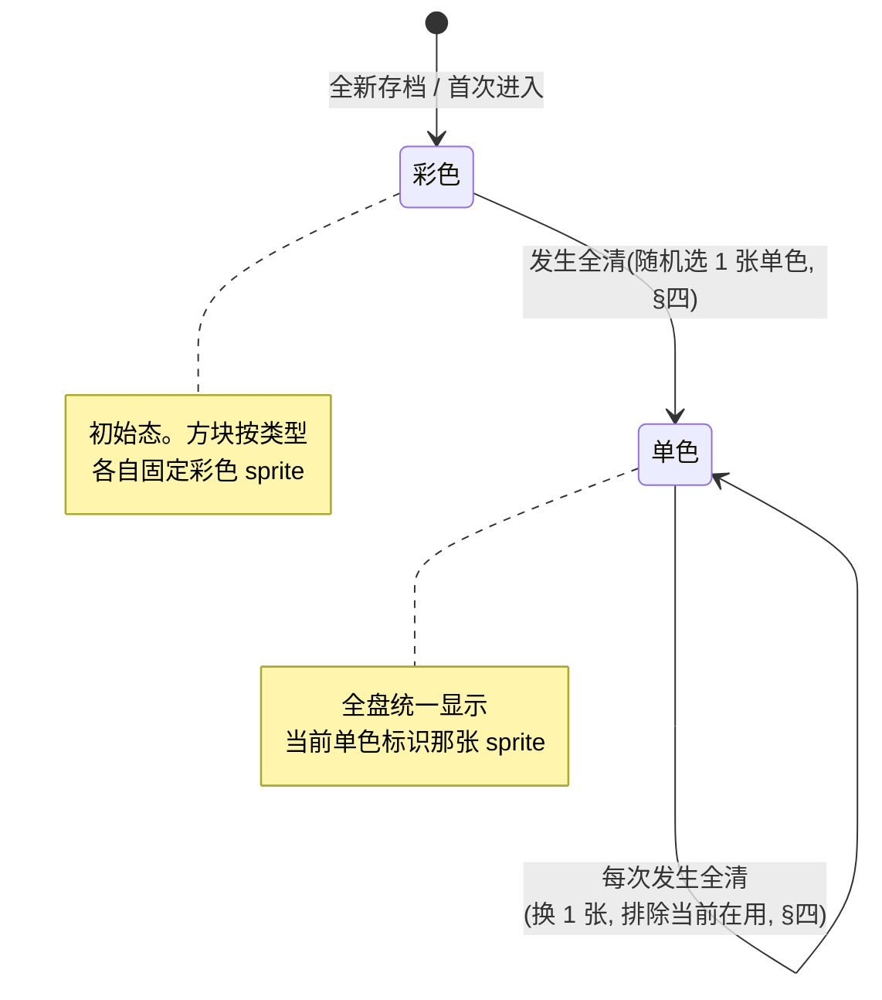

# 方块皮肤切换(全清触发单色换皮)

棋盘方块有两套皮肤:**彩色**(默认初始态,每种方块类型各自固定配色)与**单色**(全盘所有方块不分类型统一显示同一张色块)。触发链:初始彩色 → 首次**全清**整盘转单色(随机选一张)→ 此后每次全清换一张单色、排除当前在用那张。皮肤态跨会话续存。本篇定义皮肤状态模型、状态机、单色随机选取规则、续存要求与行为级验收,**不涉及代码符号 / 文件路径 / 接缝定位**(代码层定位由 dev 实现时承接)。

**读前必看 · 「全清」是本作的多义词,本功能特指其一**

工程与既有设计稿里「清屏 / 清盘」出现在**两个语义不同**的地方,本功能只挂其中一个,挂错即做错:

| 出现处 | 含义 | 与本功能关系 |
| --- | --- | --- |
| **DDA「清屏窗口」**([01·§四](#01-gameplay-overview::dda) / [02·§一](#02-dynamic-difficulty) / [07·§五](#07-blockblast-code-architecture)) | 一个**分数难度窗口**(分数 < 15000):系统主动喂「能清空棋盘」的方块引导清盘。它是发牌调度的一个分支,不是某个时刻的事件。 | **无关**,切勿挂此。 |
| **全清 / All-clear / perfect clear**([11·§5.4](#11-core-loop-completion::allclear-table) / [11·§5.5](#11-core-loop-completion::settle)) | 一次落子消除后**整个 8×8 棋盘被清空那一刻**的布尔事件。 | **本功能就挂此**。皮肤切换在每次全清事件发生时触发。 |

> 本篇全文统一用「**全清(All-clear)**」指棋盘整盘被清空事件,不用「清屏」一词,避免与 DDA「清屏窗口」混淆。

**立项信息**

| 项 | 内容 |
| --- | --- |
| **类型** | 棋盘表现 · 玩法表现层新增 · 出设计稿 + 验收标准 |
| **方向约束** | 在已落地融合 / 无尽玩法之上做加法;**不引入新存储框架 / 不新增窗口**(纯棋盘渲染行为)。皮肤态续存沿用既有存档边界([设计 14](#14-save-system))与无尽模型局内态续存([设计 49](#49-infinite-no-rounds))。 |
| **范围(产品)** | ① 彩色态(初始,按方块类型固定配色)与单色态(全盘统一一张随机色块)两套皮肤;② 全清事件触发的状态机(初始 → 首次全清转单色 → 每次全清换色、防连续重复);③ 单色随机选取规则;④ 皮肤态跨会话续存。**不做**:皮肤商店 / 玩家手动选皮 / 多套换风格皮肤 / 按方块类型分别换皮(单色是「全盘一张」,见下)。 |
| **需求降层** | **a. 表层要求**:全清后整盘从彩色变单色,每次全清换一张随机单色,退出重进保持。 **b. 底层目的**:全清(perfect clear)是高难度成就(8×8 整盘清空),发生稀少。给它一个**强烈、即时、可累积的视觉奖励**——整盘换皮——把这次成就「具象化」成玩家看得见的战利品(我清出来的这块单色棋盘),且每次换新色制造收集 / 新鲜感,强化重复追求全清的动机。 **c. 有无更直达 b 的做法**:b 的核心(把稀有成就变成看得见的奖励 + 制造新鲜感)由本方案直达。本作 [11·§5.4](#11-core-loop-completion::allclear-table) 已有「全清换背景」(后统一归女神升级)与「全清发 Lv3 图案」两类奖励,皮肤切换是**第三条独立的全清视觉奖励轴**(方块本身换皮,区别于背景轴与图案轴),不冲突、不替代。无更直达做法;唯一需 boss 拍的是「皮肤切换跟随哪个全清口径」(每次整盘清空 vs 与女神 / 图案奖励同口径的「已武装全清」),见 [§六 待拍板](#50-block-skin-switch::open)。 |

## 一、改什么与为什么 {#what}

**现状**:棋盘方块自始至终是彩色——每种方块类型(以方块库形状 / 元素区分)各自固定一种配色,从开局到全程不变。全清事件目前只触发奖励(Lv3 图案 + 推进女神好评 + 换背景),**不改变方块自身外观**。

**本篇新增**:在全清事件上叠加一条「方块换皮」视觉反馈——

| # | 改动 | 目的 |
| --- | --- | --- |
| 1 | 引入皮肤态:彩色态 / 单色态 + 单色态下的「当前单色 sprite 标识」 | 让棋盘外观成为一个有状态、可演进的量,而非恒定彩色 |
| 2 | 首次全清:整盘从彩色转单色 | 把第一次全清成就标记为「棋盘外观质变」的里程碑 |
| 3 | 每次全清:换一张新的单色 sprite,排除当前在用那张 | 制造收集 / 新鲜感,且避免「换了等于没换」的连续重复 |
| 4 | 皮肤态跨会话续存 | 与无尽模型「局内态整盘续存」一致——退出重进棋盘外观保持,不回退到彩色 |

**向上对体验**:全清是稀有高难成就,本功能给它一个**整盘级、不可错过、可累积**的视觉奖励,强化「想再清一次看看下张什么色」的重复追求动机。无本功能则全清的视觉奖励仅限背景 + 图案,方块本身无变化。

## 二、皮肤状态模型 {#model}

皮肤态由两个量描述(语义,非代码字段):

| 量 | 语义 | 取值 |
| --- | --- | --- |
| **皮肤模式** | 当前棋盘用哪套皮肤 | 彩色 / 单色 二选一 |
| **当前单色标识** | 单色态下全盘统一显示的那张单色 sprite 的标识 | 一个指向单色资源中某张 sprite 的标识;**仅在单色态有意义**,彩色态下无意义(可视为「未选」) |

**两套皮肤的渲染语义**:

| 模式 | 棋盘上每个方块怎么取图 |
| --- | --- |
| **彩色** | 按方块**类型**取各自固定的彩色 sprite(现状行为)——不同类型的方块显示不同颜色,与本功能引入前一致。 |
| **单色** | **全盘所有方块,不分类型,统一显示「当前单色标识」指向的同一张 sprite**。这是「真正的单色棋盘」——整盘一个颜色,不是「每种类型换成另一套配色」,也不是「整套换风格」。 |

> [!NOTE]
> **单色 = 全盘一张,不是按类型一套**:用户已拍板单色态下全盘统一一张随机 sprite(不分方块类型)。故单色态下方块类型对**外观**不再有区分作用(类型仍参与玩法逻辑,只是渲染层都贴同一张图)。这是设计意图,非简化偷工。

## 三、状态机 {#fsm}

**状态机规则(逐条,行为级)**:

1. **初始态 = 彩色**。全新存档 / 没有皮肤态记录时,棋盘按方块类型彩色渲染。
2. **彩色 → 单色(首次全清)**:发生全清事件时,若当前为彩色态 → 转单色态,并按 [§四](#50-block-skin-switch::pick) 随机选 1 张单色 sprite 作为「当前单色标识」。此后棋盘全盘统一显示该 sprite。
3. **单色 → 单色(后续每次全清)**:已在单色态时,每次发生全清事件 → 按 [§四](#50-block-skin-switch::pick) 重新随机选 1 张单色 sprite,**排除当前在用那张**,更新「当前单色标识」。
4. **单色态不退回彩色**:没有任何路径从单色回到彩色。一旦首次全清发生,棋盘永久进入单色态(续存后亦保持),只在不同单色 sprite 间切换。
5. **皮肤切换是全清的纯视觉附加**:它不改变全清的任何玩法结算(图案奖励 / 女神好评 / 体力返还 / 背景切换均不受影响),也不被皮肤态反向影响。

> [!TIP]
> **「单色态不退回彩色」是有意的**:彩色是「还没清过屏的新手棋盘」标记,单色是「已达成全清」的标记。退回彩色会抹掉已达成的成就感。若后续需要「重置皮肤」入口,属新功能、本篇不做。

## 四、单色随机选取规则 {#pick}

单色资源(美术规格见 [§五](#50-block-skin-switch::art))是一组带编号的 sprite。选取规则:

| 项 | 规则 |
| --- | --- |
| **候选池** | 单色资源中**实际存在的全部 sprite 标识构成的集合**。编号**不连续**(资源编号有留空段),候选池必须是「真实存在的标识集」,**不是 1..N 的连续区间**——按连续区间随机会选到不存在的编号,导致空图。 |
| **首次全清(彩色→单色)** | 从候选池中**等概率随机**选 1 张。此时无「当前在用」可排除,全池可选。 |
| **后续全清(单色→单色)** | 从候选池中**排除「当前在用那张」后等概率随机**选 1 张,保证与上一张不同(防连续重复)。 |
| **候选池大小退化兜底** | 若候选池只有 1 张(排除当前后为空)→ 保持当前那张不变(无可换)。正常资源数量远大于 1,此分支仅为不变量兜底。 |

> [!NOTE]
> **「防连续重复」只防相邻两次相同,不防更早出现过的**:用户要求是「排除当前正在用的那张」。即第 N 次和第 N+1 次必不同,但第 N+2 次可以等于第 N 次。这是设计意图(无需「整轮不重复」的洗牌逻辑),实现简单且满足「换了就有变化」的体验诉求。若后续要「一轮不重复」属增强,本篇不做。可砍 / 增强

**崩法走查(本机制)**:

| 崩法类型 | 风险 | 对策 |
| --- | --- | --- |
| **零值 / 空池** | 候选池按连续编号区间(1..N)构造 → 选到留空编号 → 棋盘贴空图 / 缺图 | 候选池取**真实存在的标识集**(见上),不按连续区间。这是给 dev 的硬约束:随机域 = 已存在 sprite 集,不是编号上界。 |
| **防重退化** | 候选池仅 1 张时「排除当前」使可选集为空 → 随机崩溃 / 死循环 | 退化兜底:可选集空 → 保持当前不变(见上表)。 |

## 五、美术规格(资源层) {#art}

> 本节是**美术资源规格**(设计输入),非代码定位。

| 皮肤 | 源切图目录(相对工程 `Assets/AssetRaw/UIRaw/Atlas/blocks/`) | 打包图集 | 运行期 sprite 命名 | 数量 |
| --- | --- | --- | --- | --- |
| **彩色** | `default_skin/` | `Atlas_blocks_blocks_main` | `blocks_main_<编号>` | 8 张(编号 1 / 6 / 14 / 15 / 16 / 18 / 19 / 21) |
| **单色** | `blocks_skin/`(目录内含 README 资产清单) | `Atlas_blocks_blocks_skin` | `blocks_skin_atlas_<编号>` | 337 张 |

**单色资源编号特征(决定候选池构造)**:

- 编号**不连续**,分布在若干段:7–25、29–47、51–97、226–477;段间留空(缺 26–28 / 48–50 / 98–225)无对应文件。
- 故候选池是「这 337 个实际存在编号的集合」,**不能用** `1..477` 或 `1..337` 这类连续区间近似。
- 主尺寸 84×84(331 张),另有 6 张 44×44 小尺寸(编号 51 / 52 / 53 / 54 / 93 / 247)。小尺寸与主尺寸用途相同,是否纳入候选池见 [§六 待拍板](#50-block-skin-switch::open)(默认:纳入,与主块统一渲染;若小尺寸贴满棋盘格观感不一致,可剔除这 6 张)。

> [!WARNING]
> **彩色与单色不是同一套「按类型对应」的图**:彩色是 8 张「按方块类型固定配色」的图(每类型一张);单色是 337 张「全盘统一用一张」的色块库。二者不存在编号对应关系——单色态下不按类型选图,整盘只用候选池里随机选中的那一张。

## 六、续存要求 {#persist}

皮肤态需**跨会话 / 重进游戏续存**,与无尽模型「局内态整盘续存」([设计 49](#49-infinite-no-rounds))一致。

**存档字段判据**(对齐 [设计 14 §3.1](#14-save-system::format) 的进盘判据与本篇 dev 实现):

| 项 | 语义层级 | 进盘? |
| --- | --- | --- |
| **皮肤模式(彩色 / 单色)** | 当前会话运行态(随全清演进,跨会话续存) | **是(局内态)** |
| **当前单色标识** | 当前会话运行态(单色态下全盘在用那张) | **是(局内态)** |

- 皮肤态属**局内态**(当前运行中的棋盘状态,跨会话续存),与「全清武装位 / 连消链长」同类——它们都是「影响 / 描述当前局面」的运行态,在无尽模型下整盘续存。归类参照 [设计 14 §3.1](#14-save-system::format) 局内段。
- **续存往返要求**:退出 → 重进后,皮肤模式与当前单色标识与退出前**逐一相等**;棋盘按恢复后的皮肤态渲染(单色态显示恢复的那张 sprite,不回退彩色)。
- **缺字段保底**(旧档 / 全新档无皮肤态字段):缺皮肤模式 → 默认**彩色**;缺当前单色标识(或彩色态)→ 视为「未选」。这与 [设计 14 §3.2](#14-save-system::format) 「缺字段天然给类型默认值」一致,保证旧档升级 / 全新档进游戏 = 彩色态(符合「初始 = 彩色」)。

**崩法走查(续存)**:

| 崩法类型 | 风险 | 对策 |
| --- | --- | --- |
| **中途存档 / 旧档无字段** | 旧档没有皮肤态字段 → 读出非法值 / 抛异常 | 缺字段保底夹值:缺 = 彩色态 + 未选(见上),任何缺失输入产出合法初始态。 |
| **存档被篡改 / 单色标识指向不存在 sprite** | 本地单机存档可被改;存出的单色标识若指向已不存在的编号 → 单色态贴空图 | 加载时校验:当前单色标识不在候选池(真实存在集)→ 视为非法,**重新随机选一张**(单色态)或回退彩色(由 dev 取其一,默认单色态重选,保持「已达成全清」语义)。本篇标记为 dev 加载校验点,见 [§八 验收](#50-block-skin-switch::accept) A6。 |

## 七、功能点分档(范围闸) {#scope}

| 功能点 | 档 | 说明 |
| --- | --- | --- |
| 彩色态(按类型固定配色)= 初始 | 核心 | 现状行为,本功能保持。 |
| 全清触发彩色→单色 + 单色随机选取 | 核心 | 本功能主体。 |
| 每次全清换色 + 排除当前(防连续重复) | 核心 | 用户明确要求。 |
| 皮肤态跨会话续存 | 核心 | 用户明确要求,对齐无尽模型。 |
| 加载时单色标识非法校验(篡改 / 资源缺失兜底) | 增强 | 不变量兜底,正常路径不触发;砍掉则恶意改档可致空图(单机无收益,影响小)。建议做。 |
| 「一轮不重复」洗牌(而非仅排除相邻) | 可砍 | 用户只要求排除当前;本篇不做。 |
| 皮肤切换动画 / 转场特效 | 可砍 | 本篇只定义「换成哪张」,转场表现不在范围(瞬切即可)。 |

> **范围收敛核对**:砍掉全部「可砍 / 增强」档后,核心(初始彩色 + 全清转 / 换单色 + 防相邻重复 + 续存)仍完整成立。

## 八、验收标准 {#accept}

分两组:**A 组**可单测(状态机 / 防重 / 续存往返,纯逻辑,code-blind);**B 组**需运行手验(表现层渲染)。

### A 组 · 可单测(状态机 / 防重 / 续存) {#accept-a}

| # | 验收点 | 完成定义(可观测,test 逐条核对) |
| --- | --- | --- |
| A1 | 初始 = 彩色 | 全新 / 无皮肤态记录的状态下查询皮肤态 → 皮肤模式 = 彩色,当前单色标识 = 未选。 |
| A2 | 首次全清转单色 | 彩色态下触发 1 次全清事件 → 皮肤模式变为单色,当前单色标识 ∈ 候选池(真实存在集),非未选。 |
| A3 | 后续全清换色且不连续重复 | 单色态(在用某张 X)下触发 1 次全清 → 新当前单色标识 ≠ X 且 ∈ 候选池。连续触发多次全清,任意相邻两次的当前单色标识两两不等。 |
| A4 | 候选池域正确(不含留空编号) | 多次(足量)触发全清采样所得的当前单色标识,全部 ∈ 真实存在 sprite 标识集;不出现留空段编号(如 26 / 48 / 100 等)。 |
| A5 | 续存往返保真 | 设皮肤态为单色 + 某当前单色标识 → 导出 / 序列化 / 反序列化 / 导入到新状态 → 皮肤模式与当前单色标识逐一相等(同设计 14 整盘往返口径)。 |
| A6 | 缺字段 / 非法值保底 | (a) 无皮肤态字段的输入导入 → 得彩色态 + 未选;(b) 单色态但当前单色标识指向候选池外的编号 → 加载后产出合法态(默认:单色态重随机选一张 ∈ 候选池;不抛异常、不留空标识)。 |
| A7 | 单色不退回彩色 | 单色态下任意次全清后皮肤模式恒为单色;无任何操作路径使其回到彩色。 |
| A8 | 候选池退化兜底 | (构造性)候选池仅 1 张时,单色态触发全清 → 保持当前那张不变(不抛异常 / 不死循环)。 |
| A9 | 皮肤切换不污染全清结算 | 全清触发皮肤切换的同时,全清的玩法结算(图案奖励 / 女神好评 / 体力返还等)与无皮肤功能时一致——皮肤切换是纯附加,不改结算数值与顺序。 |

> A 组「全清事件」指棋盘整盘被清空的判定([§intro](#50-block-skin-switch::intro) 的全清,非 DDA 清屏窗口)。test 据 dev 实现的全清判定接缝驱动用例,本篇不指定接缝符号。

### B 组 · 需运行手验(表现层渲染) {#accept-b}

| # | 验收点 | 完成定义(人眼 / 截图核对) |
| --- | --- | --- |
| B1 | 全新进游戏彩色渲染 | 全新存档进游戏,棋盘方块按类型显示各自彩色(不同类型不同色),与本功能引入前观感一致。 |
| B2 | 全清后整盘单色 | 触发 1 次全清后,棋盘 / 后续落子的方块全盘**统一为同一张单色图**(不分类型同色)。 |
| B3 | 再次全清换不同单色 | 再触发 1 次全清,棋盘单色图**肉眼可见与上一次不同**。 |
| B4 | 退出重进皮肤保持 | 单色态(某张)下退出游戏再重进 → 棋盘仍为单色态、且为退出前那张单色图(不回退彩色)。 |

> B 组依赖运行环境(Unity Play / 真机)。若运行环境不可达(MCP 桥断 / 拖拽不支持致全清难手触发),B 组判 **BLOCKED 不判 FAIL**;A 组已覆盖状态机 / 防重 / 续存的可单测逻辑,是验收主力。

## 九、待拍板清单 {#open}

集中列出需 boss / 用户拍板的范围开关与口径(均有安全默认,默认即可推进):

| # | 待拍板 | 默认(本篇采用) | 备选 | 影响 |
| --- | --- | --- | --- | --- |
| 1 | **皮肤切换跟随哪个全清口径** | 与女神好评 / 图案奖励**同口径**——即 [11·§5.5](#11-core-loop-completion::settle) 全清判定通过(「已武装」状态触发)时切换皮肤。复用既有全清事件单一口径,避免第二份「什么算全清」定义。 | 「每次整盘被清空那一刻」都切换(含 [11·§5.4](#11-core-loop-completion::allclear-table) 武装位抑制下的连续第二次全清——奖励不发但皮肤仍换)。 | 行为差异仅出现在「连续两次全清」的罕见局面:默认下第二次不换皮(与不发奖一致),备选下第二次仍换皮。 |
| 2 | **44×44 小尺寸 6 张是否纳入候选池** | 纳入(与 84×84 主块统一参与随机)。 | 剔除这 6 张(编号 51/52/53/54/93/247),仅用主尺寸,避免小图贴满棋盘格时观感不一致。 | 纯观感;若 dev / 美术发现小图按棋盘格尺寸缩放后失真,改剔除。 |
| 3 | **加载时单色标识非法的兜底方向** | 单色态重新随机选一张(保「已达成全清」语义)。 | 回退彩色态。 | 仅篡改 / 资源缺失的异常路径,单机无外部收益,影响极小。 |

> 三项均有安全默认且可逆,按三段阶梯①取默认推进,不入 BLOCKED。boss 关单复核如需改,另开增量。

## 十、风险表 {#risk}

| 风险 | 应对 |
| --- | --- |
| **挂错全清口径**:把皮肤切换挂到 DDA「清屏窗口」(分数难度窗)而非全清事件 | 本篇 [§intro](#50-block-skin-switch::intro) 已用对照表明确二者语义;dev 现场定位「全清事件」接缝(整盘被清空判定,复用 [11·§5.5](#11-core-loop-completion::settle)),不挂清屏窗口。验收 A 组以「整盘清空」驱动,挂错则 A2/A3 直接失败暴露。 |
| **候选池按连续编号构造致空图** | [§四](#50-block-skin-switch::pick) / [§五](#50-block-skin-switch::art) 已硬约束候选池 = 真实存在标识集;验收 A4 专项核对不出现留空段编号。 |
| **旧档 / 篡改档致非法皮肤态** | [§六](#50-block-skin-switch::persist) 缺字段保底 + 非法标识兜底;验收 A6 覆盖。 |
| **皮肤切换误改全清玩法结算** | [§三](#50-block-skin-switch::fsm) 规则 5 明确皮肤切换是纯视觉附加;验收 A9 核对结算不受影响。 |
| **续存归错通道**(误存成元层 / 不进盘) | [§六](#50-block-skin-switch::persist) 明确归局内态(同全清武装位类),对齐 [设计 14](#14-save-system) 局内段;验收 A5 续存往返保真覆盖。 |
