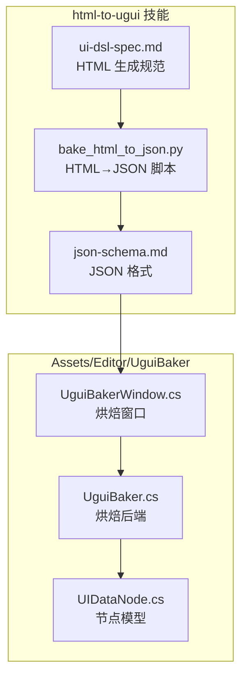
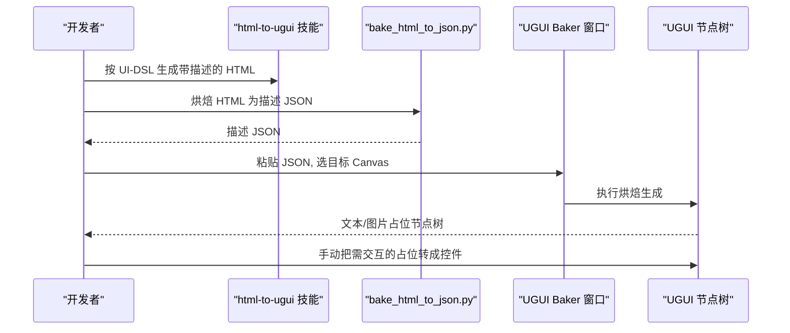
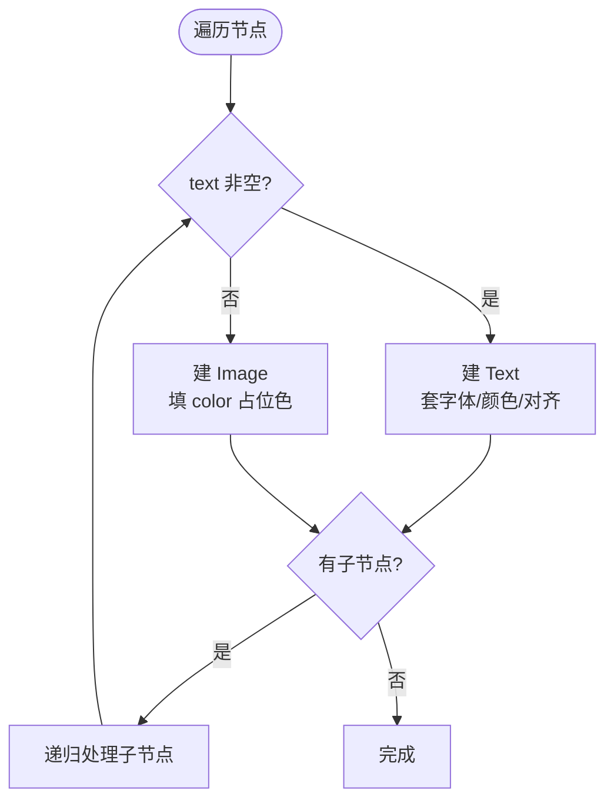
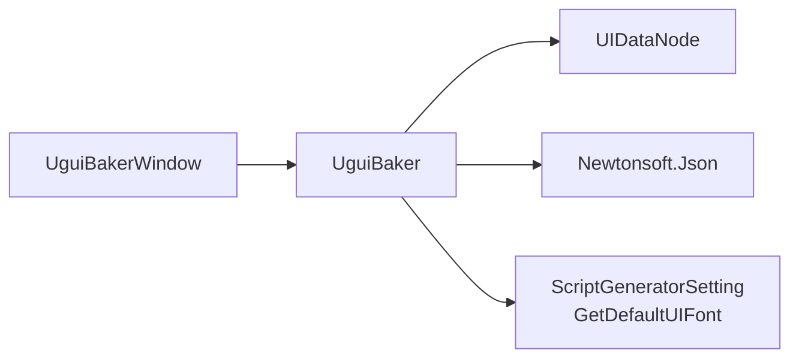

# HTML转UGUI工具

<cite>
**本文引用的文件**
- [UguiBaker.cs](file://Assets/Editor/UguiBaker/UguiBaker.cs)
- [UIDataNode.cs](file://Assets/Editor/UguiBaker/UIDataNode.cs)
- [UguiBakerWindow.cs](file://Assets/Editor/UguiBaker/UguiBakerWindow.cs)
- [ScriptGeneratorSetting.cs](file://Assets/Editor/UIScriptGenerator/ScriptGeneratorSetting.cs)
- [SKILL.md](file://.claude/skills/html-to-ugui/SKILL.md)
- [json-schema.md](file://.claude/skills/html-to-ugui/references/json-schema.md)
- [ui-dsl-spec.md](file://.claude/skills/html-to-ugui/references/ui-dsl-spec.md)
- [bake_html_to_json.py](file://.claude/skills/html-to-ugui/scripts/bake_html_to_json.py)
</cite>

## 目录
1. [简介](#简介)
2. [项目结构](#项目结构)
3. [核心组件](#核心组件)
4. [架构总览](#架构总览)
5. [描述 JSON 格式](#描述-json-格式)
6. [烘焙规则](#烘焙规则)
7. [字体配置](#字体配置)
8. [依赖关系分析](#依赖关系分析)
9. [故障排查指南](#故障排查指南)
10. [结论](#结论)

## 简介
本工具把 HTML 原型转换为 Unity UGUI 的**视觉占位**节点树。流程为：用自然语言描述 → 带中文描述的 HTML → 描述 JSON → 在 Unity 烘焙出 UGUI 节点树。

工具只产视觉占位，不建控件。每个节点二选一：

- 节点有可见文字（`text` 非空）→ 建 legacy `Text`，用可配置字体渲染中文。
- 节点无文字 → 建 `Image` 占位，填 `color` 占位色。

哪个区域要成为真按钮、滑条、输入框、下拉、滚动等控件，由人在 Unity 里手动转。项目最终 UI 用图集精灵换皮，自动建出的默认控件是丢弃品，因此烘焙阶段不生成控件。

html→ugui 与 image→ugui 两条线共用同一个烘焙后端 `UguiBaker`，契约相同。

## 项目结构
烘焙后端位于 `Assets/Editor/UguiBaker`，命名空间 `EditorTools.Ugui`：

- UguiBaker.cs：源无关的烘焙后端，把描述 JSON 还原成 UGUI 节点树。
- UIDataNode.cs：描述 JSON 的节点模型，字段与 JSON 一一对应，Newtonsoft 直接映射。
- UguiBakerWindow.cs：编辑器窗口，菜单 `Tools/UI Architecture/UGUI Baker (JSON)`，提供粘贴 JSON 或选 JSON 文件两种输入。

HTML 生成与烘焙成 JSON 的规范与脚本随 `html-to-ugui` 技能提供：

- .claude/skills/html-to-ugui/references/ui-dsl-spec.md：HTML 生成规范（UI-DSL）。
- .claude/skills/html-to-ugui/references/json-schema.md：描述 JSON 格式。
- .claude/skills/html-to-ugui/scripts/bake_html_to_json.py：HTML → 描述 JSON 的烘焙脚本。



**章节来源**
- [UguiBaker.cs:1-97](file://Assets/Editor/UguiBaker/UguiBaker.cs#L1-L97)
- [UIDataNode.cs:1-34](file://Assets/Editor/UguiBaker/UIDataNode.cs#L1-L34)
- [UguiBakerWindow.cs:1-119](file://Assets/Editor/UguiBaker/UguiBakerWindow.cs#L1-L119)

## 核心组件
- UguiBaker：静态烘焙后端。`Bake(json, parent)` 反序列化描述 JSON，递归在目标 Canvas 下生成节点树，整棵树共用一份字体，注册 Undo。
- UIDataNode：节点模型。`name` 为中文描述（同时作为生成节点名），含 `x/y/width/height`、`color`（图片占位色）、`text`（有则建文本）、`fontColor/fontSize/textAlign`（仅文本用）、`children`。
- UguiBakerWindow：编辑器窗口。选目标 Canvas（缺省时自动在场景找或新建），粘贴 JSON 或选 JSON 文件，点击执行烘焙生成。

**章节来源**
- [UguiBaker.cs:14-96](file://Assets/Editor/UguiBaker/UguiBaker.cs#L14-L96)
- [UIDataNode.cs:11-33](file://Assets/Editor/UguiBaker/UIDataNode.cs#L11-L33)
- [UguiBakerWindow.cs:11-118](file://Assets/Editor/UguiBaker/UguiBakerWindow.cs#L11-L118)

## 架构总览
工具采用“生成 HTML → 烘焙 JSON → Unity 还原节点树”的三步工作流：

- 生成 HTML：按 UI-DSL 规范生成带中文描述的 HTML，元素只标 `data-u-name="中文描述"`，不标控件类型。
- 烘焙 JSON：运行 `bake_html_to_json.py` 提取每个元素的坐标、尺寸、颜色、文字，输出描述 JSON。
- 还原节点树：把 JSON 粘进 UGUI Baker 窗口，选目标 Canvas，执行烘焙；有文字的节点建文本，其余建图片占位。



**章节来源**
- [SKILL.md](file://.claude/skills/html-to-ugui/SKILL.md)
- [UguiBakerWindow.cs:68-100](file://Assets/Editor/UguiBaker/UguiBakerWindow.cs#L68-L100)

## 描述 JSON 格式
烘焙后端从如下结构还原节点树。每个节点只产出二选一的视觉占位，不设控件类型字段。

```json
{
  "name": "标题",            // 中文描述：说明该节点是什么，同时作为生成节点名
  "x": 0,                    // 相对父节点的 X 坐标 (px)
  "y": 0,                    // 相对父节点的 Y 坐标 (px)
  "width": 1920,             // 节点宽度 (px)
  "height": 1080,            // 节点高度 (px)
  "color": "#2C3E50",        // 图片占位色 (#RRGGBB 或 #RRGGBBAA), 透明为 #FFFFFF00; 文本节点可不填
  "text": "显示文本",         // 有可见文字 → 建文本(Text); 为空 → 建图片(Image)
  "fontColor": "#FFFFFF",    // 仅文本用：字体颜色
  "fontSize": 24,            // 仅文本用：字体大小 (px)
  "textAlign": "center",     // 仅文本用：文本对齐 left/right/center
  "children": []             // 子节点数组, 结构相同
}
```

坐标系：原点在父节点左上角，X 向右递增、Y 向下递增。Unity 端用 `anchorMin/Max = (0,1)` + `pivot = (0,1)` 定位，`anchoredPosition = (localX, -localY)`。

**章节来源**
- [UIDataNode.cs:11-33](file://Assets/Editor/UguiBaker/UIDataNode.cs#L11-L33)
- [json-schema.md](file://.claude/skills/html-to-ugui/references/json-schema.md)

## 烘焙规则
- `text` 非空 → 文本节点：建 `Text`，套用 `fontColor/fontSize/textAlign`，用配置的默认 UI 字体渲染（中文走方正 GBK 字体）。文本节点不渲染底色，其 `color` 被忽略。
- `text` 为空 → 图片节点：建 `Image`，填 `color` 占位色；占位色全透明（alpha≈0）时自动关闭射线检测，不挡下层节点。

要做“按钮”这类带底色 + 文字的占位，用**父图片节点（填 `color` 底色）+ 子文本节点（填 `text` 文字）**两层表达，不要把 `text` 和 `color` 写在同一节点。

烘焙不推断控件类型。生成后由人在 Unity 里给需要交互的占位节点手动加 Button/Slider/InputField/Dropdown/ScrollRect 等组件。



**章节来源**
- [UguiBaker.cs:31-75](file://Assets/Editor/UguiBaker/UguiBaker.cs#L31-L75)

## 字体配置
文本节点使用可配置的默认 UI 字体。取值入口为 Project Settings → TEngine → UISettings → “默认 UI 字体”。

回退链：配置字体 → `Assets/AssetRaw/Fonts/GBK.ttf` → 内置 `LegacyRuntime.ttf`。开箱未配置时回退到工程内 GBK.ttf，正常渲染中文，不依赖 OS 字体回退。换字体即改该设置后重新烘焙。

**章节来源**
- [ScriptGeneratorSetting.cs:154-169](file://Assets/Editor/UIScriptGenerator/ScriptGeneratorSetting.cs#L154-L169)
- [UguiBaker.cs:24-24](file://Assets/Editor/UguiBaker/UguiBaker.cs#L24-L24)

## 依赖关系分析
- UguiBakerWindow 调用 UguiBaker.Bake 执行烘焙。
- UguiBaker 依赖 Newtonsoft.Json 反序列化描述 JSON。
- UguiBaker 通过 ScriptGeneratorSetting.GetDefaultUIFont 取文本节点字体。
- image→ugui 线复用同一 UguiBaker，与 html→ugui 共享描述 JSON 契约。



**章节来源**
- [UguiBaker.cs:1-29](file://Assets/Editor/UguiBaker/UguiBaker.cs#L1-L29)
- [UguiBakerWindow.cs:88-100](file://Assets/Editor/UguiBaker/UguiBakerWindow.cs#L88-L100)

## 故障排查指南
- JSON 解析为空：检查 JSON 格式是否符合节点模型；窗口会弹框提示。
- 未指定目标 Canvas：缺省时窗口会自动在场景查找 Canvas，没有则新建一个 ScreenSpaceOverlay Canvas 与 EventSystem。
- 中文显示为方块：确认默认 UI 字体指向含中文字形的字体（开箱为 GBK.ttf）。
- “按钮”占位无底色：把底色写在父图片节点、文字写在子文本节点；文本节点的 `color` 不渲染。

**章节来源**
- [UguiBaker.cs:17-29](file://Assets/Editor/UguiBaker/UguiBaker.cs#L17-L29)
- [UguiBakerWindow.cs:68-117](file://Assets/Editor/UguiBaker/UguiBakerWindow.cs#L68-L117)

## 结论
HTML 转 UGUI 工具把 HTML 原型转换为 UGUI 视觉占位节点树：有文字建文本、无文字建图片占位，控件由人手动转。烘焙后端 `UguiBaker` 源无关，与 image→ugui 共用同一描述 JSON 契约，文本字体可在 UISettings 配置。该工具加速 UI 视觉布局的初始搭建，最终换皮与交互控件由人接力完成。
