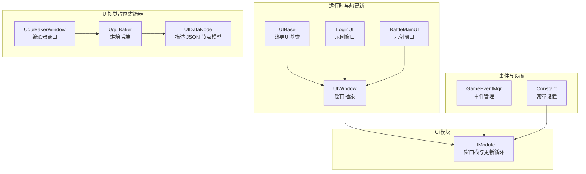
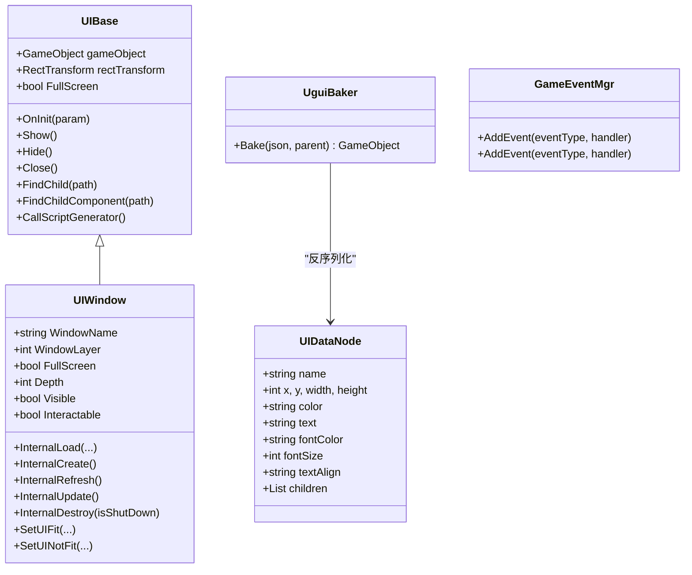
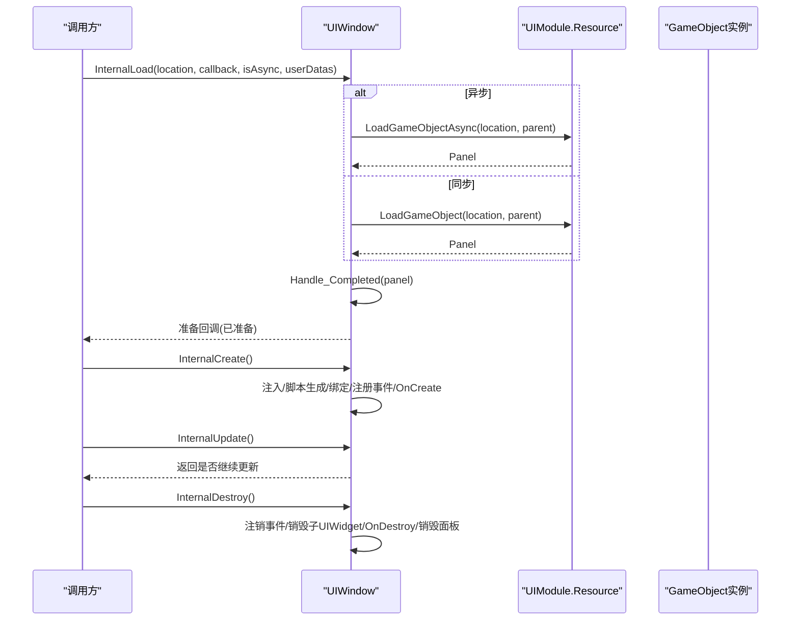
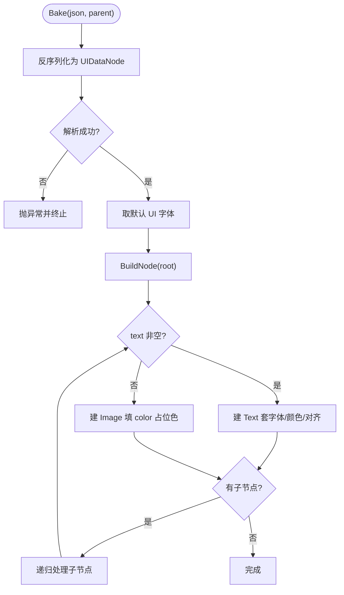
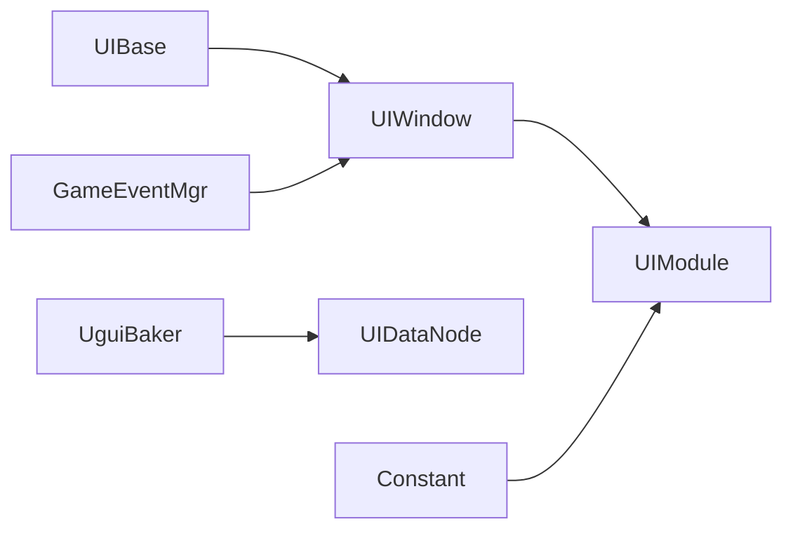

# UI系统

<cite>
**本文引用的文件**
- [UIWindow.cs](file://Assets/GameScripts/HotFix/GameLogic/Module/UIModule/UIWindow.cs)
- [UIBase.cs](file://Assets/Launcher/Scripts/UIBase.cs)
- [LoginUI.cs](file://Assets/GameScripts/HotFix/GameLogic/UI/LoginUI/LoginUI.cs)
- [BattleMainUI.cs](file://Assets/GameScripts/HotFix/GameLogic/UI/BattleMainUI/BattleMainUI.cs)
- [UguiBaker.cs](file://Assets/Editor/UguiBaker/UguiBaker.cs)
- [UIDataNode.cs](file://Assets/Editor/UguiBaker/UIDataNode.cs)
- [UguiBakerWindow.cs](file://Assets/Editor/UguiBaker/UguiBakerWindow.cs)
- [Constant.cs](file://Assets/TEngine/Runtime/Core/Constant/Constant.cs)
- [GameEventMgr.cs](file://Assets/TEngine/Runtime/Core/GameEvent/GameEventMgr.cs)
</cite>

## 目录
1. [简介](#简介)
2. [项目结构](#项目结构)
3. [核心组件](#核心组件)
4. [架构总览](#架构总览)
5. [详细组件分析](#详细组件分析)
6. [依赖关系分析](#依赖关系分析)
7. [性能考量](#性能考量)
8. [故障排查指南](#故障排查指南)
9. [结论](#结论)
10. [附录](#附录)

## 简介
本文件面向TEngine UI系统，系统性梳理UI框架的整体架构与设计理念，覆盖UI组件绑定、生命周期管理、事件处理、UI视觉占位烘焙工具（HTML转UGUI）、窗口管理机制（显示/隐藏、层级、遮罩）以及最佳实践与扩展指南。文档以仓库中的实际代码为依据，配合图示帮助读者快速理解并高效使用该UI体系。

## 项目结构
TEngine UI系统由“运行时UI基类”、“热更新UI窗口”、“UI模块管理”、“UGUI 视觉占位烘焙工具”、“UI资源与脚本生成”等部分组成。核心文件分布如下：
- 运行时与热更新层：UIBase、UIWindow、具体UI窗口（如LoginUI、BattleMainUI）
- UI模块与管理：UIModule（通过UIWindow参与管理）
- UI视觉占位烘焙器：UguiBaker（描述 JSON → 文本/图片占位节点树）
- 事件系统：GameEventMgr（UI事件订阅）
- 常量与设置：Constant（如UI音效相关设置）

**图表来源**
- [UIBase.cs:1-94](file://Assets/Launcher/Scripts/UIBase.cs#L1-L94)
- [UIWindow.cs:1-524](file://Assets/GameScripts/HotFix/GameLogic/Module/UIModule/UIWindow.cs#L1-L524)
- [LoginUI.cs:1-14](file://Assets/GameScripts/HotFix/GameLogic/UI/LoginUI/LoginUI.cs#L1-L14)
- [BattleMainUI.cs:1-30](file://Assets/GameScripts/HotFix/GameLogic/UI/BattleMainUI/BattleMainUI.cs#L1-L30)
- [UguiBaker.cs:1-97](file://Assets/Editor/UguiBaker/UguiBaker.cs#L1-L97)
- [UIDataNode.cs:1-34](file://Assets/Editor/UguiBaker/UIDataNode.cs#L1-L34)
- [GameEventMgr.cs:48-94](file://Assets/TEngine/Runtime/Core/GameEvent/GameEventMgr.cs#L48-L94)
- [Constant.cs:1-21](file://Assets/TEngine/Runtime/Core/Constant/Constant.cs#L1-L21)

**章节来源**
- [UIBase.cs:1-94](file://Assets/Launcher/Scripts/UIBase.cs#L1-L94)
- [UIWindow.cs:1-524](file://Assets/GameScripts/HotFix/GameLogic/Module/UIModule/UIWindow.cs#L1-L524)
- [UguiBaker.cs:1-97](file://Assets/Editor/UguiBaker/UguiBaker.cs#L1-L97)

## 核心组件
- UIBase：热更UI基类，提供通用生命周期入口、显示/隐藏、查找子节点/组件、参数传递等能力。
- UIWindow：UI窗口抽象，继承自UIBase，负责窗口生命周期（加载、创建、刷新、更新、销毁）、层级排序、可见性与交互性、安全区域适配、定时关闭等。
- 具体UI窗口：如LoginUI、BattleMainUI，通过特性标注窗口层级与定位，内部通过脚本生成器方法完成组件绑定。
- UguiBaker：编辑器烘焙后端，将描述 JSON 还原为 UGUI 视觉占位节点树。节点有文字则建 Text，否则建 Image 占位；不建控件。
- UguiBakerWindow：烘焙窗口，菜单 `Tools/UI Architecture/UGUI Baker (JSON)`，提供粘贴 JSON 或选 JSON 文件两种输入。
- GameEventMgr：事件系统封装，便于UI订阅与派发事件。
- Constant：常量设置，包含UI相关设置键名（如UI音效开关与音量）。

**章节来源**
- [UIBase.cs:1-94](file://Assets/Launcher/Scripts/UIBase.cs#L1-L94)
- [UIWindow.cs:1-524](file://Assets/GameScripts/HotFix/GameLogic/Module/UIModule/UIWindow.cs#L1-L524)
- [LoginUI.cs:1-14](file://Assets/GameScripts/HotFix/GameLogic/UI/LoginUI/LoginUI.cs#L1-L14)
- [BattleMainUI.cs:1-30](file://Assets/GameScripts/HotFix/GameLogic/UI/BattleMainUI/BattleMainUI.cs#L1-L30)
- [UguiBaker.cs:1-97](file://Assets/Editor/UguiBaker/UguiBaker.cs#L1-L97)
- [UguiBakerWindow.cs:1-119](file://Assets/Editor/UguiBaker/UguiBakerWindow.cs#L1-L119)
- [GameEventMgr.cs:48-94](file://Assets/TEngine/Runtime/Core/GameEvent/GameEventMgr.cs#L48-L94)
- [Constant.cs:1-21](file://Assets/TEngine/Runtime/Core/Constant/Constant.cs#L1-L21)

## 架构总览
UI系统采用“热更新UI基类 + 抽象窗口 + 编辑器烘焙工具”的分层设计：
- 热更新层：UIBase提供通用能力；UIWindow负责窗口生命周期与渲染层管理。
- 管理层：UIModule维护窗口栈、更新循环与层级排序。
- 设计工具层：UguiBaker将描述 JSON 还原为 UGUI 视觉占位节点树，加速 UI 视觉布局搭建。
- 事件与设置：GameEventMgr统一事件订阅；Constant提供设置键名。

**图表来源**
- [UIBase.cs:1-94](file://Assets/Launcher/Scripts/UIBase.cs#L1-L94)
- [UIWindow.cs:1-524](file://Assets/GameScripts/HotFix/GameLogic/Module/UIModule/UIWindow.cs#L1-L524)
- [UguiBaker.cs:1-97](file://Assets/Editor/UguiBaker/UguiBaker.cs#L1-L97)
- [UIDataNode.cs:1-34](file://Assets/Editor/UguiBaker/UIDataNode.cs#L1-L34)
- [GameEventMgr.cs:48-94](file://Assets/TEngine/Runtime/Core/GameEvent/GameEventMgr.cs#L48-L94)

## 详细组件分析

### UIBase：热更UI基类
- 职责：提供UI通用能力，如显示/隐藏、参数初始化、子节点/组件查找、脚本生成器调用。
- 关键点：
  - 提供FindChild/FindChildComponent系列方法，支持按路径查找与类型化组件获取。
  - 提供CallScriptGenerator与虚函数ScriptGenerator，用于脚本生成器绑定。
  - Show/Hide/Close分别控制激活状态与关闭流程。

**章节来源**
- [UIBase.cs:1-94](file://Assets/Launcher/Scripts/UIBase.cs#L1-L94)

### UIWindow：窗口抽象与生命周期
- 生命周期阶段：
  - 加载：InternalLoad根据资源来源异步或同步加载实例，完成后Handle_Completed并触发准备回调。
  - 创建：InternalCreate执行注入、脚本生成器、成员绑定、事件注册与OnCreate回调。
  - 刷新：InternalRefresh调用OnRefresh。
  - 更新：InternalUpdate遍历子UIWidget并调用OnUpdate，返回是否需要持续更新。
  - 销毁：InternalDestroy注销事件、销毁子UIWidget、清理回调与面板。
- 层级与可见性：
  - Depth属性通过Canvas.sortingOrder实现层级排序，并同步子Canvas。
  - Visible属性控制显示/隐藏与Raycaster交互性，同时设置图层。
- 安全区域适配：SetUIFit/SetUINotFit支持刘海屏适配与局部不参与适配。
- 定时关闭：HideTimeToClose与隐藏定时器配合，隐藏一段时间后关闭。

**图表来源**
- [UIWindow.cs:314-524](file://Assets/GameScripts/HotFix/GameLogic/Module/UIModule/UIWindow.cs#L314-L524)

**章节来源**
- [UIWindow.cs:1-524](file://Assets/GameScripts/HotFix/GameLogic/Module/UIModule/UIWindow.cs#L1-L524)

### 具体UI窗口：LoginUI 与 BattleMainUI
- LoginUI：通过Window特性标注层级，作为最小示例窗口。
- BattleMainUI：展示脚本生成器绑定流程，包含容器与多个子节点的绑定方法，演示了如何在ScriptGenerator中完成组件缓存与事件声明区域。

**章节来源**
- [LoginUI.cs:1-14](file://Assets/GameScripts/HotFix/GameLogic/UI/LoginUI/LoginUI.cs#L1-L14)
- [BattleMainUI.cs:1-30](file://Assets/GameScripts/HotFix/GameLogic/UI/BattleMainUI/BattleMainUI.cs#L1-L30)

### UGUI 视觉占位烘焙器：UguiBaker
- 功能概述：
  - 通过 UguiBakerWindow 支持粘贴 JSON 与选 JSON 文件两种输入。
  - 把描述 JSON 还原为 UGUI 视觉占位节点树：节点有可见文字（`text` 非空）建 legacy Text，否则建 Image 占位。
  - 不建控件。真按钮、滑条、输入框、下拉、滚动等由人在 Unity 里给占位节点手动转。
  - 节点用 `anchorMin/Max=(0,1)`、`pivot=(0,1)` 定位，`sizeDelta` 取节点宽高。
- 关键流程：
  - `UguiBaker.Bake(json, parent)`：反序列化 JSON → 取默认 UI 字体 → 递归 BuildNode → 注册 Undo。
  - 文本节点套用 `fontColor/fontSize/textAlign`，用配置字体渲染中文；图片节点填 `color` 占位色，全透明时关闭射线检测。
  - html→ugui 与 image→ugui 共用同一后端与描述 JSON 契约。

**图表来源**
- [UguiBaker.cs:17-56](file://Assets/Editor/UguiBaker/UguiBaker.cs#L17-L56)
- [UguiBaker.cs:58-75](file://Assets/Editor/UguiBaker/UguiBaker.cs#L58-L75)

**章节来源**
- [UguiBaker.cs:1-97](file://Assets/Editor/UguiBaker/UguiBaker.cs#L1-L97)
- [UIDataNode.cs:1-34](file://Assets/Editor/UguiBaker/UIDataNode.cs#L1-L34)
- [UguiBakerWindow.cs:1-119](file://Assets/Editor/UguiBaker/UguiBakerWindow.cs#L1-L119)

### UI事件处理与设置
- 事件处理：通过GameEventMgr提供的AddEvent系列方法订阅UI事件，支持不同参数类型的委托。
- 设置键名：Constant中提供UI相关设置键名（如UI音效开关与音量），便于统一管理。

**章节来源**
- [GameEventMgr.cs:48-94](file://Assets/TEngine/Runtime/Core/GameEvent/GameEventMgr.cs#L48-L94)
- [Constant.cs:1-21](file://Assets/TEngine/Runtime/Core/Constant/Constant.cs#L1-L21)

## 依赖关系分析
- UIBase与UIWindow：UIWindow继承自UIBase，获得通用能力并扩展窗口特有生命周期与渲染层管理。
- UguiBaker与UIDataNode：烘焙器把描述 JSON 反序列化为 UIDataNode 节点树，并取默认 UI 字体渲染文本节点。
- UIWindow与UIModule：UIWindow通过UIModule进行资源加载、窗口栈管理与更新循环。
- GameEventMgr与UI：UI可通过事件系统订阅与派发事件，实现解耦交互。
- Constant与UI：UI设置键名集中管理，便于统一读取与持久化。

**图表来源**
- [UIBase.cs:1-94](file://Assets/Launcher/Scripts/UIBase.cs#L1-L94)
- [UIWindow.cs:1-524](file://Assets/GameScripts/HotFix/GameLogic/Module/UIModule/UIWindow.cs#L1-L524)
- [UguiBaker.cs:1-97](file://Assets/Editor/UguiBaker/UguiBaker.cs#L1-L97)
- [UIDataNode.cs:1-34](file://Assets/Editor/UguiBaker/UIDataNode.cs#L1-L34)
- [GameEventMgr.cs:48-94](file://Assets/TEngine/Runtime/Core/GameEvent/GameEventMgr.cs#L48-L94)
- [Constant.cs:1-21](file://Assets/TEngine/Runtime/Core/Constant/Constant.cs#L1-L21)

**章节来源**
- [UIBase.cs:1-94](file://Assets/Launcher/Scripts/UIBase.cs#L1-L94)
- [UIWindow.cs:1-524](file://Assets/GameScripts/HotFix/GameLogic/Module/UIModule/UIWindow.cs#L1-L524)
- [UguiBaker.cs:1-97](file://Assets/Editor/UguiBaker/UguiBaker.cs#L1-L97)
- [UIDataNode.cs:1-34](file://Assets/Editor/UguiBaker/UIDataNode.cs#L1-L34)
- [GameEventMgr.cs:48-94](file://Assets/TEngine/Runtime/Core/GameEvent/GameEventMgr.cs#L48-L94)
- [Constant.cs:1-21](file://Assets/TEngine/Runtime/Core/Constant/Constant.cs#L1-L21)

## 性能考量
- 组件查找与缓存：建议在脚本生成器中缓存常用子节点与组件引用，避免频繁FindChild/GetComponent带来的开销。
- 更新循环：UIWindow的InternalUpdate会遍历子UIWidget并调用OnUpdate，尽量减少不必要的子节点数量或合并更新逻辑。
- Canvas与Raycaster：Visible切换会启用/禁用GraphicRaycaster，避免在不可见时仍进行射线检测。
- 烘焙占位：烘焙为视觉占位（文本/图片），节点生成按节点数线性递归；全透明占位关闭射线检测，减少无效命中。
- 资源加载：优先使用异步加载（InternalLoad的异步分支），避免主线程阻塞。

[本节为通用指导，不直接分析具体文件]

## 故障排查指南
- 窗口未显示或无交互：
  - 检查Visible与Interactable状态，确认Canvas图层是否正确设置。
  - 确认GraphicRaycaster已启用且未被遮挡。
- 窗口层级错乱：
  - 使用Depth属性调整sortingOrder，并确保子Canvas同步更新。
- 资源加载失败：
  - 确认资源路径与FromResources标记一致；异步加载时检查UIModule.Resource接口。
- UGUI 烘焙失败：
  - 检查 JSON 格式是否符合节点模型；目标 Canvas 缺省时窗口会自动查找或新建；中文显示为方块时确认默认 UI 字体含中文字形。
- 事件未触发：
  - 确认通过GameEventMgr正确订阅事件；检查事件类型与委托签名匹配。

**章节来源**
- [UIWindow.cs:143-218](file://Assets/GameScripts/HotFix/GameLogic/Module/UIModule/UIWindow.cs#L143-L218)
- [UIWindow.cs:464-502](file://Assets/GameScripts/HotFix/GameLogic/Module/UIModule/UIWindow.cs#L464-L502)
- [UguiBakerWindow.cs:68-117](file://Assets/Editor/UguiBaker/UguiBakerWindow.cs#L68-L117)
- [GameEventMgr.cs:48-94](file://Assets/TEngine/Runtime/Core/GameEvent/GameEventMgr.cs#L48-L94)

## 结论
TEngine UI系统通过清晰的层次划分与工具链支持，实现了从设计到运行时的高效闭环：UIBase与UIWindow提供了稳定的生命周期与渲染层管理；UguiBaker加速了 UI 视觉布局的初始搭建；GameEventMgr与Constant完善了事件与设置体系。遵循本文的最佳实践与扩展指南，可在保证性能的同时快速迭代UI功能。

[本节为总结性内容，不直接分析具体文件]

## 附录

### UI窗口管理机制（显示/隐藏、层级、遮罩）
- 显示/隐藏：通过Visible属性切换图层与Raycaster，实现显示与交互控制。
- 层级管理：通过Depth属性设置sortingOrder并同步子Canvas，保证层级一致性。
- 遮罩处理：通过Canvas与GraphicRaycaster共同控制交互范围，避免穿透点击。

**章节来源**
- [UIWindow.cs:143-218](file://Assets/GameScripts/HotFix/GameLogic/Module/UIModule/UIWindow.cs#L143-L218)
- [UIWindow.cs:494-497](file://Assets/GameScripts/HotFix/GameLogic/Module/UIModule/UIWindow.cs#L494-L497)

### UI视觉占位烘焙工具使用步骤
- 打开：菜单 `Tools/UI Architecture/UGUI Baker (JSON)`。
- 输入：粘贴描述 JSON，或选 JSON 文件。
- 执行：选目标 Canvas（缺省时自动查找或新建），点击执行烘焙生成。
- 输出：在场景中得到文本/图片占位节点树；需要交互的占位由人手动转成控件。

**章节来源**
- [UguiBakerWindow.cs:28-100](file://Assets/Editor/UguiBaker/UguiBakerWindow.cs#L28-L100)
- [UguiBaker.cs:17-56](file://Assets/Editor/UguiBaker/UguiBaker.cs#L17-L56)

### UI开发最佳实践
- 组件绑定：在脚本生成器中缓存常用组件，减少运行时查找。
- 生命周期：合理使用OnCreate/OnRefresh/OnUpdate/OnDestroy，避免在不可见状态下执行昂贵操作。
- 事件处理：通过GameEventMgr统一订阅与派发，保持UI与业务解耦。
- 性能优化：优先异步加载资源；减少不必要的子节点；合理使用Canvas与Raycaster。
- 设置管理：使用Constant中的键名统一管理UI相关设置。

**章节来源**
- [UIWindow.cs:338-425](file://Assets/GameScripts/HotFix/GameLogic/Module/UIModule/UIWindow.cs#L338-L425)
- [GameEventMgr.cs:48-94](file://Assets/TEngine/Runtime/Core/GameEvent/GameEventMgr.cs#L48-L94)
- [Constant.cs:1-21](file://Assets/TEngine/Runtime/Core/Constant/Constant.cs#L1-L21)

### 扩展指南与自定义UI组件
- 自定义窗口：继承UIWindow，实现Init、ScriptGenerator、RegisterEvent、OnCreate/OnDestroy等。
- 占位转控件：对烘焙出的图片占位节点，在 Unity 里手动加 Button/Slider/InputField 等组件，再按命名前缀跑脚本生成器绑定。
- 事件扩展：通过GameEventMgr新增事件类型与处理器，保持UI与模块解耦。

**章节来源**
- [UIWindow.cs:237-350](file://Assets/GameScripts/HotFix/GameLogic/Module/UIModule/UIWindow.cs#L237-L350)
- [UguiBaker.cs:31-75](file://Assets/Editor/UguiBaker/UguiBaker.cs#L31-L75)
- [GameEventMgr.cs:48-94](file://Assets/TEngine/Runtime/Core/GameEvent/GameEventMgr.cs#L48-L94)