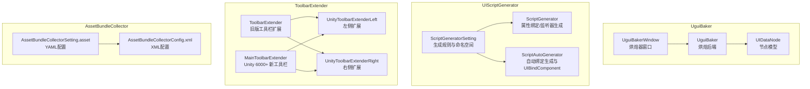
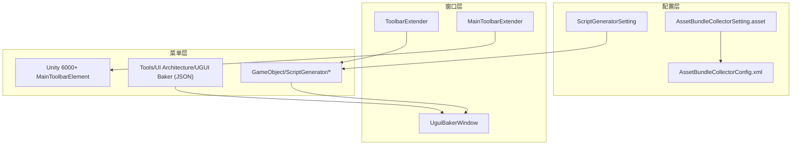
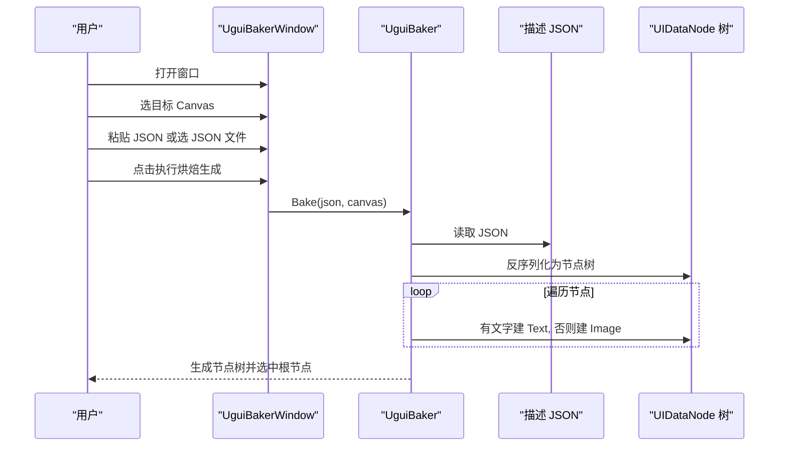
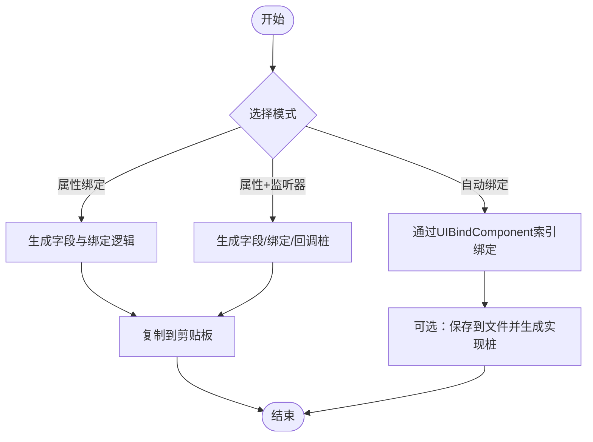
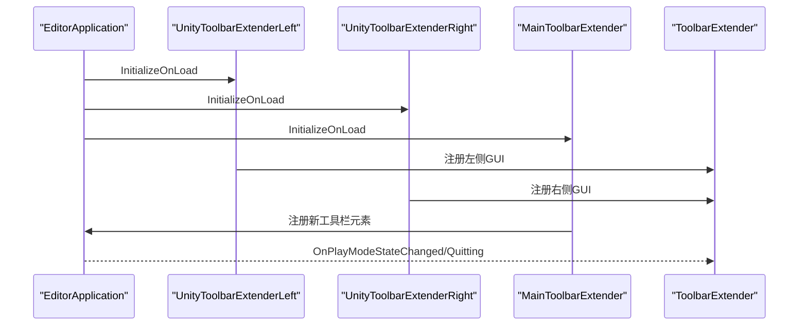
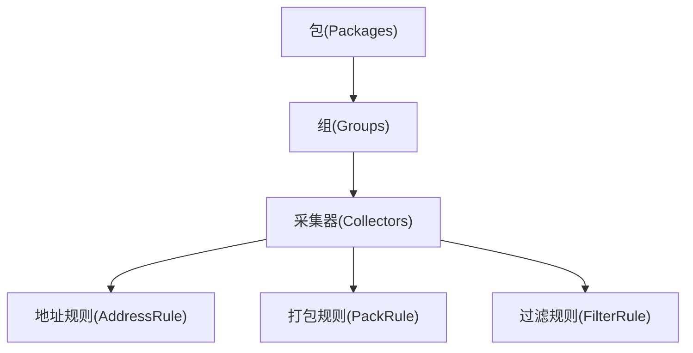
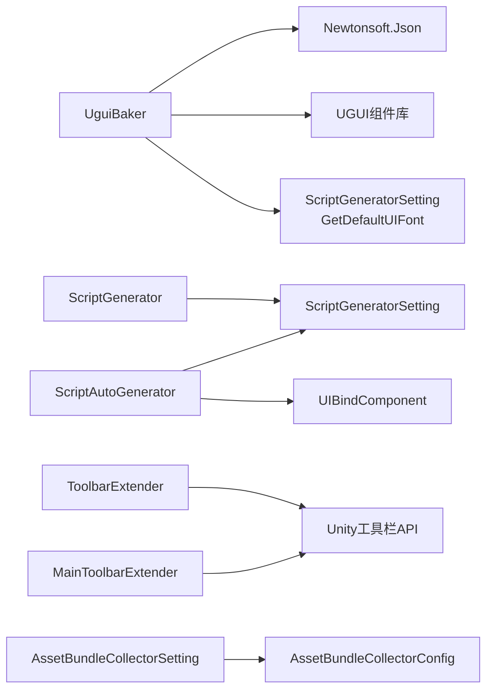

# 编辑器工具

<cite>
**本文引用的文件**
- [UguiBaker.cs](file://Assets/Editor/UguiBaker/UguiBaker.cs)
- [UIDataNode.cs](file://Assets/Editor/UguiBaker/UIDataNode.cs)
- [UguiBakerWindow.cs](file://Assets/Editor/UguiBaker/UguiBakerWindow.cs)
- [ScriptGenerator.cs](file://Assets/Editor/UIScriptGenerator/ScriptGenerator.cs)
- [ScriptAutoGenerator.cs](file://Assets/Editor/UIScriptGenerator/ScriptAutoGenerator.cs)
- [ScriptGeneratorSetting.cs](file://Assets/Editor/UIScriptGenerator/ScriptGeneratorSetting.cs)
- [ToolbarExtender.cs](file://Assets/Editor/ToolbarExtender/ToolbarExtender.cs)
- [UnityToolbarExtenderLeft.cs](file://Assets/Editor/ToolbarExtender/UnityToolbarExtenderLeft/UnityToolbarExtenderLeft.cs)
- [UnityToolbarExtenderRight.cs](file://Assets/Editor/ToolbarExtender/UnityToolbarExtenderRight/UnityToolbarExtenderRight.cs)
- [MainToolbarExtender.cs](file://Assets/Editor/ToolbarExtender/Unity6000_OR_New/MainToolbarExtender.cs)
- [AssetBundleCollectorSetting.asset](file://Assets/Editor/AssetBundleCollector/AssetBundleCollectorSetting.asset)
- [AssetBundleCollectorConfig.xml](file://Assets/Editor/AssetBundleCollector/AssetBundleCollectorConfig.xml)
</cite>

## 目录
1. [简介](#简介)
2. [项目结构](#项目结构)
3. [核心组件](#核心组件)
4. [架构总览](#架构总览)
5. [详细组件分析](#详细组件分析)
6. [依赖关系分析](#依赖关系分析)
7. [性能考量](#性能考量)
8. [故障排查指南](#故障排查指南)
9. [结论](#结论)
10. [附录](#附录)

## 简介
本文件系统性梳理 TEngine 编辑器工具集，覆盖以下能力：
- UGUI 视觉占位烘焙器：基于描述 JSON 生成 UGUI 视觉占位节点树，有文字的节点建文本、其余建图片占位，控件由人手动转。
- 资源收集器：通过配置文件与 XML 描述，对资源分包、打包策略、地址规则、过滤规则进行集中管理，便于构建期资源组织。
- 工具栏扩展：在 Unity 工具栏左右两侧注入自定义按钮与下拉菜单，支持场景快速启动、场景切换、播放模式选择等常用操作；兼容 Unity 6000+ 新工具栏 API。

本指南既面向使用者提供安装、配置与使用技巧，也面向开发者提供扩展与二次开发指引。

## 项目结构
编辑器工具主要分布在以下位置：
- Editor/UguiBaker：UGUI 视觉占位烘焙器，含烘焙后端、节点模型与烘焙器窗口。
- Editor/UIScriptGenerator：UI 脚本自动生成器，支持“属性绑定”和“属性+监听器”两种模式，并支持 TextMeshPro 与 UniTask。
- Editor/ToolbarExtender：工具栏扩展，兼容旧版与 Unity 6000+ 新工具栏 API。
- Editor/AssetBundleCollector：资源收集与分包配置，提供 YAML 与 XML 两套配置入口。

**图表来源**
- [UguiBaker.cs:1-97](file://Assets/Editor/UguiBaker/UguiBaker.cs#L1-L97)
- [UguiBakerWindow.cs:1-119](file://Assets/Editor/UguiBaker/UguiBakerWindow.cs#L1-L119)
- [ScriptGeneratorSetting.cs:1-120](file://Assets/Editor/UIScriptGenerator/ScriptGeneratorSetting.cs#L1-L120)
- [ScriptGenerator.cs:1-80](file://Assets/Editor/UIScriptGenerator/ScriptGenerator.cs#L1-L80)
- [ScriptAutoGenerator.cs:1-120](file://Assets/Editor/UIScriptGenerator/ScriptAutoGenerator.cs#L1-L120)
- [ToolbarExtender.cs:1-60](file://Assets/Editor/ToolbarExtender/ToolbarExtender.cs#L1-L60)
- [UnityToolbarExtenderLeft.cs:1-21](file://Assets/Editor/ToolbarExtender/UnityToolbarExtenderLeft/UnityToolbarExtenderLeft.cs#L1-L21)
- [UnityToolbarExtenderRight.cs:1-25](file://Assets/Editor/ToolbarExtender/UnityToolbarExtenderRight/UnityToolbarExtenderRight.cs#L1-L25)
- [MainToolbarExtender.cs:1-60](file://Assets/Editor/ToolbarExtender/Unity6000_OR_New/MainToolbarExtender.cs#L1-L60)
- [AssetBundleCollectorSetting.asset:1-60](file://Assets/Editor/AssetBundleCollector/AssetBundleCollectorSetting.asset#L1-L60)
- [AssetBundleCollectorConfig.xml:1-48](file://Assets/Editor/AssetBundleCollector/AssetBundleCollectorConfig.xml#L1-L48)

**章节来源**
- [UguiBaker.cs:1-97](file://Assets/Editor/UguiBaker/UguiBaker.cs#L1-L97)
- [ScriptGeneratorSetting.cs:1-120](file://Assets/Editor/UIScriptGenerator/ScriptGeneratorSetting.cs#L1-L120)
- [ToolbarExtender.cs:1-60](file://Assets/Editor/ToolbarExtender/ToolbarExtender.cs#L1-L60)
- [AssetBundleCollectorSetting.asset:1-60](file://Assets/Editor/AssetBundleCollector/AssetBundleCollectorSetting.asset#L1-L60)

## 核心组件
- UGUI 视觉占位烘焙器（UguiBaker / UguiBakerWindow）
  - 通过窗口支持粘贴 JSON 与选 JSON 文件两种输入。
  - 把描述 JSON 还原为 UGUI 节点树：节点有文字建 legacy Text、其余建 Image 占位。
  - 文本节点用可配置字体渲染中文，图片节点填占位色，全透明占位关闭射线检测。
  - 不建控件；真按钮/滑条/输入框/下拉/滚动由人在 Unity 里手动转。
- UI 脚本生成器（ScriptGenerator/ScriptAutoGenerator）
  - 基于命名规则与命名空间生成 UI 绑定代码，支持“属性绑定”和“属性+监听器”两种模式。
  - 支持 TextMeshPro 与 UniTask，自动生成回调桩函数签名。
  - 自动绑定模式下，通过 UIBindComponent 与索引顺序进行组件查找与绑定。
- 工具栏扩展（ToolbarExtender + MainToolbarExtender）
  - 旧版：通过反射注入 GUI 区域，向左/右侧添加自定义控件。
  - Unity 6000+：使用新 API 注册按钮与下拉菜单，支持场景启动、场景切换、播放模式选择。
- 资源收集器（AssetBundleCollectorSetting/XML）
  - YAML：集中管理包、组、采集器、打包与地址规则。
  - XML：历史配置入口，描述相同内容。

**章节来源**
- [UguiBaker.cs:31-75](file://Assets/Editor/UguiBaker/UguiBaker.cs#L31-L75)
- [ScriptGenerator.cs:60-135](file://Assets/Editor/UIScriptGenerator/ScriptGenerator.cs#L60-L135)
- [ScriptAutoGenerator.cs:89-254](file://Assets/Editor/UIScriptGenerator/ScriptAutoGenerator.cs#L89-L254)
- [ToolbarExtender.cs:62-170](file://Assets/Editor/ToolbarExtender/ToolbarExtender.cs#L62-L170)
- [MainToolbarExtender.cs:22-150](file://Assets/Editor/ToolbarExtender/Unity6000_OR_New/MainToolbarExtender.cs#L22-L150)
- [AssetBundleCollectorSetting.asset:18-80](file://Assets/Editor/AssetBundleCollector/AssetBundleCollectorSetting.asset#L18-L80)
- [AssetBundleCollectorConfig.xml:1-48](file://Assets/Editor/AssetBundleCollector/AssetBundleCollectorConfig.xml#L1-L48)

## 架构总览
编辑器工具采用“配置驱动 + 编辑器窗口 + 菜单入口”的组合方式：
- 配置层：ScriptableObject + YAML/XML，统一管理生成规则、包与组、采集器与打包规则。
- 窗口层：EditorWindow/新工具栏元素，提供可视化交互与快捷操作。
- 菜单层：通过 [MenuItem] 注入菜单，触发烘焙、生成与绑定流程。

**图表来源**
- [ScriptGeneratorSetting.cs:1-120](file://Assets/Editor/UIScriptGenerator/ScriptGeneratorSetting.cs#L1-L120)
- [UguiBakerWindow.cs:21-26](file://Assets/Editor/UguiBaker/UguiBakerWindow.cs#L21-L26)
- [AssetBundleCollectorSetting.asset:1-60](file://Assets/Editor/AssetBundleCollector/AssetBundleCollectorSetting.asset#L1-L60)
- [AssetBundleCollectorConfig.xml:1-48](file://Assets/Editor/AssetBundleCollector/AssetBundleCollectorConfig.xml#L1-L48)
- [ToolbarExtender.cs:62-170](file://Assets/Editor/ToolbarExtender/ToolbarExtender.cs#L62-L170)
- [MainToolbarExtender.cs:22-150](file://Assets/Editor/ToolbarExtender/Unity6000_OR_New/MainToolbarExtender.cs#L22-L150)
- [ScriptGenerator.cs:12-58](file://Assets/Editor/UIScriptGenerator/ScriptGenerator.cs#L12-L58)
- [UguiBakerWindow.cs:28-100](file://Assets/Editor/UguiBaker/UguiBakerWindow.cs#L28-L100)

## 详细组件分析

### UGUI 视觉占位烘焙器（UguiBaker）工作流
- 输入模式
  - 粘贴 JSON：直接在窗口文本框粘贴描述 JSON。
  - JSON 文件：选择磁盘上的 JSON 文件。
- 烘焙流程
  - 选择目标 Canvas（缺省时自动在场景查找，没有则新建 ScreenSpaceOverlay Canvas 与 EventSystem）。
  - `UguiBaker.Bake` 反序列化 JSON 为 UIDataNode 节点树，取默认 UI 字体，递归创建 GameObject。
  - 节点有文字建 legacy Text，其余建 Image 占位；不挂控件。
- 输出
  - 生成的节点树作为 Undo 可回滚对象，选中根节点以便后续编辑与手动转控件。

**图表来源**
- [UguiBakerWindow.cs:68-100](file://Assets/Editor/UguiBaker/UguiBakerWindow.cs#L68-L100)
- [UguiBaker.cs:17-56](file://Assets/Editor/UguiBaker/UguiBaker.cs#L17-L56)

**章节来源**
- [UguiBakerWindow.cs:1-119](file://Assets/Editor/UguiBaker/UguiBakerWindow.cs#L1-L119)
- [UguiBaker.cs:1-97](file://Assets/Editor/UguiBaker/UguiBaker.cs#L1-L97)
- [UIDataNode.cs:1-34](file://Assets/Editor/UguiBaker/UIDataNode.cs#L1-L34)

### UI 脚本生成器（ScriptGenerator/ScriptAutoGenerator）
- 生成模式
  - 属性绑定：仅生成字段与绑定逻辑。
  - 属性+监听器：额外生成回调桩函数签名（支持 UniTask）。
- 自动绑定模式
  - 通过 UIBindComponent 与索引顺序进行组件查找与绑定，减少手写代码。
  - 支持 TextMeshPro 与多种 UI 控件的事件回调（按钮、开关、滑条、下拉）。
- 规则与命名空间
  - 通过 ScriptGeneratorSetting 统一管理命名风格、命名空间、UI 组件匹配规则、UIWidget 前缀等。

**图表来源**
- [ScriptGenerator.cs:60-135](file://Assets/Editor/UIScriptGenerator/ScriptGenerator.cs#L60-L135)
- [ScriptAutoGenerator.cs:89-254](file://Assets/Editor/UIScriptGenerator/ScriptAutoGenerator.cs#L89-L254)
- [ScriptGeneratorSetting.cs:117-157](file://Assets/Editor/UIScriptGenerator/ScriptGeneratorSetting.cs#L117-L157)

**章节来源**
- [ScriptGenerator.cs:60-135](file://Assets/Editor/UIScriptGenerator/ScriptGenerator.cs#L60-L135)
- [ScriptAutoGenerator.cs:89-254](file://Assets/Editor/UIScriptGenerator/ScriptAutoGenerator.cs#L89-L254)
- [ScriptGeneratorSetting.cs:117-157](file://Assets/Editor/UIScriptGenerator/ScriptGeneratorSetting.cs#L117-L157)

### 工具栏扩展（ToolbarExtender 与 MainToolbarExtender）
- 旧版工具栏（非 6000+）
  - 通过反射获取 Unity Toolbar 的工具数量与布局，计算左右区域矩形，注入自定义 GUI。
  - 左侧：Claude 启动器、场景启动器等。
  - 右侧：场景切换、播放模式等。
- Unity 6000+ 新工具栏
  - 使用 MainToolbarElement 注册按钮与下拉菜单。
  - 场景启动按钮：记录上次编辑场景并在退出播放态后恢复。
  - 场景切换下拉：按分类列出场景，支持编辑态与运行态切换。
  - 播放模式下拉：提供多种资源运行模式选项。

**图表来源**
- [UnityToolbarExtenderLeft.cs:11-17](file://Assets/Editor/ToolbarExtender/UnityToolbarExtenderLeft/UnityToolbarExtenderLeft.cs#L11-L17)
- [UnityToolbarExtenderRight.cs:12-21](file://Assets/Editor/ToolbarExtender/UnityToolbarExtenderRight/UnityToolbarExtenderRight.cs#L12-L21)
- [MainToolbarExtender.cs:14-20](file://Assets/Editor/ToolbarExtender/Unity6000_OR_New/MainToolbarExtender.cs#L14-L20)
- [ToolbarExtender.cs:20-46](file://Assets/Editor/ToolbarExtender/ToolbarExtender.cs#L20-L46)

**章节来源**
- [ToolbarExtender.cs:62-170](file://Assets/Editor/ToolbarExtender/ToolbarExtender.cs#L62-L170)
- [UnityToolbarExtenderLeft.cs:11-17](file://Assets/Editor/ToolbarExtender/UnityToolbarExtenderLeft/UnityToolbarExtenderLeft.cs#L11-L17)
- [UnityToolbarExtenderRight.cs:12-21](file://Assets/Editor/ToolbarExtender/UnityToolbarExtenderRight/UnityToolbarExtenderRight.cs#L12-L21)
- [MainToolbarExtender.cs:22-150](file://Assets/Editor/ToolbarExtender/Unity6000_OR_New/MainToolbarExtender.cs#L22-L150)

### 资源收集器（AssetBundleCollector）
- YAML 配置（AssetBundleCollectorSetting.asset）
  - 包（Packages）：每个包可启用地址化、小写化、忽略默认类型等。
  - 组（Groups）：每组可启用/禁用，定义采集路径、采集器类型、地址规则、打包规则、过滤规则与标签。
  - 采集器（Collectors）：指向具体资源路径，决定如何打包与寻址。
- XML 配置（AssetBundleCollectorConfig.xml）
  - 与 YAML 配置描述相同内容，用于历史迁移或特定流程。

**图表来源**
- [AssetBundleCollectorSetting.asset:18-80](file://Assets/Editor/AssetBundleCollector/AssetBundleCollectorSetting.asset#L18-L80)
- [AssetBundleCollectorConfig.xml:4-36](file://Assets/Editor/AssetBundleCollector/AssetBundleCollectorConfig.xml#L4-L36)

**章节来源**
- [AssetBundleCollectorSetting.asset:1-218](file://Assets/Editor/AssetBundleCollector/AssetBundleCollectorSetting.asset#L1-L218)
- [AssetBundleCollectorConfig.xml:1-48](file://Assets/Editor/AssetBundleCollector/AssetBundleCollectorConfig.xml#L1-L48)

## 依赖关系分析
- 组件耦合
  - UguiBaker 依赖 Newtonsoft.Json 反序列化描述 JSON，依赖 Unity UI 组件库生成 Text/Image 占位，并通过 ScriptGeneratorSetting.GetDefaultUIFont 取文本字体。
  - ScriptGenerator/ScriptAutoGenerator 依赖 ScriptGeneratorSetting 进行规则与命名空间解析；在自动绑定模式下依赖 UIBindComponent。
  - ToolbarExtender 与 MainToolbarExtender 依赖 Unity Editor 工具栏 API；MainToolbarExtender 还依赖场景管理 API。
  - AssetBundleCollectorSetting/XML 之间为互补配置，共同描述包与组的采集策略。
- 外部依赖
  - Newtonsoft.Json 用于 JSON 解析。
  - TextMeshPro（可选）用于高级文本渲染。
  - UniTask（可选）用于异步回调。

**图表来源**
- [UguiBaker.cs:1-97](file://Assets/Editor/UguiBaker/UguiBaker.cs#L1-L97)
- [ScriptGenerator.cs:60-135](file://Assets/Editor/UIScriptGenerator/ScriptGenerator.cs#L60-L135)
- [ScriptAutoGenerator.cs:89-254](file://Assets/Editor/UIScriptGenerator/ScriptAutoGenerator.cs#L89-L254)
- [ToolbarExtender.cs:62-170](file://Assets/Editor/ToolbarExtender/ToolbarExtender.cs#L62-L170)
- [MainToolbarExtender.cs:22-150](file://Assets/Editor/ToolbarExtender/Unity6000_OR_New/MainToolbarExtender.cs#L22-L150)
- [AssetBundleCollectorSetting.asset:1-60](file://Assets/Editor/AssetBundleCollector/AssetBundleCollectorSetting.asset#L1-L60)
- [AssetBundleCollectorConfig.xml:1-48](file://Assets/Editor/AssetBundleCollector/AssetBundleCollectorConfig.xml#L1-L48)

**章节来源**
- [UguiBaker.cs:1-97](file://Assets/Editor/UguiBaker/UguiBaker.cs#L1-L97)
- [ScriptGenerator.cs:60-135](file://Assets/Editor/UIScriptGenerator/ScriptGenerator.cs#L60-L135)
- [ScriptAutoGenerator.cs:89-254](file://Assets/Editor/UIScriptGenerator/ScriptAutoGenerator.cs#L89-L254)
- [ToolbarExtender.cs:62-170](file://Assets/Editor/ToolbarExtender/ToolbarExtender.cs#L62-L170)
- [MainToolbarExtender.cs:22-150](file://Assets/Editor/ToolbarExtender/Unity6000_OR_New/MainToolbarExtender.cs#L22-L150)
- [AssetBundleCollectorSetting.asset:1-60](file://Assets/Editor/AssetBundleCollector/AssetBundleCollectorSetting.asset#L1-L60)
- [AssetBundleCollectorConfig.xml:1-48](file://Assets/Editor/AssetBundleCollector/AssetBundleCollectorConfig.xml#L1-L48)

## 性能考量
- UGUI 烘焙器
  - JSON 解析与节点树递归创建为 O(N)；建议控制单次烘焙节点规模，避免过深层级导致编辑器卡顿。
  - 整棵树共用一份字体，避免每个文本节点重复查资源。
- 脚本生成器
  - 自动绑定模式通过索引顺序访问，避免逐层查找；建议保持 UI 结构稳定，减少频繁重排导致的索引变化。
  - 生成代码量较大时，优先使用“属性绑定”模式，减少回调桩生成。
- 工具栏扩展
  - 旧版反射计算区域矩形，尽量减少复杂布局；新工具栏 API 更加高效，优先使用 MainToolbarExtender。
- 资源收集器
  - 大型项目建议拆分包与组，合理设置过滤规则，避免不必要的资源进入打包流程。

[本节为通用指导，无需特定文件引用]

## 故障排查指南
- UGUI 烘焙器
  - 未指定目标 Canvas：缺省时窗口会自动在场景查找 Canvas，没有则新建一个并附带 EventSystem。
  - JSON 解析为空或异常：检查 JSON 格式是否符合节点模型；确保包含位置、尺寸等字段；窗口会弹框提示。
  - 中文显示为方块：确认默认 UI 字体（Project Settings → TEngine → UISettings）指向含中文字形的字体，开箱为 GBK.ttf。
- 脚本生成器
  - “属性绑定组件”模式不可用：若启用了 UseBindComponent，则相关菜单项会被禁用。切换到“属性+监听器”或关闭绑定组件模式。
  - 自动绑定失败：确认根物体上存在 UIBindComponent；检查子节点命名是否符合规则前缀。
  - TextMeshPro/UniTask 未生效：确保项目中已引入相应依赖。
- 工具栏扩展
  - 旧版工具栏不显示：确认 Unity 版本未达到 6000+；否则应使用 MainToolbarExtender。
  - 新工具栏元素未出现：检查 MainToolbarElement 注解与注册逻辑；确认 EditorApplication 生命周期回调正确。
- 资源收集器
  - 包/组未生效：检查 YAML/XML 配置中的包名、组名与采集路径是否一致；确认过滤规则与标签设置正确。

**章节来源**
- [UguiBakerWindow.cs:68-117](file://Assets/Editor/UguiBaker/UguiBakerWindow.cs#L68-L117)
- [ScriptGenerator.cs:18-28](file://Assets/Editor/UIScriptGenerator/ScriptGenerator.cs#L18-L28)
- [ScriptAutoGenerator.cs:124-129](file://Assets/Editor/UIScriptGenerator/ScriptAutoGenerator.cs#L124-L129)
- [ToolbarExtender.cs:62-170](file://Assets/Editor/ToolbarExtender/ToolbarExtender.cs#L62-L170)
- [MainToolbarExtender.cs:22-150](file://Assets/Editor/ToolbarExtender/Unity6000_OR_New/MainToolbarExtender.cs#L22-L150)
- [AssetBundleCollectorSetting.asset:1-60](file://Assets/Editor/AssetBundleCollector/AssetBundleCollectorSetting.asset#L1-L60)
- [AssetBundleCollectorConfig.xml:1-48](file://Assets/Editor/AssetBundleCollector/AssetBundleCollectorConfig.xml#L1-L48)

## 结论
TEngine 编辑器工具集通过“配置 + 窗口 + 菜单”的方式，实现了从 UI 原型到脚本绑定、从资源分包到工具栏增强的完整工作流。对于使用者，建议先掌握配置与菜单入口；对于开发者，建议理解各组件的职责边界与扩展点，结合现有规则与命名空间进行定制化开发。

[本节为总结性内容，无需特定文件引用]

## 附录

### 使用指南（安装与配置）
- 安装
  - 烘焙器与脚本生成器位于 Assets/Editor 下，随工程即用。
- UGUI 烘焙器
  - 在菜单 Tools/UI Architecture 下打开“UGUI Baker (JSON)”。
  - 粘贴描述 JSON 或选 JSON 文件，选择目标 Canvas（缺省时自动查找或新建），点击“执行烘焙生成”。
  - 文本节点字体在 Project Settings → TEngine → UISettings 配置，开箱为 GBK.ttf。
- UI 脚本生成器
  - 在菜单 TEngine/Create ScriptGeneratorSetting 创建全局设置，配置命名空间、命名风格与生成规则。
  - 在 GameObject 菜单下选择“ScriptGenerator”系列菜单，生成属性绑定或属性+监听器代码。
  - 自动绑定模式下，先为根物体添加 UIBindComponent，再执行生成。
- 工具栏扩展
  - 旧版 Unity：使用 ToolbarExtender，左侧/右侧扩展会自动注入。
  - Unity 6000+：使用 MainToolbarExtender，场景启动、场景切换、播放模式选择等元素会出现在主工具栏。
- 资源收集器
  - 在菜单中打开 AssetBundleCollector 设置，配置包、组、采集器、打包与地址规则。
  - 如需历史配置，可参考 AssetBundleCollectorConfig.xml。

**章节来源**
- [UguiBakerWindow.cs:21-100](file://Assets/Editor/UguiBaker/UguiBakerWindow.cs#L21-L100)
- [ScriptGeneratorSetting.cs:100-115](file://Assets/Editor/UIScriptGenerator/ScriptGeneratorSetting.cs#L100-L115)
- [ScriptGenerator.cs:12-58](file://Assets/Editor/UIScriptGenerator/ScriptGenerator.cs#L12-L58)
- [ScriptAutoGenerator.cs:30-76](file://Assets/Editor/UIScriptGenerator/ScriptAutoGenerator.cs#L30-L76)
- [ToolbarExtender.cs:62-170](file://Assets/Editor/ToolbarExtender/ToolbarExtender.cs#L62-L170)
- [MainToolbarExtender.cs:22-150](file://Assets/Editor/ToolbarExtender/Unity6000_OR_New/MainToolbarExtender.cs#L22-L150)
- [AssetBundleCollectorSetting.asset:1-60](file://Assets/Editor/AssetBundleCollector/AssetBundleCollectorSetting.asset#L1-L60)
- [AssetBundleCollectorConfig.xml:1-48](file://Assets/Editor/AssetBundleCollector/AssetBundleCollectorConfig.xml#L1-L48)

### 扩展开发指南
- UGUI 烘焙器扩展
  - 若需支持新的 JSON 字段，在 UIDataNode 中扩展字段并在 UguiBaker.BuildNode/ApplyText/ApplyImage 中读取应用。
  - 烘焙阶段只产视觉占位；交互控件不在此扩展，由人在烤完后手动转。
- 脚本生成器扩展
  - 在 ScriptGeneratorSetting 的 ScriptGenerateRule 中增加新的命名规则与组件映射。
  - 若需支持新的事件回调，可在 ScriptGenerator/ScriptAutoGenerator 中扩展回调生成逻辑。
- 工具栏扩展
  - 旧版：在 ToolbarExtender.LeftToolbarGUI/RightToolbarGUI 中添加自定义 Action。
  - Unity 6000+：使用 MainToolbarElement 注册按钮或下拉菜单，注意 EditorApplication 生命周期回调。
- 资源收集器扩展
  - 在 YAML/XML 中新增包/组/采集器，配置合适的地址规则与打包规则。
  - 若需自定义过滤规则，可在构建管线中扩展对应逻辑。

**章节来源**
- [UguiBaker.cs:31-95](file://Assets/Editor/UguiBaker/UguiBaker.cs#L31-L95)
- [ScriptGeneratorSetting.cs:68-95](file://Assets/Editor/UIScriptGenerator/ScriptGeneratorSetting.cs#L68-L95)
- [ScriptGenerator.cs:137-151](file://Assets/Editor/UIScriptGenerator/ScriptGenerator.cs#L137-L151)
- [ScriptAutoGenerator.cs:258-273](file://Assets/Editor/UIScriptGenerator/ScriptAutoGenerator.cs#L258-L273)
- [ToolbarExtender.cs:17-18](file://Assets/Editor/ToolbarExtender/ToolbarExtender.cs#L17-L18)
- [MainToolbarExtender.cs:22-150](file://Assets/Editor/ToolbarExtender/Unity6000_OR_New/MainToolbarExtender.cs#L22-L150)
- [AssetBundleCollectorSetting.asset:18-80](file://Assets/Editor/AssetBundleCollector/AssetBundleCollectorSetting.asset#L18-L80)
- [AssetBundleCollectorConfig.xml:4-36](file://Assets/Editor/AssetBundleCollector/AssetBundleCollectorConfig.xml#L4-L36)